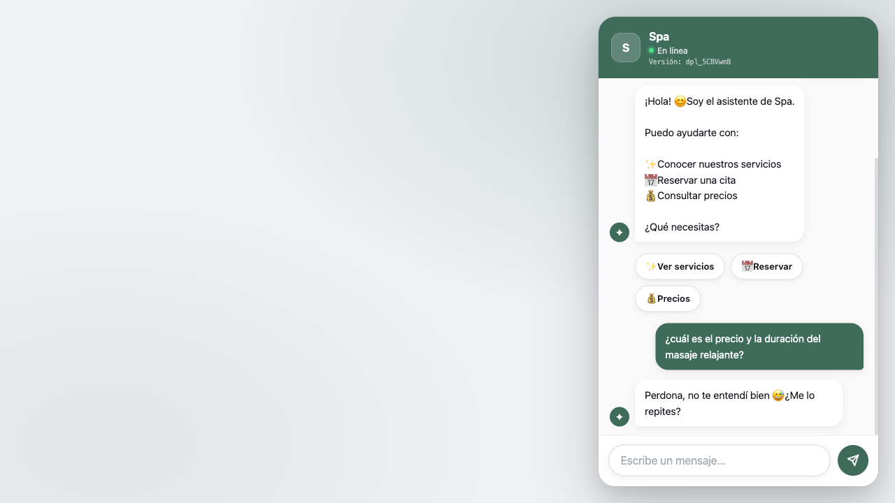
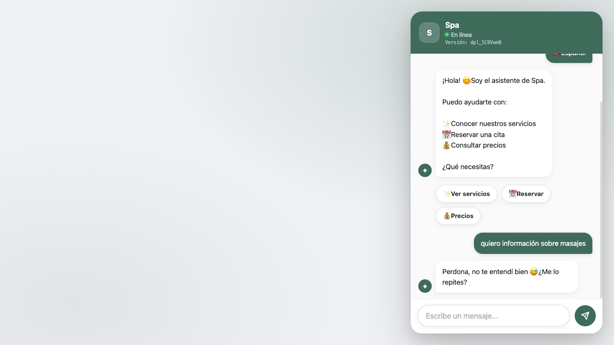
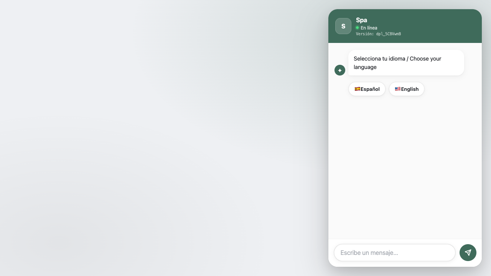
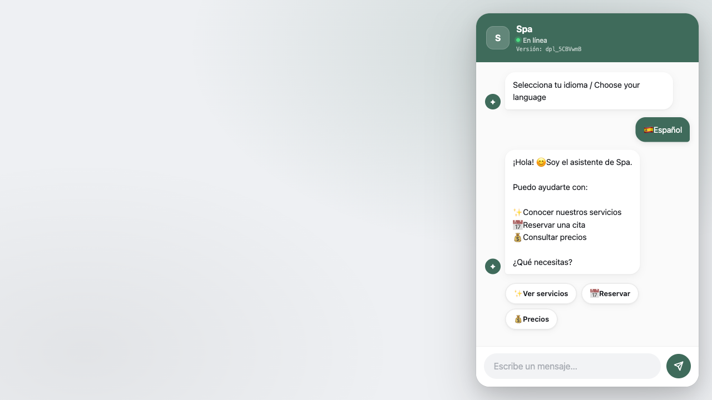

# Expediente Completo de Auditoría y Conversaciones — Spa (spa)
**Fecha:** 2026-08-13T03:07:52.210Z
**URL Objetivo:** https://jbstudio.app/asistente.html?id=spa
**Carpeta de Capturas:** `./auditoria-capturas-spa-1786590472210/`

## 1. Resumen de la Suite
- Escenarios registrados: 10
- Capturas guardadas: 19
- Archivo de evidencia: `auditoria-conversaciones-spa-1786590472210.md`

## 2. Matriz General de Resultados
| Escenario | Resultado | Observaciones |
|---|---|---|
| A — Preguntas informativas sin reservar | **DETENIDO / INCOMPLETO** | No pude determinar qué está pidiendo el bot. Respuesta exacta del bot: "Perdona, no te entendí bien 😅 ¿Me lo repites?" |
| B — Reserva con cliente fastidioso y correcciones | **DETENIDO / INCOMPLETO** | No pude determinar qué está pidiendo el bot. Respuesta exacta del bot: "Perdona, no te entendí bien 😅 ¿Me lo repites?" |
| F — Persistencia backend | **FALLO** | Citas encontradas en Redis: 0 |
| C — Horario ocupado y propuesta alternativa | **DETENIDO / INCOMPLETO** | No pude determinar qué está pidiendo el bot. Respuesta exacta del bot: "Perdona, no te entendí bien 😅 ¿Me lo repites?" |
| D — Auditoría real de slots de disponibilidad | **DETENIDO / INCOMPLETO** | No pude determinar qué está pidiendo el bot. Respuesta exacta del bot: "Perdona, no te entendí bien 😅 ¿Me lo repites?" |
| E — Auditoría de memoria y actualización de datos | **DETENIDO / INCOMPLETO** | No pude determinar qué está pidiendo el bot. Respuesta exacta del bot: "Perdona, no te entendí bien 😅 ¿Me lo repites?" |
| G — Modificación API | **OMITIDO / SIN TOKEN** | Status HTTP - |
| H — Cancelación API | **OMITIDO / SIN TOKEN** | Status HTTP - |
| I — Idempotencia | **ÉXITO** | Resuelto en backend |
| J — Prueba de día cerrado u horario inválido | **DETENIDO / INCOMPLETO** | No pude determinar qué está pidiendo el bot. Respuesta exacta del bot: "Perdona, no te entendí bien 😅 ¿Me lo repites?" |

## 3. Transcripciones Literales y Evidencia Visual

### ESCENARIO A — Preguntas informativas sin reservar
**Resultado:** DETENIDO / INCOMPLETO (2 turnos)
**Motivo de detención:** No pude determinar qué está pidiendo el bot. Respuesta exacta del bot: "Perdona, no te entendí bien 😅 ¿Me lo repites?"

#### Transcripción Literal Completa:
```text
1. [Bot]: Selecciona tu idioma / Choose your language
2. [Cliente]: [Clic en "Español"]
3. [Bot]: ¡Hola! 😊 Soy el asistente de Spa.

Puedo ayudarte con:

✨ Conocer nuestros servicios
📅 Reservar una cita
💰 Consultar precios

¿Qué necesitas?
4. [Cliente]: ¿cuál es el precio y la duración del masaje relajante?
5. [Bot]: Perdona, no te entendí bien 😅 ¿Me lo repites?
```

#### Instantánea del Estado Esperado por el Cliente:
```text
ESTADO ESPERADO (Turno 1):
- Servicio: Masaje relajante
- Fecha: sábado
- Hora: 4:00 PM
- Nombre: Pendiente
- Teléfono: Pendiente
- Correo: Pendiente
```

#### Evidencia Visual de Pantalla:
##### Inicio del escenario (Turno 0)


##### Catálogo de servicios mostrado (Turno 1)


##### Escenario detenido por respuesta ambigua (Turno 2)


### ESCENARIO B — Reserva con cliente fastidioso y correcciones
**Resultado:** DETENIDO / INCOMPLETO (2 turnos)
**Motivo de detención:** No pude determinar qué está pidiendo el bot. Respuesta exacta del bot: "Perdona, no te entendí bien 😅 ¿Me lo repites?"

#### Transcripción Literal Completa:
```text
1. [Bot]: Selecciona tu idioma / Choose your language
2. [Cliente]: [Clic en "Español"]
3. [Bot]: ¡Hola! 😊 Soy el asistente de Spa.

Puedo ayudarte con:

✨ Conocer nuestros servicios
📅 Reservar una cita
💰 Consultar precios

¿Qué necesitas?
4. [Cliente]: quiero información sobre masajes
5. [Bot]: Perdona, no te entendí bien 😅 ¿Me lo repites?
```

#### Instantánea del Estado Esperado por el Cliente:
```text
ESTADO ESPERADO (Turno 1):
- Servicio: Masaje relajante
- Fecha: sábado
- Hora: 4:00 PM
- Nombre: Pendiente
- Teléfono: Pendiente
- Correo: Pendiente
```

#### Evidencia Visual de Pantalla:
##### Inicio del escenario (Turno 0)


##### Catálogo de servicios mostrado (Turno 1)


##### Escenario detenido por respuesta ambigua (Turno 2)


### ESCENARIO C — Horario ocupado y propuesta alternativa
**Resultado:** DETENIDO / INCOMPLETO (2 turnos)
**Motivo de detención:** No pude determinar qué está pidiendo el bot. Respuesta exacta del bot: "Perdona, no te entendí bien 😅 ¿Me lo repites?"

#### Transcripción Literal Completa:
```text
1. [Bot]: Selecciona tu idioma / Choose your language
2. [Cliente]: [Clic en "Español"]
3. [Bot]: ¡Hola! 😊 Soy el asistente de Spa.

Puedo ayudarte con:

✨ Conocer nuestros servicios
📅 Reservar una cita
💰 Consultar precios

¿Qué necesitas?
4. [Cliente]: quiero información sobre masajes
5. [Bot]: Perdona, no te entendí bien 😅 ¿Me lo repites?
```

#### Instantánea del Estado Esperado por el Cliente:
```text
ESTADO ESPERADO (Turno 1):
- Servicio: Masaje relajante
- Fecha: sábado
- Hora: 4:00 PM
- Nombre: Pendiente
- Teléfono: Pendiente
- Correo: Pendiente
```

#### Evidencia Visual de Pantalla:
##### Inicio del escenario (Turno 0)


##### Catálogo de servicios mostrado (Turno 1)


##### Escenario detenido por respuesta ambigua (Turno 2)


### ESCENARIO D — Auditoría real de slots de disponibilidad
**Resultado:** DETENIDO / INCOMPLETO (2 turnos)
**Motivo de detención:** No pude determinar qué está pidiendo el bot. Respuesta exacta del bot: "Perdona, no te entendí bien 😅 ¿Me lo repites?"

#### Transcripción Literal Completa:
```text
1. [Bot]: Selecciona tu idioma / Choose your language
2. [Cliente]: [Clic en "Español"]
3. [Bot]: ¡Hola! 😊 Soy el asistente de Spa.

Puedo ayudarte con:

✨ Conocer nuestros servicios
📅 Reservar una cita
💰 Consultar precios

¿Qué necesitas?
4. [Cliente]: quiero información sobre masajes
5. [Bot]: Perdona, no te entendí bien 😅 ¿Me lo repites?
```

#### Instantánea del Estado Esperado por el Cliente:
```text
ESTADO ESPERADO (Turno 1):
- Servicio: Masaje relajante
- Fecha: sábado
- Hora: 4:00 PM
- Nombre: Pendiente
- Teléfono: Pendiente
- Correo: Pendiente
```

#### Evidencia Visual de Pantalla:
##### Inicio del escenario (Turno 0)


##### Catálogo de servicios mostrado (Turno 1)


##### Slots de horarios mostrados (Turno 2)


##### Escenario detenido por respuesta ambigua (Turno 2)


### ESCENARIO E — Auditoría de memoria y actualización de datos
**Resultado:** DETENIDO / INCOMPLETO (2 turnos)
**Motivo de detención:** No pude determinar qué está pidiendo el bot. Respuesta exacta del bot: "Perdona, no te entendí bien 😅 ¿Me lo repites?"

#### Transcripción Literal Completa:
```text
1. [Bot]: Selecciona tu idioma / Choose your language
2. [Cliente]: [Clic en "Español"]
3. [Bot]: ¡Hola! 😊 Soy el asistente de Spa.

Puedo ayudarte con:

✨ Conocer nuestros servicios
📅 Reservar una cita
💰 Consultar precios

¿Qué necesitas?
4. [Cliente]: quiero información sobre masajes
5. [Bot]: Perdona, no te entendí bien 😅 ¿Me lo repites?
```

#### Instantánea del Estado Esperado por el Cliente:
```text
ESTADO ESPERADO (Turno 1):
- Servicio: Masaje relajante
- Fecha: sábado
- Hora: 4:00 PM
- Nombre: Pendiente
- Teléfono: Pendiente
- Correo: Pendiente
```

#### Evidencia Visual de Pantalla:
##### Inicio del escenario (Turno 0)


##### Catálogo de servicios mostrado (Turno 1)


##### Escenario detenido por respuesta ambigua (Turno 2)


### ESCENARIO J — Prueba de día cerrado u horario inválido
**Resultado:** DETENIDO / INCOMPLETO (2 turnos)
**Motivo de detención:** No pude determinar qué está pidiendo el bot. Respuesta exacta del bot: "Perdona, no te entendí bien 😅 ¿Me lo repites?"

#### Transcripción Literal Completa:
```text
1. [Bot]: Selecciona tu idioma / Choose your language
2. [Cliente]: [Clic en "Español"]
3. [Bot]: ¡Hola! 😊 Soy el asistente de Spa.

Puedo ayudarte con:

✨ Conocer nuestros servicios
📅 Reservar una cita
💰 Consultar precios

¿Qué necesitas?
4. [Cliente]: quiero información sobre masajes
5. [Bot]: Perdona, no te entendí bien 😅 ¿Me lo repites?
```

#### Instantánea del Estado Esperado por el Cliente:
```text
ESTADO ESPERADO (Turno 1):
- Servicio: Masaje relajante
- Fecha: sábado
- Hora: 4:00 PM
- Nombre: Pendiente
- Teléfono: Pendiente
- Correo: Pendiente
```

#### Evidencia Visual de Pantalla:
##### Inicio del escenario (Turno 0)


##### Catálogo de servicios mostrado (Turno 1)


##### Escenario detenido por respuesta ambigua (Turno 2)


## 4. Validaciones Directas Backend (Sin Navegador)

### ESCENARIO F — PERSISTENCIA EN REDIS
```text
REQUEST: GET https://jbstudio.app/api/admin-reservations?clientId=spa
RESPONSE STATUS: 200
CITAS HALLADAS EN REDIS: 0
RESULTADO: FALLO
```

### ESCENARIO G — MODIFICACIÓN VÍA API
```text
REQUEST: N/A
RESPONSE STATUS: N/A
RESULTADO: OMITIDO / SIN TOKEN
```

### ESCENARIO H — CANCELACIÓN VÍA API
```text
REQUEST: N/A
RESPONSE STATUS: N/A
RESULTADO: OMITIDO / SIN TOKEN
```

### ESCENARIO I — IDEMPOTENCIA DE CONFIRMACIÓN
```text
PETICIÓN CONCURRENTE 1: Status 429
PETICIÓN CONCURRENTE 2: Status 201
RESULTADO: ÉXITO
```
