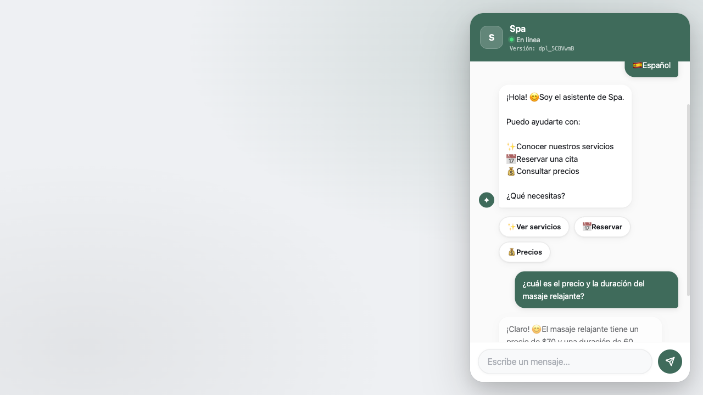
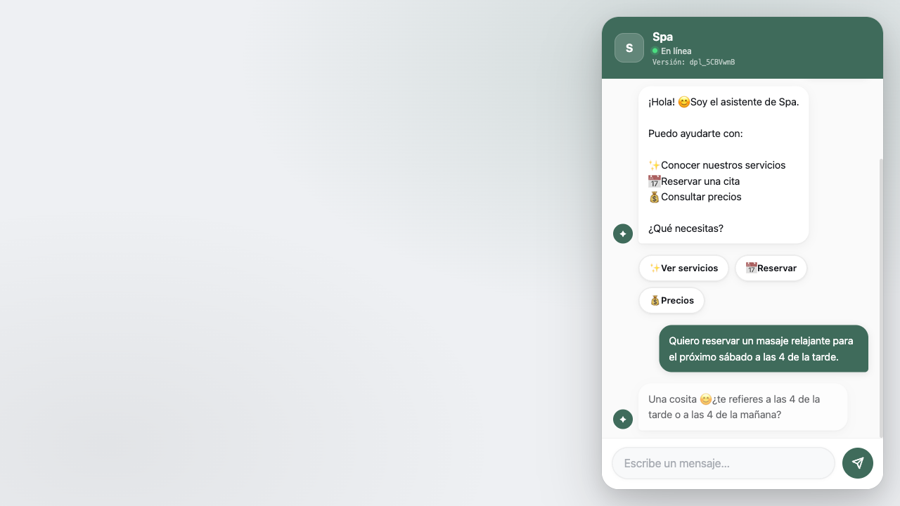
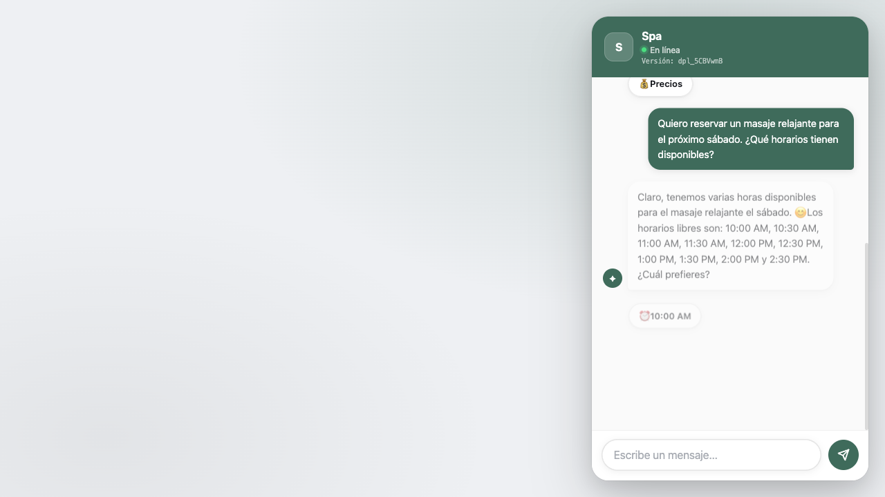
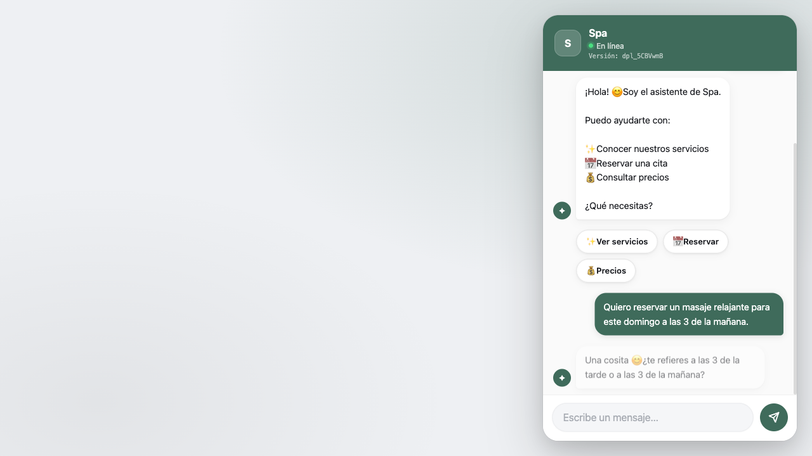

# Auditoría supervisada — spa
**Fecha:** 2026-08-13T04:38:09.502Z
**URL:** https://jbstudio.app/asistente.html?id=spa
**Capturas:** `./auditoria-capturas-spa-1786595858968/`

## Matriz
| Escenario | Objetivo | Resultado | Motivo |
|---|---|---|---|
| A | informacion_servicio | **OBJETIVO ALCANZADO** | Respondió información de precio o duración. |
| B | resumen_reserva | **NO EJECUTADO COMPLETAMENTE** | No hay una continuación coherente para esta respuesta del bot: "Una cosita 😊 ¿te refieres a las 4 de la tarde o a las 4 de la mañana?" |
| C | alternativa_horario | **NO EJECUTADO COMPLETAMENTE** | No hay una continuación coherente para esta respuesta del bot: "Una cosita 😊 ¿te refieres a las 4 de la tarde o a las 4 de la mañana?" |
| D | slots_disponibles | **OBJETIVO ALCANZADO** | Mostró disponibilidad o slots visibles. |
| E | correccion_dato | **NO EJECUTADO COMPLETAMENTE** | No hay una continuación coherente para esta respuesta del bot: "Una cosita 😊 ¿te refieres a las 4 de la tarde o a las 4 de la mañana?" |
| J | rechazo_horario | **NO EJECUTADO COMPLETAMENTE** | No hay una continuación coherente para esta respuesta del bot: "Una cosita 😊 ¿te refieres a las 3 de la tarde o a las 3 de la mañana?" |

## Conversaciones completas
### A — Preguntas informativas sin reservar
**Estado final real:** `{"servicio":"masaje relajante","fecha":null,"hora":null,"nombre":null,"telefono":null,"email":null,"notas":null}`
**Resultado:** OBJETIVO ALCANZADO — Respondió información de precio o duración.

```text
1. [Cliente] [Clic en Español]
2. [Bot] ¡Hola! 😊 Soy el asistente de Spa. Puedo ayudarte con: ✨ Conocer nuestros servicios 📅 Reservar una cita 💰 Consultar precios ¿Qué necesitas?
3. [Cliente] ¿cuál es el precio y la duración del masaje relajante?
4. [Bot] ¡Claro! 😊 El masaje relajante tiene un precio de $70 y una duración de 60 minutos. Es una excelente opción para relajarte. ¿Te gustaría saber más sobre otros servicios o quizás reservar una cita?
```

#### Capturas
- Turno 0: horarios-disponibles. Slots/texto de disponibilidad verificados visualmente. Estado: `{"servicio":null,"fecha":null,"hora":null,"nombre":null,"telefono":null,"email":null,"notas":null}`
  
- Turno 1: horarios-disponibles. Slots/texto de disponibilidad verificados visualmente. Estado: `{"servicio":"masaje relajante","fecha":null,"hora":null,"nombre":null,"telefono":null,"email":null,"notas":null}`
  

#### Mensajes bloqueados por incoherencia
- Ninguno.

### B — Reserva con corrección coherente
**Estado final real:** `{"servicio":"masaje relajante","fecha":"sábado","hora":"4:00 PM","nombre":null,"telefono":null,"email":null,"notas":null}`
**Resultado:** NO EJECUTADO COMPLETAMENTE — No hay una continuación coherente para esta respuesta del bot: "Una cosita 😊 ¿te refieres a las 4 de la tarde o a las 4 de la mañana?"

```text
1. [Cliente] [Clic en Español]
2. [Bot] ¡Hola! 😊 Soy el asistente de Spa. Puedo ayudarte con: ✨ Conocer nuestros servicios 📅 Reservar una cita 💰 Consultar precios ¿Qué necesitas?
3. [Cliente] Quiero reservar un masaje relajante para el próximo sábado a las 4 de la tarde.
4. [Bot] Una cosita 😊 ¿te refieres a las 4 de la tarde o a las 4 de la mañana?
```

#### Capturas
- Turno 0: horarios-disponibles. Slots/texto de disponibilidad verificados visualmente. Estado: `{"servicio":null,"fecha":null,"hora":null,"nombre":null,"telefono":null,"email":null,"notas":null}`
  
- Turno 1: horarios-disponibles. Slots/texto de disponibilidad verificados visualmente. Estado: `{"servicio":"masaje relajante","fecha":"sábado","hora":"4:00 PM","nombre":null,"telefono":null,"email":null,"notas":null}`
  

#### Mensajes bloqueados por incoherencia
- Ninguno.

### C — Horario ocupado y alternativa
**Estado final real:** `{"servicio":"masaje relajante","fecha":"sábado","hora":"4:00 PM","nombre":null,"telefono":null,"email":null,"notas":null}`
**Resultado:** NO EJECUTADO COMPLETAMENTE — No hay una continuación coherente para esta respuesta del bot: "Una cosita 😊 ¿te refieres a las 4 de la tarde o a las 4 de la mañana?"

```text
1. [Cliente] [Clic en Español]
2. [Bot] ¡Hola! 😊 Soy el asistente de Spa. Puedo ayudarte con: ✨ Conocer nuestros servicios 📅 Reservar una cita 💰 Consultar precios ¿Qué necesitas?
3. [Cliente] Quiero reservar un masaje relajante para el próximo sábado a las 4 de la tarde.
4. [Bot] Una cosita 😊 ¿te refieres a las 4 de la tarde o a las 4 de la mañana?
```

#### Capturas
- Turno 0: horarios-disponibles. Slots/texto de disponibilidad verificados visualmente. Estado: `{"servicio":null,"fecha":null,"hora":null,"nombre":null,"telefono":null,"email":null,"notas":null}`
  
- Turno 1: horarios-disponibles. Slots/texto de disponibilidad verificados visualmente. Estado: `{"servicio":"masaje relajante","fecha":"sábado","hora":"4:00 PM","nombre":null,"telefono":null,"email":null,"notas":null}`
  

#### Mensajes bloqueados por incoherencia
- Ninguno.

### D — Slots reales de disponibilidad
**Estado final real:** `{"servicio":"masaje relajante","fecha":"sábado","hora":null,"nombre":null,"telefono":null,"email":null,"notas":null}`
**Resultado:** OBJETIVO ALCANZADO — Mostró disponibilidad o slots visibles.

```text
1. [Cliente] [Clic en Español]
2. [Bot] ¡Hola! 😊 Soy el asistente de Spa. Puedo ayudarte con: ✨ Conocer nuestros servicios 📅 Reservar una cita 💰 Consultar precios ¿Qué necesitas?
3. [Cliente] Quiero reservar un masaje relajante para el próximo sábado. ¿Qué horarios tienen disponibles?
4. [Bot] Claro, tenemos varias horas disponibles para el masaje relajante el sábado. 😊 Los horarios libres son: 10:00 AM, 10:30 AM, 11:00 AM, 11:30 AM, 12:00 PM, 12:30 PM, 1:00 PM, 1:30 PM, 2:00 PM y 2:30 PM. ¿Cuál prefieres?
```

#### Capturas
- Turno 0: horarios-disponibles. Slots/texto de disponibilidad verificados visualmente. Estado: `{"servicio":null,"fecha":null,"hora":null,"nombre":null,"telefono":null,"email":null,"notas":null}`
  
- Turno 1: horarios-disponibles. Slots/texto de disponibilidad verificados visualmente. Estado: `{"servicio":"masaje relajante","fecha":"sábado","hora":null,"nombre":null,"telefono":null,"email":null,"notas":null}`
  

#### Mensajes bloqueados por incoherencia
- Ninguno.

### E — Memoria y actualización de datos
**Estado final real:** `{"servicio":"masaje relajante","fecha":"sábado","hora":"4:00 PM","nombre":null,"telefono":null,"email":null,"notas":null}`
**Resultado:** NO EJECUTADO COMPLETAMENTE — No hay una continuación coherente para esta respuesta del bot: "Una cosita 😊 ¿te refieres a las 4 de la tarde o a las 4 de la mañana?"

```text
1. [Cliente] [Clic en Español]
2. [Bot] ¡Hola! 😊 Soy el asistente de Spa. Puedo ayudarte con: ✨ Conocer nuestros servicios 📅 Reservar una cita 💰 Consultar precios ¿Qué necesitas?
3. [Cliente] Quiero reservar un masaje relajante para el próximo sábado a las 4 de la tarde.
4. [Bot] Una cosita 😊 ¿te refieres a las 4 de la tarde o a las 4 de la mañana?
```

#### Capturas
- Turno 0: horarios-disponibles. Slots/texto de disponibilidad verificados visualmente. Estado: `{"servicio":null,"fecha":null,"hora":null,"nombre":null,"telefono":null,"email":null,"notas":null}`
  
- Turno 1: horarios-disponibles. Slots/texto de disponibilidad verificados visualmente. Estado: `{"servicio":"masaje relajante","fecha":"sábado","hora":"4:00 PM","nombre":null,"telefono":null,"email":null,"notas":null}`
  

#### Mensajes bloqueados por incoherencia
- Ninguno.

### J — Día cerrado u horario inválido
**Estado final real:** `{"servicio":"masaje relajante","fecha":"domingo","hora":"3:00 AM","nombre":null,"telefono":null,"email":null,"notas":null}`
**Resultado:** NO EJECUTADO COMPLETAMENTE — No hay una continuación coherente para esta respuesta del bot: "Una cosita 😊 ¿te refieres a las 3 de la tarde o a las 3 de la mañana?"

```text
1. [Cliente] [Clic en Español]
2. [Bot] ¡Hola! 😊 Soy el asistente de Spa. Puedo ayudarte con: ✨ Conocer nuestros servicios 📅 Reservar una cita 💰 Consultar precios ¿Qué necesitas?
3. [Cliente] Quiero reservar un masaje relajante para este domingo a las 3 de la mañana.
4. [Bot] Una cosita 😊 ¿te refieres a las 3 de la tarde o a las 3 de la mañana?
```

#### Capturas
- Turno 0: horarios-disponibles. Slots/texto de disponibilidad verificados visualmente. Estado: `{"servicio":null,"fecha":null,"hora":null,"nombre":null,"telefono":null,"email":null,"notas":null}`
  
- Turno 1: horarios-disponibles. Slots/texto de disponibilidad verificados visualmente. Estado: `{"servicio":"masaje relajante","fecha":"domingo","hora":"3:00 AM","nombre":null,"telefono":null,"email":null,"notas":null}`
  

#### Mensajes bloqueados por incoherencia
- Ninguno.

## Hallazgos clasificados
- **SCRIPT** | B, turno 1 | ESCENARIO DETENIDO | MEDIO | No hay una continuación coherente para esta respuesta del bot: "Una cosita 😊 ¿te refieres a las 4 de la tarde o a las 4 de la mañana?"
- **SCRIPT** | C, turno 1 | ESCENARIO DETENIDO | MEDIO | No hay una continuación coherente para esta respuesta del bot: "Una cosita 😊 ¿te refieres a las 4 de la tarde o a las 4 de la mañana?"
- **SCRIPT** | E, turno 1 | ESCENARIO DETENIDO | MEDIO | No hay una continuación coherente para esta respuesta del bot: "Una cosita 😊 ¿te refieres a las 4 de la tarde o a las 4 de la mañana?"
- **SCRIPT** | J, turno 1 | ESCENARIO DETENIDO | MEDIO | No hay una continuación coherente para esta respuesta del bot: "Una cosita 😊 ¿te refieres a las 3 de la tarde o a las 3 de la mañana?"
