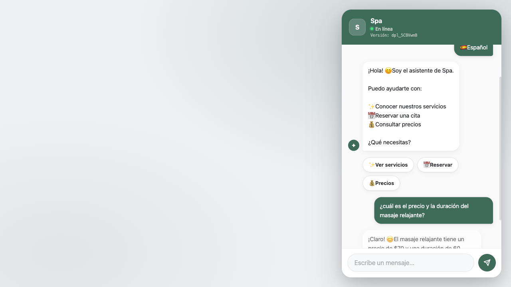
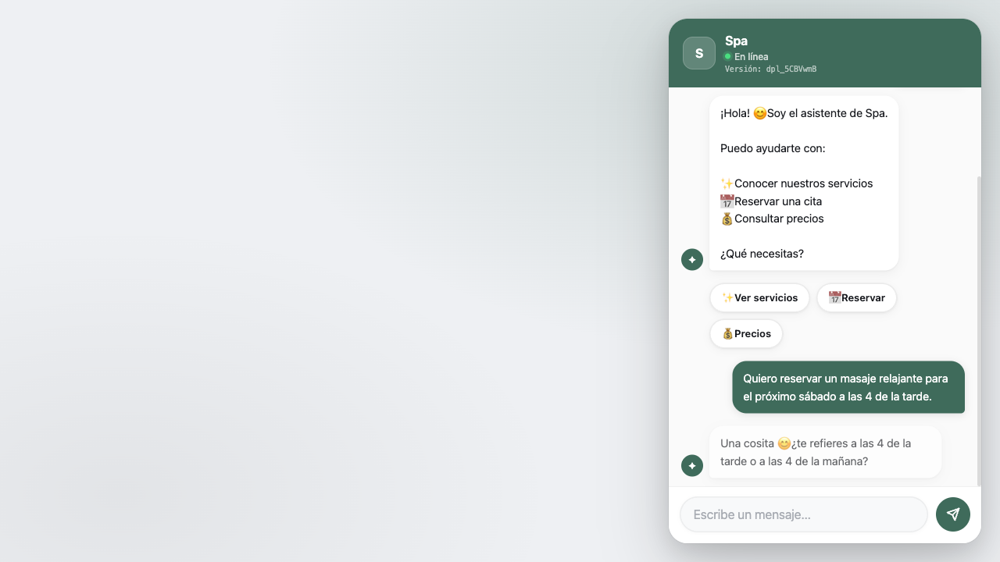
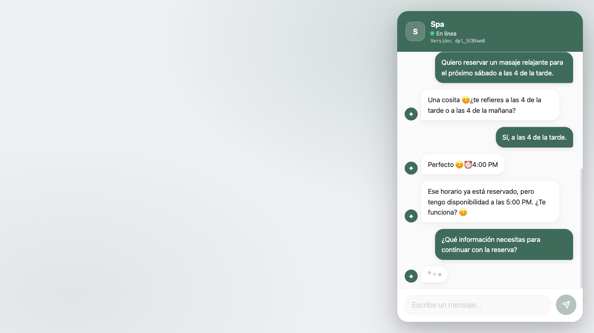
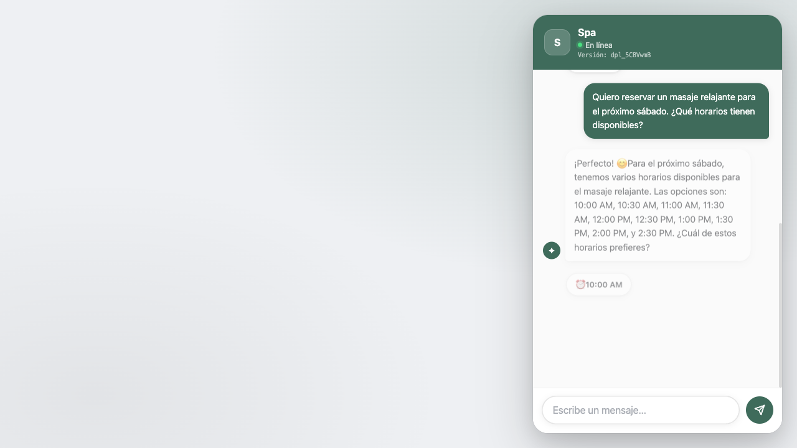
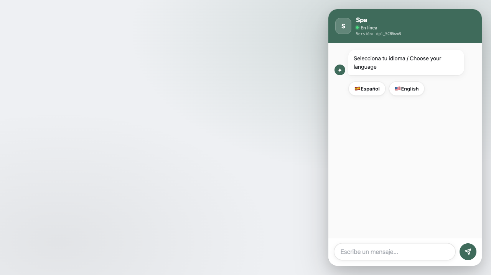
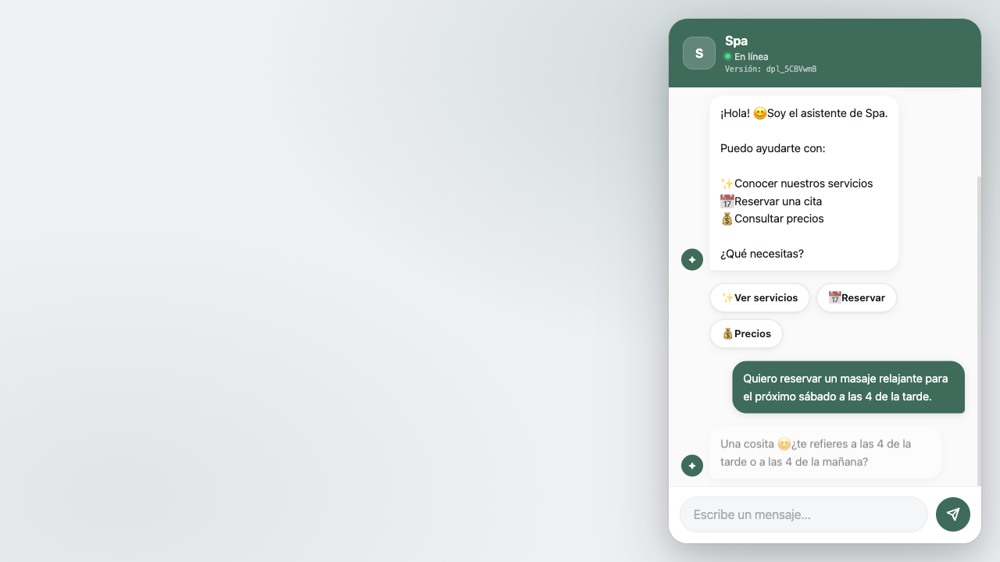
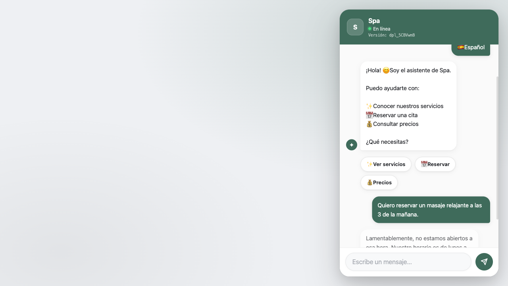
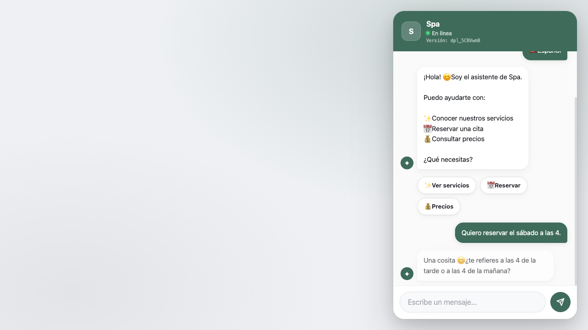
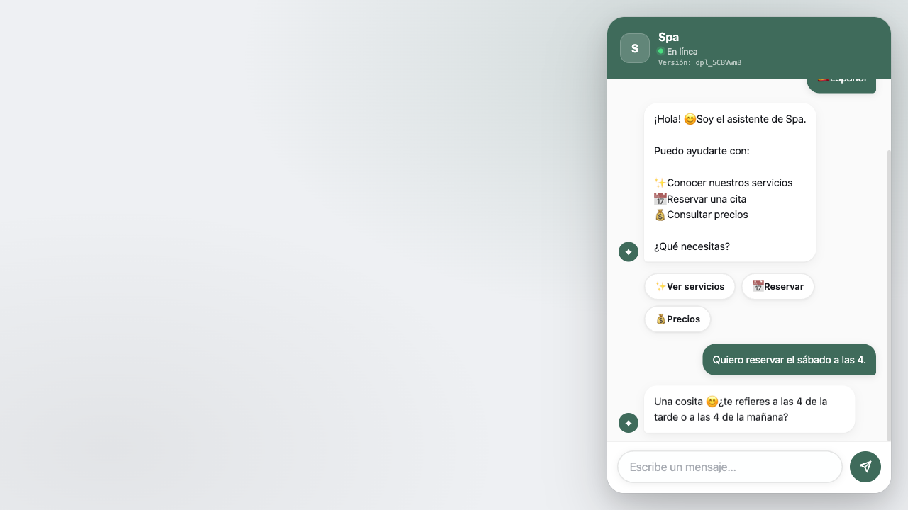
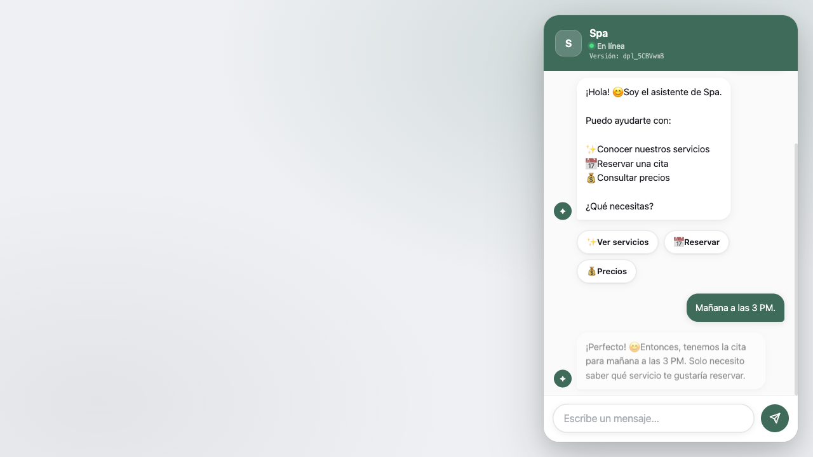

# Auditoría supervisada — spa
**Fecha:** 2026-08-13T06:06:45.401Z
**URL:** https://jbstudio.app/asistente.html?id=spa
**Capturas:** `./auditoria-capturas-spa-1786601133117/`

## Matriz
| Escenario | Objetivo | Resultado | Motivo |
|---|---|---|---|
| A | informacion_servicio | **OBJETIVO ALCANZADO** | Respondió información de precio o duración. |
| B | resumen_reserva | **NO EJECUTADO COMPLETAMENTE** | No hay una continuación coherente para esta respuesta del bot: "Ese horario ya está reservado, pero tengo disponibilidad a las 5:00 PM. ¿Te funciona? 😊" |
| C | alternativa_horario | **OBJETIVO ALCANZADO** | Ofreció una alternativa tras un horario no disponible. |
| D | slots_disponibles | **OBJETIVO ALCANZADO** | Mostró slots reales desde chatbot-ui: ⏰ 10:00 AM, ⏰ 10:30 AM, ⏰ 11:00 AM, ⏰ 11:30 AM, ⏰ 12:00 PM, ⏰ 12:30 PM, ⏰ 1:00 PM, ⏰ 1:30 PM. |
| E | correccion_dato | **NO EJECUTADO COMPLETAMENTE** | No hay una continuación coherente para esta respuesta del bot: "Ese horario ya está reservado, pero tengo disponibilidad a las 5:00 PM. ¿Te funciona? 😊" |
| J | rechazo_horario | **OBJETIVO ALCANZADO** | Explicó el rechazo de día/hora inválido. |
| K | hora_pm_sin_pregunta | **OBJETIVO ALCANZADO** | Guardó 4:00 PM sin pedir aclaración AM/PM. |
| L | hora_am_sin_fecha | **OBJETIVO ALCANZADO** | Guardó 3:00 AM sin crear fecha mañana. |
| M | hora_deducida_pm | **NO EJECUTADO COMPLETAMENTE** | No hay una continuación coherente para esta respuesta del bot: "Una cosita 😊 ¿te refieres a las 4 de la tarde o a las 4 de la mañana?" |
| N | botones_ampm | **OBJETIVO ALCANZADO** | Mostró botones 4:00 AM y 4:00 PM sin pregunta textual. |
| O | fecha_y_hora | **OBJETIVO ALCANZADO** | Guardó fecha mañana y hora 3:00 PM. |
| F | escritura_produccion_bloqueada | **NO EJECUTADO COMPLETAMENTE** | Bloqueado: requiere escritura de reservas en producción, no autorizada. |
| G | escritura_produccion_bloqueada | **NO EJECUTADO COMPLETAMENTE** | Bloqueado: requiere escritura de reservas en producción, no autorizada. |
| H | escritura_produccion_bloqueada | **NO EJECUTADO COMPLETAMENTE** | Bloqueado: requiere escritura de reservas en producción, no autorizada. |
| I | escritura_produccion_bloqueada | **NO EJECUTADO COMPLETAMENTE** | Bloqueado: requiere escritura de reservas en producción, no autorizada. |

## Conversaciones completas
### A — Preguntas informativas sin reservar
**Estado final real:** `{"servicio":"masaje relajante","fecha":null,"hora":null,"nombre":null,"telefono":null,"email":null,"notas":null}`
**Resultado:** OBJETIVO ALCANZADO — Respondió información de precio o duración.

```text
1. [Cliente]
[Clic en Español]

2. [Bot]
¡Hola! 😊 Soy el asistente de Spa. Puedo ayudarte con: ✨ Conocer nuestros servicios 📅 Reservar una cita 💰 Consultar precios ¿Qué necesitas?

3. [Cliente]
¿cuál es el precio y la duración del masaje relajante?

4. [Bot]
¡Claro! 😊 El masaje relajante tiene un precio de $70 y una duración de 60 minutos. Es una excelente opción para relajarte. ¿Te gustaría reservarlo o conocer más sobre otros servicios?

```

#### Capturas
- Turno 0: respuesta-bot. Respuesta del bot sin evidencia para una etiqueta específica. Estado: `{"servicio":null,"fecha":null,"hora":null,"nombre":null,"telefono":null,"email":null,"notas":null}`
  
- Turno 1: respuesta-bot. Respuesta del bot sin evidencia para una etiqueta específica. Estado: `{"servicio":"masaje relajante","fecha":null,"hora":null,"nombre":null,"telefono":null,"email":null,"notas":null}`
  

#### Mensajes bloqueados por incoherencia
- Ninguno.

### B — Reserva con corrección coherente
**Estado final real:** `{"servicio":"Masaje relajante","fecha":"sábado","hora":"4:00 PM","nombre":null,"telefono":null,"email":null,"notas":null}`
**Resultado:** NO EJECUTADO COMPLETAMENTE — No hay una continuación coherente para esta respuesta del bot: "Ese horario ya está reservado, pero tengo disponibilidad a las 5:00 PM. ¿Te funciona? 😊"

```text
1. [Cliente]
[Clic en Español]

2. [Bot]
¡Hola! 😊 Soy el asistente de Spa. Puedo ayudarte con: ✨ Conocer nuestros servicios 📅 Reservar una cita 💰 Consultar precios ¿Qué necesitas?

3. [Cliente]
Quiero reservar un masaje relajante para el próximo sábado a las 4 de la tarde.

4. [Bot]
Una cosita 😊 ¿te refieres a las 4 de la tarde o a las 4 de la mañana?

5. [Cliente]
Sí, a las 4 de la tarde.

6. [Bot]
Perfecto 😊 ⏰ 4:00 PM

7. [Cliente]
¿Qué información necesitas para continuar con la reserva?

8. [Bot]
Ese horario ya está reservado, pero tengo disponibilidad a las 5:00 PM. ¿Te funciona? 😊

```

#### Capturas
- Turno 0: respuesta-bot. Respuesta del bot sin evidencia para una etiqueta específica. Estado: `{"servicio":null,"fecha":null,"hora":null,"nombre":null,"telefono":null,"email":null,"notas":null}`
  
- Turno 1: respuesta-bot. Respuesta del bot sin evidencia para una etiqueta específica. Estado: `{"servicio":"masaje relajante","fecha":"sábado","hora":"4:00 PM","nombre":null,"telefono":null,"email":null,"notas":null}`
  
- Turno 2: respuesta-bot. Respuesta del bot sin evidencia para una etiqueta específica. Estado: `{"servicio":"masaje relajante","fecha":"sábado","hora":"4:00 PM","nombre":null,"telefono":null,"email":null,"notas":null}`
  
- Turno 3: respuesta-bot. Respuesta del bot sin evidencia para una etiqueta específica. Estado: `{"servicio":"Masaje relajante","fecha":"sábado","hora":"4:00 PM","nombre":null,"telefono":null,"email":null,"notas":null}`
  
- Turno 3: escenario-detenido. Respuesta del bot sin evidencia para una etiqueta específica. Estado: `{"servicio":"Masaje relajante","fecha":"sábado","hora":"4:00 PM","nombre":null,"telefono":null,"email":null,"notas":null}`
  

#### Mensajes bloqueados por incoherencia
- Ninguno.

### C — Horario ocupado y alternativa
**Estado final real:** `{"servicio":"Masaje relajante","fecha":"sábado","hora":"4:00 PM","nombre":null,"telefono":null,"email":null,"notas":null}`
**Resultado:** OBJETIVO ALCANZADO — Ofreció una alternativa tras un horario no disponible.

```text
1. [Cliente]
[Clic en Español]

2. [Bot]
¡Hola! 😊 Soy el asistente de Spa. Puedo ayudarte con: ✨ Conocer nuestros servicios 📅 Reservar una cita 💰 Consultar precios ¿Qué necesitas?

3. [Cliente]
Quiero reservar un masaje relajante para el próximo sábado a las 4 de la tarde.

4. [Bot]
Una cosita 😊 ¿te refieres a las 4 de la tarde o a las 4 de la mañana?

5. [Cliente]
Sí, a las 4 de la tarde.

6. [Bot]
Perfecto 😊 ⏰ 4:00 PM

7. [Cliente]
¿Qué información necesitas para continuar con la reserva?

8. [Bot]
Ese horario ya está reservado, pero tengo disponibilidad a las 5:00 PM. ¿Te funciona? 😊

```

#### Capturas
- Turno 0: respuesta-bot. Respuesta del bot sin evidencia para una etiqueta específica. Estado: `{"servicio":null,"fecha":null,"hora":null,"nombre":null,"telefono":null,"email":null,"notas":null}`
  
- Turno 1: respuesta-bot. Respuesta del bot sin evidencia para una etiqueta específica. Estado: `{"servicio":"masaje relajante","fecha":"sábado","hora":"4:00 PM","nombre":null,"telefono":null,"email":null,"notas":null}`
  
- Turno 2: respuesta-bot. Respuesta del bot sin evidencia para una etiqueta específica. Estado: `{"servicio":"masaje relajante","fecha":"sábado","hora":"4:00 PM","nombre":null,"telefono":null,"email":null,"notas":null}`
  
- Turno 3: respuesta-bot. Respuesta del bot sin evidencia para una etiqueta específica. Estado: `{"servicio":"Masaje relajante","fecha":"sábado","hora":"4:00 PM","nombre":null,"telefono":null,"email":null,"notas":null}`
  

#### Mensajes bloqueados por incoherencia
- Ninguno.

### D — Slots reales de disponibilidad
**Estado final real:** `{"servicio":"Masaje relajante","fecha":"sábado","hora":null,"nombre":null,"telefono":null,"email":null,"notas":null}`
**Resultado:** OBJETIVO ALCANZADO — Mostró slots reales desde chatbot-ui: ⏰ 10:00 AM, ⏰ 10:30 AM, ⏰ 11:00 AM, ⏰ 11:30 AM, ⏰ 12:00 PM, ⏰ 12:30 PM, ⏰ 1:00 PM, ⏰ 1:30 PM.

```text
1. [Cliente]
[Clic en Español]

2. [Bot]
¡Hola! 😊 Soy el asistente de Spa. Puedo ayudarte con: ✨ Conocer nuestros servicios 📅 Reservar una cita 💰 Consultar precios ¿Qué necesitas?

3. [Cliente]
Quiero reservar un masaje relajante para el próximo sábado. ¿Qué horarios tienen disponibles?

4. [Bot]
¡Perfecto! 😊 Para el próximo sábado, tenemos varios horarios disponibles para el masaje relajante. Las opciones son: 10:00 AM, 10:30 AM, 11:00 AM, 11:30 AM, 12:00 PM, 12:30 PM, 1:00 PM, 1:30 PM, 2:00 PM, y 2:30 PM. ¿Cuál de estos horarios prefieres?

```

#### Capturas
- Turno 0: respuesta-bot. Respuesta del bot sin evidencia para una etiqueta específica. Estado: `{"servicio":null,"fecha":null,"hora":null,"nombre":null,"telefono":null,"email":null,"notas":null}`
  
- Turno 1: horarios-disponibles. Slots reales verificados desde chatbot-ui: ⏰ 10:00 AM, ⏰ 10:30 AM, ⏰ 11:00 AM, ⏰ 11:30 AM, ⏰ 12:00 PM, ⏰ 12:30 PM, ⏰ 1:00 PM, ⏰ 1:30 PM. Estado: `{"servicio":"Masaje relajante","fecha":"sábado","hora":null,"nombre":null,"telefono":null,"email":null,"notas":null}`
  

#### Mensajes bloqueados por incoherencia
- Ninguno.

### E — Memoria y actualización de datos
**Estado final real:** `{"servicio":"Masaje relajante","fecha":"sábado","hora":"5:00 PM","nombre":null,"telefono":null,"email":null,"notas":null}`
**Resultado:** NO EJECUTADO COMPLETAMENTE — No hay una continuación coherente para esta respuesta del bot: "Ese horario ya está reservado, pero tengo disponibilidad a las 5:00 PM. ¿Te funciona? 😊"

```text
1. [Cliente]
[Clic en Español]

2. [Bot]
¡Hola! 😊 Soy el asistente de Spa. Puedo ayudarte con: ✨ Conocer nuestros servicios 📅 Reservar una cita 💰 Consultar precios ¿Qué necesitas?

3. [Cliente]
Quiero reservar un masaje relajante para el próximo sábado a las 4 de la tarde.

4. [Bot]
Una cosita 😊 ¿te refieres a las 4 de la tarde o a las 4 de la mañana?

5. [Cliente]
Sí, a las 4 de la tarde.

6. [Bot]
Perfecto 😊 ⏰ 4:00 PM

7. [Cliente]
En realidad, prefiero cambiar la hora a las 5 de la tarde.

8. [Bot]
Ese horario ya está reservado, pero tengo disponibilidad a las 5:00 PM. ¿Te funciona? 😊

```

#### Capturas
- Turno 0: respuesta-bot. Respuesta del bot sin evidencia para una etiqueta específica. Estado: `{"servicio":null,"fecha":null,"hora":null,"nombre":null,"telefono":null,"email":null,"notas":null}`
  
- Turno 1: respuesta-bot. Respuesta del bot sin evidencia para una etiqueta específica. Estado: `{"servicio":"masaje relajante","fecha":"sábado","hora":"4:00 PM","nombre":null,"telefono":null,"email":null,"notas":null}`
  
- Turno 2: respuesta-bot. Respuesta del bot sin evidencia para una etiqueta específica. Estado: `{"servicio":"masaje relajante","fecha":"sábado","hora":"4:00 PM","nombre":null,"telefono":null,"email":null,"notas":null}`
  
- Turno 3: respuesta-bot. Respuesta del bot sin evidencia para una etiqueta específica. Estado: `{"servicio":"Masaje relajante","fecha":"sábado","hora":"5:00 PM","nombre":null,"telefono":null,"email":null,"notas":null}`
  
- Turno 3: escenario-detenido. Respuesta del bot sin evidencia para una etiqueta específica. Estado: `{"servicio":"Masaje relajante","fecha":"sábado","hora":"5:00 PM","nombre":null,"telefono":null,"email":null,"notas":null}`
  

#### Mensajes bloqueados por incoherencia
- Ninguno.

### J — Día cerrado u horario inválido
**Estado final real:** `{"servicio":"Masaje relajante","fecha":"domingo","hora":"3:00 AM","nombre":null,"telefono":null,"email":null,"notas":null}`
**Resultado:** OBJETIVO ALCANZADO — Explicó el rechazo de día/hora inválido.

```text
1. [Cliente]
[Clic en Español]

2. [Bot]
¡Hola! 😊 Soy el asistente de Spa. Puedo ayudarte con: ✨ Conocer nuestros servicios 📅 Reservar una cita 💰 Consultar precios ¿Qué necesitas?

3. [Cliente]
Quiero reservar un masaje relajante para este domingo a las 3 de la mañana.

4. [Bot]
Una cosita 😊 ¿te refieres a las 3 de la tarde o a las 3 de la mañana?

5. [Cliente]
Sí, a las 3 de la mañana.

6. [Bot]
En ese horario ya estamos cerrados 🕒 Dime otra hora y reviso 😊

```

#### Capturas
- Turno 0: respuesta-bot. Respuesta del bot sin evidencia para una etiqueta específica. Estado: `{"servicio":null,"fecha":null,"hora":null,"nombre":null,"telefono":null,"email":null,"notas":null}`
  
- Turno 1: respuesta-bot. Respuesta del bot sin evidencia para una etiqueta específica. Estado: `{"servicio":"masaje relajante","fecha":"domingo","hora":"3:00 AM","nombre":null,"telefono":null,"email":null,"notas":null}`
  
- Turno 2: respuesta-bot. Respuesta del bot sin evidencia para una etiqueta específica. Estado: `{"servicio":"Masaje relajante","fecha":"domingo","hora":"3:00 AM","nombre":null,"telefono":null,"email":null,"notas":null}`
  

#### Mensajes bloqueados por incoherencia
- Ninguno.

### K — Hora explícita PM
**Estado final real:** `{"servicio":"masaje relajante","fecha":"sábado","hora":"4:00 PM","nombre":null,"telefono":null,"email":null,"notas":null}`
**Resultado:** OBJETIVO ALCANZADO — Guardó 4:00 PM sin pedir aclaración AM/PM.

```text
1. [Cliente]
[Clic en Español]

2. [Bot]
¡Hola! 😊 Soy el asistente de Spa. Puedo ayudarte con: ✨ Conocer nuestros servicios 📅 Reservar una cita 💰 Consultar precios ¿Qué necesitas?

3. [Cliente]
Quiero reservar un masaje relajante para el próximo sábado a las 4 de la tarde.

4. [Bot]
Una cosita 😊 ¿te refieres a las 4 de la tarde o a las 4 de la mañana?

5. [Cliente]
Sí, a las 4 de la tarde.

6. [Bot]
Perfecto 😊 ⏰ 4:00 PM

```

#### Capturas
- Turno 0: respuesta-bot. Respuesta del bot sin evidencia para una etiqueta específica. Estado: `{"servicio":null,"fecha":null,"hora":null,"nombre":null,"telefono":null,"email":null,"notas":null}`
  
- Turno 1: respuesta-bot. Respuesta del bot sin evidencia para una etiqueta específica. Estado: `{"servicio":"masaje relajante","fecha":"sábado","hora":"4:00 PM","nombre":null,"telefono":null,"email":null,"notas":null}`
  
- Turno 2: respuesta-bot. Respuesta del bot sin evidencia para una etiqueta específica. Estado: `{"servicio":"masaje relajante","fecha":"sábado","hora":"4:00 PM","nombre":null,"telefono":null,"email":null,"notas":null}`
  

#### Mensajes bloqueados por incoherencia
- Ninguno.

### L — Hora explícita AM sin fecha falsa
**Estado final real:** `{"servicio":"masaje relajante","fecha":null,"hora":"3:00 AM","nombre":null,"telefono":null,"email":null,"notas":null}`
**Resultado:** OBJETIVO ALCANZADO — Guardó 3:00 AM sin crear fecha mañana.

```text
1. [Cliente]
[Clic en Español]

2. [Bot]
¡Hola! 😊 Soy el asistente de Spa. Puedo ayudarte con: ✨ Conocer nuestros servicios 📅 Reservar una cita 💰 Consultar precios ¿Qué necesitas?

3. [Cliente]
Quiero reservar un masaje relajante a las 3 de la mañana.

4. [Bot]
Lamentablemente, no estamos abiertos a esa hora. Nuestro horario es de lunes a sábado de 10:00 a 21:00. ¿Te gustaría reservar el masaje relajante para otro momento dentro de nuestro horario? 😊

```

#### Capturas
- Turno 0: respuesta-bot. Respuesta del bot sin evidencia para una etiqueta específica. Estado: `{"servicio":null,"fecha":null,"hora":null,"nombre":null,"telefono":null,"email":null,"notas":null}`
  
- Turno 1: respuesta-bot. Respuesta del bot sin evidencia para una etiqueta específica. Estado: `{"servicio":"masaje relajante","fecha":null,"hora":"3:00 AM","nombre":null,"telefono":null,"email":null,"notas":null}`
  

#### Mensajes bloqueados por incoherencia
- Ninguno.

### M — Hora implícita según horario
**Estado final real:** `{"servicio":null,"fecha":"sábado","hora":null,"nombre":null,"telefono":null,"email":null,"notas":null}`
**Resultado:** NO EJECUTADO COMPLETAMENTE — No hay una continuación coherente para esta respuesta del bot: "Una cosita 😊 ¿te refieres a las 4 de la tarde o a las 4 de la mañana?"

```text
1. [Cliente]
[Clic en Español]

2. [Bot]
¡Hola! 😊 Soy el asistente de Spa. Puedo ayudarte con: ✨ Conocer nuestros servicios 📅 Reservar una cita 💰 Consultar precios ¿Qué necesitas?

3. [Cliente]
Quiero reservar el sábado a las 4.

4. [Bot]
Una cosita 😊 ¿te refieres a las 4 de la tarde o a las 4 de la mañana?

```

#### Capturas
- Turno 0: respuesta-bot. Respuesta del bot sin evidencia para una etiqueta específica. Estado: `{"servicio":null,"fecha":null,"hora":null,"nombre":null,"telefono":null,"email":null,"notas":null}`
  
- Turno 1: respuesta-bot. Respuesta del bot sin evidencia para una etiqueta específica. Estado: `{"servicio":null,"fecha":"sábado","hora":null,"nombre":null,"telefono":null,"email":null,"notas":null}`
  
- Turno 1: escenario-detenido. Respuesta del bot sin evidencia para una etiqueta específica. Estado: `{"servicio":null,"fecha":"sábado","hora":null,"nombre":null,"telefono":null,"email":null,"notas":null}`
  

#### Mensajes bloqueados por incoherencia
- Ninguno.

### N — Ambigüedad real con botones
**Estado final real:** `{"servicio":null,"fecha":null,"hora":null,"nombre":null,"telefono":null,"email":null,"notas":null}`
**Resultado:** OBJETIVO ALCANZADO — Mostró botones 4:00 AM y 4:00 PM sin pregunta textual.

```text
1. [Bot]
¡Hola! 😊 Soy el asistente de Auditoría local AM/PM. Puedo ayudarte con: ✨ Conocer nuestros servicios 📅 Reservar una cita 💰 Consultar precios ¿Qué necesitas?

2. [Cliente]
Quiero reservar a las 4.

3. [Bot]
¡Hola! 😊 Soy el asistente de Auditoría local AM/PM. Puedo ayudarte con: ✨ Conocer nuestros servicios 📅 Reservar una cita 💰 Consultar precios ¿Qué necesitas?

```

#### Capturas
- Turno 0: respuesta-bot. Respuesta del bot sin evidencia para una etiqueta específica. Estado: `{"servicio":null,"fecha":null,"hora":null,"nombre":null,"telefono":null,"email":null,"notas":null}`
  
- Turno 1: horarios-disponibles. Slots reales verificados desde chatbot-ui: ⏰ 4:00 AM, ⏰ 4:00 PM. Estado: `{"servicio":null,"fecha":null,"hora":null,"nombre":null,"telefono":null,"email":null,"notas":null}`
  

#### Mensajes bloqueados por incoherencia
- Ninguno.

### O — Fecha real más hora
**Estado final real:** `{"servicio":null,"fecha":"mañana","hora":"3:00 PM","nombre":null,"telefono":null,"email":null,"notas":null}`
**Resultado:** OBJETIVO ALCANZADO — Guardó fecha mañana y hora 3:00 PM.

```text
1. [Cliente]
[Clic en Español]

2. [Bot]
¡Hola! 😊 Soy el asistente de Spa. Puedo ayudarte con: ✨ Conocer nuestros servicios 📅 Reservar una cita 💰 Consultar precios ¿Qué necesitas?

3. [Cliente]
Mañana a las 3 PM.

4. [Bot]
¡Perfecto! 😊 Entonces, tenemos la cita para mañana a las 3 PM. Solo necesito saber qué servicio te gustaría reservar.

```

#### Capturas
- Turno 0: respuesta-bot. Respuesta del bot sin evidencia para una etiqueta específica. Estado: `{"servicio":null,"fecha":null,"hora":null,"nombre":null,"telefono":null,"email":null,"notas":null}`
  
- Turno 1: respuesta-bot. Respuesta del bot sin evidencia para una etiqueta específica. Estado: `{"servicio":null,"fecha":"mañana","hora":"3:00 PM","nombre":null,"telefono":null,"email":null,"notas":null}`
  

#### Mensajes bloqueados por incoherencia
- Ninguno.

### F — Persistencia backend
**Estado final real:** `{"servicio":null,"fecha":null,"hora":null,"nombre":null,"telefono":null,"email":null,"notas":null}`
**Resultado:** NO EJECUTADO COMPLETAMENTE — Bloqueado: requiere escritura de reservas en producción, no autorizada.

```text
```

#### Capturas

#### Mensajes bloqueados por incoherencia
- Ninguno.

### G — Modificación API
**Estado final real:** `{"servicio":null,"fecha":null,"hora":null,"nombre":null,"telefono":null,"email":null,"notas":null}`
**Resultado:** NO EJECUTADO COMPLETAMENTE — Bloqueado: requiere escritura de reservas en producción, no autorizada.

```text
```

#### Capturas

#### Mensajes bloqueados por incoherencia
- Ninguno.

### H — Cancelación API
**Estado final real:** `{"servicio":null,"fecha":null,"hora":null,"nombre":null,"telefono":null,"email":null,"notas":null}`
**Resultado:** NO EJECUTADO COMPLETAMENTE — Bloqueado: requiere escritura de reservas en producción, no autorizada.

```text
```

#### Capturas

#### Mensajes bloqueados por incoherencia
- Ninguno.

### I — Idempotencia
**Estado final real:** `{"servicio":null,"fecha":null,"hora":null,"nombre":null,"telefono":null,"email":null,"notas":null}`
**Resultado:** NO EJECUTADO COMPLETAMENTE — Bloqueado: requiere escritura de reservas en producción, no autorizada.

```text
```

#### Capturas

#### Mensajes bloqueados por incoherencia
- Ninguno.

## Hallazgos clasificados
- **CHATBOT** | B, turno 1 | ACLARACIÓN REDUNDANTE DE HORA | MEDIO | Cliente: "Quiero reservar un masaje relajante para el próximo sábado a las 4 de la tarde.". Bot: "Una cosita 😊 ¿te refieres a las 4 de la tarde o a las 4 de la mañana?"
- **SCRIPT** | B, turno 3 | ESCENARIO DETENIDO | MEDIO | No hay una continuación coherente para esta respuesta del bot: "Ese horario ya está reservado, pero tengo disponibilidad a las 5:00 PM. ¿Te funciona? 😊"
- **CHATBOT** | C, turno 1 | ACLARACIÓN REDUNDANTE DE HORA | MEDIO | Cliente: "Quiero reservar un masaje relajante para el próximo sábado a las 4 de la tarde.". Bot: "Una cosita 😊 ¿te refieres a las 4 de la tarde o a las 4 de la mañana?"
- **CHATBOT** | E, turno 1 | ACLARACIÓN REDUNDANTE DE HORA | MEDIO | Cliente: "Quiero reservar un masaje relajante para el próximo sábado a las 4 de la tarde.". Bot: "Una cosita 😊 ¿te refieres a las 4 de la tarde o a las 4 de la mañana?"
- **SCRIPT** | E, turno 3 | ESCENARIO DETENIDO | MEDIO | No hay una continuación coherente para esta respuesta del bot: "Ese horario ya está reservado, pero tengo disponibilidad a las 5:00 PM. ¿Te funciona? 😊"
- **CHATBOT** | J, turno 1 | ACLARACIÓN REDUNDANTE DE HORA | MEDIO | Cliente: "Quiero reservar un masaje relajante para este domingo a las 3 de la mañana.". Bot: "Una cosita 😊 ¿te refieres a las 3 de la tarde o a las 3 de la mañana?"
- **CHATBOT** | K, turno 1 | ACLARACIÓN REDUNDANTE DE HORA | MEDIO | Cliente: "Quiero reservar un masaje relajante para el próximo sábado a las 4 de la tarde.". Bot: "Una cosita 😊 ¿te refieres a las 4 de la tarde o a las 4 de la mañana?"
- **SCRIPT** | M, turno 1 | ESCENARIO DETENIDO | MEDIO | No hay una continuación coherente para esta respuesta del bot: "Una cosita 😊 ¿te refieres a las 4 de la tarde o a las 4 de la mañana?"
- **SCRIPT** | F, turno 0 | EJECUCIÓN BLOQUEADA | INFO | Crear, modificar, cancelar o repetir confirmaciones escribiría datos en producción.
- **SCRIPT** | G, turno 0 | EJECUCIÓN BLOQUEADA | INFO | Crear, modificar, cancelar o repetir confirmaciones escribiría datos en producción.
- **SCRIPT** | H, turno 0 | EJECUCIÓN BLOQUEADA | INFO | Crear, modificar, cancelar o repetir confirmaciones escribiría datos en producción.
- **SCRIPT** | I, turno 0 | EJECUCIÓN BLOQUEADA | INFO | Crear, modificar, cancelar o repetir confirmaciones escribiría datos en producción.
