# Auditoría supervisada — spa
**Fecha:** 2026-08-13T06:15:38.757Z
**URL:** https://jbstudio.app/asistente.html?id=spa
**Capturas:** `./auditoria-capturas-spa-1786601636942/`

## Matriz
| Escenario | Objetivo | Resultado | Motivo |
|---|---|---|---|
| A | informacion_servicio | **OBJETIVO ALCANZADO** | Respondió información de precio o duración. |
| B | resumen_reserva | **NO EJECUTADO COMPLETAMENTE** | Límite de 20 turnos alcanzado. No hay una continuación específica para esta respuesta del bot: "Perdona, ¿de la mañana o de la tarde? 😊" |
| C | alternativa_horario | **OBJETIVO ALCANZADO** | Ofreció una alternativa tras un horario no disponible. |
| D | slots_disponibles | **OBJETIVO ALCANZADO** | Mostró slots reales desde chatbot-ui: ⏰ 10:00 AM, ⏰ 10:30 AM, ⏰ 11:00 AM, ⏰ 11:30 AM, ⏰ 12:00 PM, ⏰ 12:30 PM, ⏰ 1:00 PM, ⏰ 1:30 PM. |
| E | correccion_dato | **NO EJECUTADO COMPLETAMENTE** | Límite de 20 turnos alcanzado. El bot pidió nombre y la respuesta propuesta no aporta un nombre. |
| J | rechazo_horario | **OBJETIVO ALCANZADO** | Explicó el rechazo de día/hora inválido. |
| K | hora_pm_sin_pregunta | **NO EJECUTADO COMPLETAMENTE** | Límite de 20 turnos alcanzado. El bot pidió nombre y la respuesta propuesta no aporta un nombre. |
| L | hora_am_sin_fecha | **OBJETIVO ALCANZADO** | Guardó 3:00 AM sin crear fecha mañana. |
| M | hora_deducida_pm | **NO EJECUTADO COMPLETAMENTE** | Límite de 20 turnos alcanzado. El chatbot no entendió la intención original tras una reformulación equivalente. |
| N | botones_ampm | **OBJETIVO ALCANZADO** | Mostró botones 4:00 AM y 4:00 PM sin pregunta textual. |
| O | fecha_y_hora | **NO EJECUTADO COMPLETAMENTE** | Límite de 20 turnos alcanzado. El chatbot no entendió la intención original tras una reformulación equivalente. |
| F | escritura_produccion_bloqueada | **NO EJECUTADO COMPLETAMENTE** | Bloqueado: requiere escritura de reservas en producción, no autorizada. |
| G | escritura_produccion_bloqueada | **NO EJECUTADO COMPLETAMENTE** | Bloqueado: requiere escritura de reservas en producción, no autorizada. |
| H | escritura_produccion_bloqueada | **NO EJECUTADO COMPLETAMENTE** | Bloqueado: requiere escritura de reservas en producción, no autorizada. |
| I | escritura_produccion_bloqueada | **NO EJECUTADO COMPLETAMENTE** | Bloqueado: requiere escritura de reservas en producción, no autorizada. |

## Conversaciones completas
### A — Preguntas informativas sin reservar
**Estado final real:** `{"servicio":"masaje relajante","fecha":null,"hora":null,"nombre":null,"telefono":null,"email":null,"notas":null}`
**Resultado:** OBJETIVO ALCANZADO — Respondió información de precio o duración.

```text
1. [Cliente]
[Clic en Español]

2. [Bot]
¡Hola! 😊 Soy el asistente de Spa. Puedo ayudarte con: ✨ Conocer nuestros servicios 📅 Reservar una cita 💰 Consultar precios ¿Qué necesitas?

3. [Cliente]
¿cuál es el precio y la duración del masaje relajante?

4. [Bot]
¡Claro! 😊 El masaje relajante tiene un precio de $70 y una duración de 60 minutos. Es una excelente opción para relajarte. ¿Te gustaría reservarlo o conocer más sobre otros servicios?

```

#### Capturas
- Turno 0: respuesta-bot. Respuesta del bot sin evidencia para una etiqueta específica. Estado: `{"servicio":null,"fecha":null,"hora":null,"nombre":null,"telefono":null,"email":null,"notas":null}`
  
- Turno 1: respuesta-bot. Respuesta del bot sin evidencia para una etiqueta específica. Estado: `{"servicio":"masaje relajante","fecha":null,"hora":null,"nombre":null,"telefono":null,"email":null,"notas":null}`
  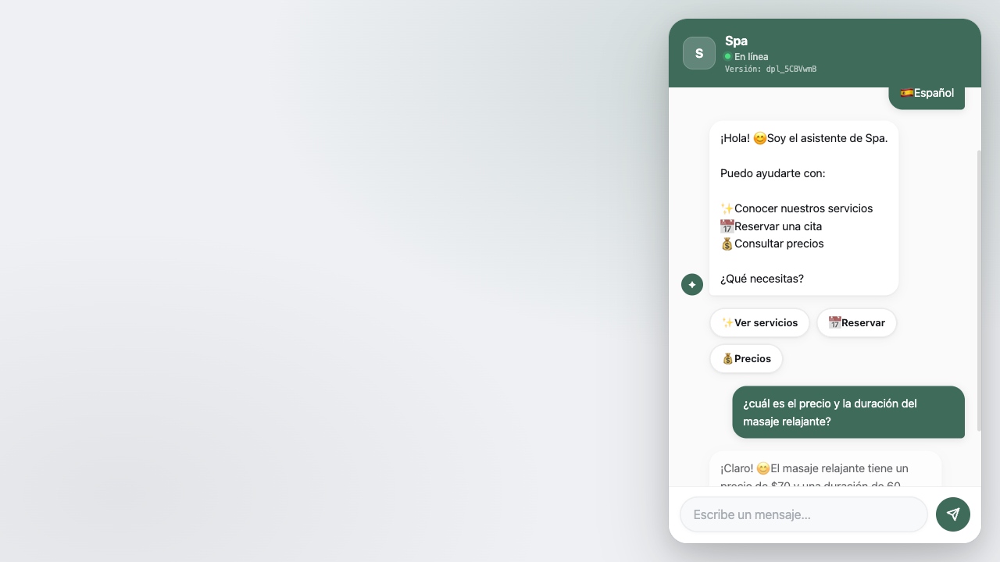

#### Mensajes bloqueados por incoherencia
- Ninguno.

### B — Reserva con corrección coherente
**Estado final real:** `{"servicio":"Masaje relajante","fecha":"sábado","hora":"4:00 PM","nombre":null,"telefono":null,"email":null,"notas":null}`
**Resultado:** NO EJECUTADO COMPLETAMENTE — Límite de 20 turnos alcanzado. No hay una continuación específica para esta respuesta del bot: "Perdona, ¿de la mañana o de la tarde? 😊"

```text
1. [Cliente]
[Clic en Español]

2. [Bot]
¡Hola! 😊 Soy el asistente de Spa. Puedo ayudarte con: ✨ Conocer nuestros servicios 📅 Reservar una cita 💰 Consultar precios ¿Qué necesitas?

3. [Cliente]
Quiero reservar un masaje relajante para el próximo sábado a las 4 de la tarde.

4. [Bot]
Una cosita 😊 ¿te refieres a las 4 de la tarde o a las 4 de la mañana?

5. [Cliente]
Sí, a las 4 de la tarde.

6. [Bot]
Perfecto 😊 ⏰ 4:00 PM

7. [Cliente]
¿Qué información necesitas para continuar con la reserva?

8. [Bot]
Ese horario ya está reservado, pero tengo disponibilidad a las 5:00 PM. ¿Te funciona? 😊

9. [Cliente]
Sigo con la reserva.

10. [Bot]
Perdona, ¿de la mañana o de la tarde? 😊

11. [Cliente]
Sigo con la reserva.

12. [Bot]
Perdona, ¿de la mañana o de la tarde? 😊

13. [Cliente]
Sigo con la reserva.

14. [Bot]
Perdona, ¿de la mañana o de la tarde? 😊

15. [Cliente]
Sigo con la reserva.

16. [Bot]
Perdona, ¿de la mañana o de la tarde? 😊

17. [Cliente]
Sigo con la reserva.

18. [Bot]
Perdona, ¿de la mañana o de la tarde? 😊

19. [Cliente]
Sigo con la reserva.

20. [Bot]
Perdona, ¿de la mañana o de la tarde? 😊

21. [Cliente]
Sigo con la reserva.

22. [Bot]
Perdona, ¿de la mañana o de la tarde? 😊

23. [Cliente]
Sigo con la reserva.

24. [Bot]
Perdona, ¿de la mañana o de la tarde? 😊

25. [Cliente]
Sigo con la reserva.

26. [Bot]
Perdona, ¿de la mañana o de la tarde? 😊

27. [Cliente]
Sigo con la reserva.

28. [Bot]
Perdona, ¿de la mañana o de la tarde? 😊

29. [Cliente]
Sigo con la reserva.

30. [Bot]
Perdona, ¿de la mañana o de la tarde? 😊

31. [Cliente]
Sigo con la reserva.

32. [Bot]
Perdona, ¿de la mañana o de la tarde? 😊

33. [Cliente]
Sigo con la reserva.

34. [Bot]
Perdona, ¿de la mañana o de la tarde? 😊

35. [Cliente]
Sigo con la reserva.

36. [Bot]
Perdona, ¿de la mañana o de la tarde? 😊

37. [Cliente]
Sigo con la reserva.

38. [Bot]
Perdona, ¿de la mañana o de la tarde? 😊

39. [Cliente]
Sigo con la reserva.

40. [Bot]
Perdona, ¿de la mañana o de la tarde? 😊

41. [Cliente]
Sigo con la reserva.

42. [Bot]
Perdona, ¿de la mañana o de la tarde? 😊

```

#### Capturas
- Turno 0: respuesta-bot. Respuesta del bot sin evidencia para una etiqueta específica. Estado: `{"servicio":null,"fecha":null,"hora":null,"nombre":null,"telefono":null,"email":null,"notas":null}`
  
- Turno 1: respuesta-bot. Respuesta del bot sin evidencia para una etiqueta específica. Estado: `{"servicio":"masaje relajante","fecha":"sábado","hora":"4:00 PM","nombre":null,"telefono":null,"email":null,"notas":null}`
  
- Turno 2: respuesta-bot. Respuesta del bot sin evidencia para una etiqueta específica. Estado: `{"servicio":"masaje relajante","fecha":"sábado","hora":"4:00 PM","nombre":null,"telefono":null,"email":null,"notas":null}`
  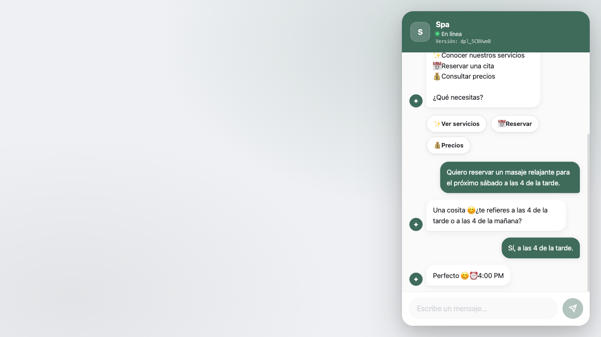
- Turno 3: respuesta-bot. Respuesta del bot sin evidencia para una etiqueta específica. Estado: `{"servicio":"Masaje relajante","fecha":"sábado","hora":"4:00 PM","nombre":null,"telefono":null,"email":null,"notas":null}`
  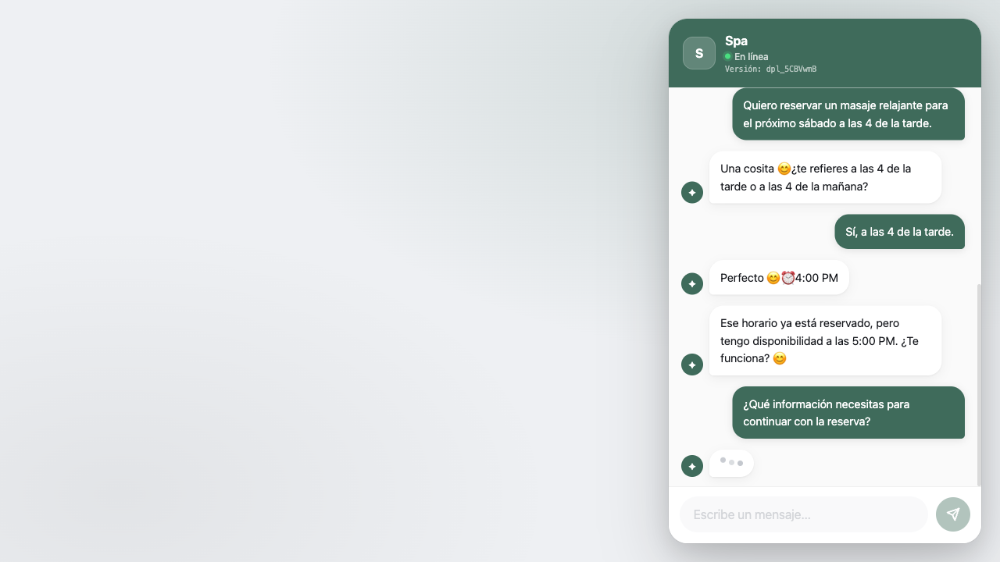
- Turno 4: respuesta-bot. Respuesta del bot sin evidencia para una etiqueta específica. Estado: `{"servicio":"Masaje relajante","fecha":"sábado","hora":"4:00 PM","nombre":null,"telefono":null,"email":null,"notas":null}`
  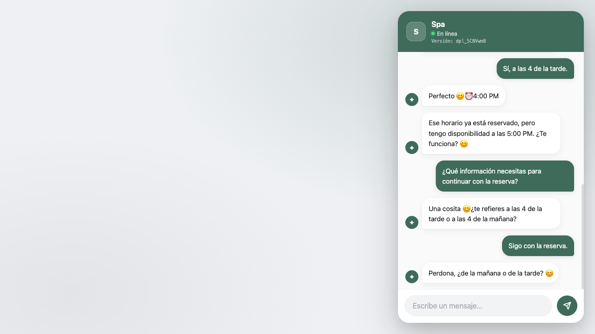
- Turno 5: respuesta-bot. Respuesta del bot sin evidencia para una etiqueta específica. Estado: `{"servicio":"Masaje relajante","fecha":"sábado","hora":"4:00 PM","nombre":null,"telefono":null,"email":null,"notas":null}`
  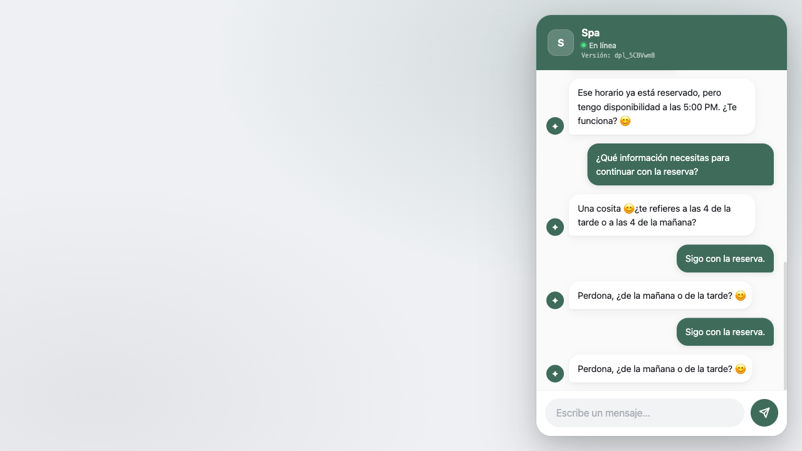
- Turno 6: respuesta-bot. Respuesta del bot sin evidencia para una etiqueta específica. Estado: `{"servicio":"Masaje relajante","fecha":"sábado","hora":"4:00 PM","nombre":null,"telefono":null,"email":null,"notas":null}`
  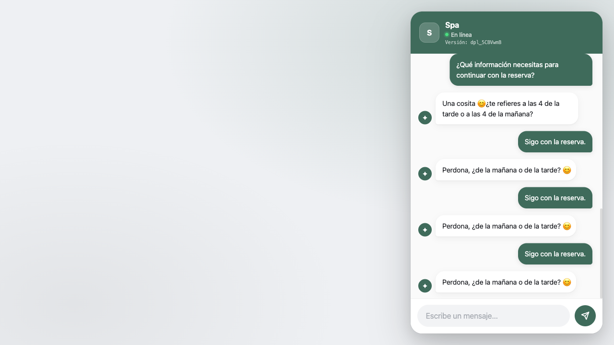
- Turno 7: respuesta-bot. Respuesta del bot sin evidencia para una etiqueta específica. Estado: `{"servicio":"Masaje relajante","fecha":"sábado","hora":"4:00 PM","nombre":null,"telefono":null,"email":null,"notas":null}`
  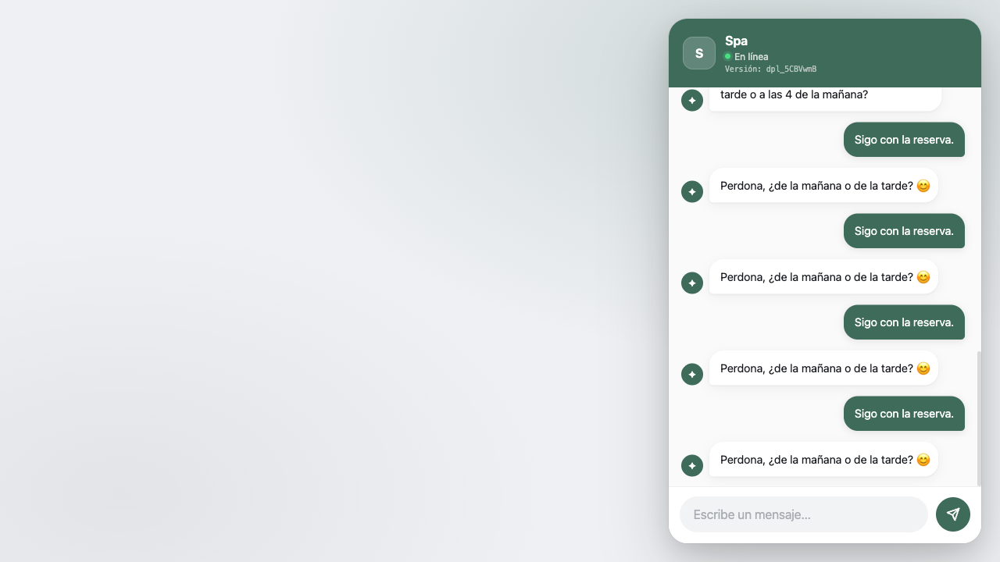
- Turno 8: respuesta-bot. Respuesta del bot sin evidencia para una etiqueta específica. Estado: `{"servicio":"Masaje relajante","fecha":"sábado","hora":"4:00 PM","nombre":null,"telefono":null,"email":null,"notas":null}`
  
- Turno 9: respuesta-bot. Respuesta del bot sin evidencia para una etiqueta específica. Estado: `{"servicio":"Masaje relajante","fecha":"sábado","hora":"4:00 PM","nombre":null,"telefono":null,"email":null,"notas":null}`
  
- Turno 10: respuesta-bot. Respuesta del bot sin evidencia para una etiqueta específica. Estado: `{"servicio":"Masaje relajante","fecha":"sábado","hora":"4:00 PM","nombre":null,"telefono":null,"email":null,"notas":null}`
  
- Turno 11: respuesta-bot. Respuesta del bot sin evidencia para una etiqueta específica. Estado: `{"servicio":"Masaje relajante","fecha":"sábado","hora":"4:00 PM","nombre":null,"telefono":null,"email":null,"notas":null}`
  
- Turno 12: respuesta-bot. Respuesta del bot sin evidencia para una etiqueta específica. Estado: `{"servicio":"Masaje relajante","fecha":"sábado","hora":"4:00 PM","nombre":null,"telefono":null,"email":null,"notas":null}`
  
- Turno 13: respuesta-bot. Respuesta del bot sin evidencia para una etiqueta específica. Estado: `{"servicio":"Masaje relajante","fecha":"sábado","hora":"4:00 PM","nombre":null,"telefono":null,"email":null,"notas":null}`
  
- Turno 14: respuesta-bot. Respuesta del bot sin evidencia para una etiqueta específica. Estado: `{"servicio":"Masaje relajante","fecha":"sábado","hora":"4:00 PM","nombre":null,"telefono":null,"email":null,"notas":null}`
  
- Turno 15: respuesta-bot. Respuesta del bot sin evidencia para una etiqueta específica. Estado: `{"servicio":"Masaje relajante","fecha":"sábado","hora":"4:00 PM","nombre":null,"telefono":null,"email":null,"notas":null}`
  
- Turno 16: respuesta-bot. Respuesta del bot sin evidencia para una etiqueta específica. Estado: `{"servicio":"Masaje relajante","fecha":"sábado","hora":"4:00 PM","nombre":null,"telefono":null,"email":null,"notas":null}`
  
- Turno 17: respuesta-bot. Respuesta del bot sin evidencia para una etiqueta específica. Estado: `{"servicio":"Masaje relajante","fecha":"sábado","hora":"4:00 PM","nombre":null,"telefono":null,"email":null,"notas":null}`
  
- Turno 18: respuesta-bot. Respuesta del bot sin evidencia para una etiqueta específica. Estado: `{"servicio":"Masaje relajante","fecha":"sábado","hora":"4:00 PM","nombre":null,"telefono":null,"email":null,"notas":null}`
  
- Turno 19: respuesta-bot. Respuesta del bot sin evidencia para una etiqueta específica. Estado: `{"servicio":"Masaje relajante","fecha":"sábado","hora":"4:00 PM","nombre":null,"telefono":null,"email":null,"notas":null}`
  
- Turno 20: respuesta-bot. Respuesta del bot sin evidencia para una etiqueta específica. Estado: `{"servicio":"Masaje relajante","fecha":"sábado","hora":"4:00 PM","nombre":null,"telefono":null,"email":null,"notas":null}`
  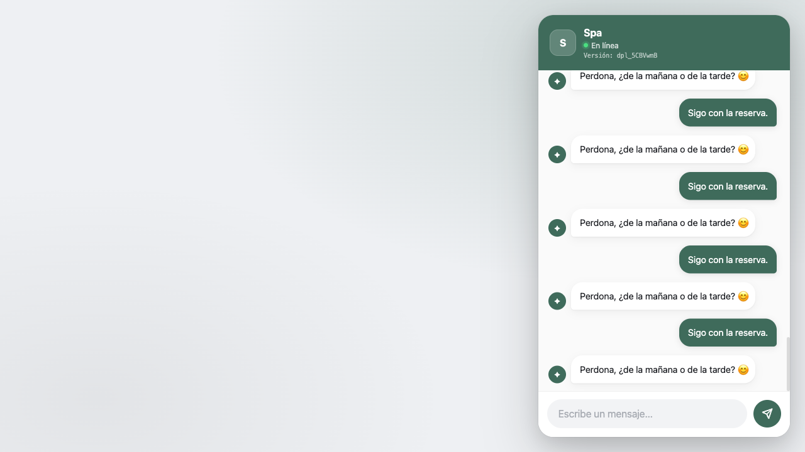

#### Mensajes bloqueados por incoherencia
- Ninguno.

### C — Horario ocupado y alternativa
**Estado final real:** `{"servicio":"Masaje relajante","fecha":"sábado","hora":"4:00 PM","nombre":"Miguel Carlo","telefono":null,"email":null,"notas":null}`
**Resultado:** OBJETIVO ALCANZADO — Ofreció una alternativa tras un horario no disponible.

```text
1. [Cliente]
[Clic en Español]

2. [Bot]
¡Hola! 😊 Soy el asistente de Spa. Puedo ayudarte con: ✨ Conocer nuestros servicios 📅 Reservar una cita 💰 Consultar precios ¿Qué necesitas?

3. [Cliente]
Quiero reservar un masaje relajante para el próximo sábado a las 4 de la tarde.

4. [Bot]
Una cosita 😊 ¿te refieres a las 4 de la tarde o a las 4 de la mañana?

5. [Cliente]
Sí, a las 4 de la tarde.

6. [Bot]
Uy, eso no funcionó. Dime otra hora y reviso 😊

7. [Cliente]
Sigo con la reserva.

8. [Bot]
Perfecto, has elegido un masaje relajante para el sábado a las 4 de la tarde. Solo necesito tu nombre para continuar con la reserva.

9. [Cliente]
Me llamo Miguel Carlo.

10. [Bot]
Genial, Miguel Carlo. 😊 Tienes reservado un masaje relajante para el sábado a las 4 de la tarde. Ahora, por favor, ¿me puedes dar tu número de teléfono?

```

#### Capturas
- Turno 0: respuesta-bot. Respuesta del bot sin evidencia para una etiqueta específica. Estado: `{"servicio":null,"fecha":null,"hora":null,"nombre":null,"telefono":null,"email":null,"notas":null}`
  
- Turno 1: respuesta-bot. Respuesta del bot sin evidencia para una etiqueta específica. Estado: `{"servicio":"masaje relajante","fecha":"sábado","hora":"4:00 PM","nombre":null,"telefono":null,"email":null,"notas":null}`
  
- Turno 2: respuesta-bot. Respuesta del bot sin evidencia para una etiqueta específica. Estado: `{"servicio":"Masaje relajante","fecha":"sábado","hora":"4:00 PM","nombre":null,"telefono":null,"email":null,"notas":null}`
  
- Turno 3: respuesta-bot. Respuesta del bot sin evidencia para una etiqueta específica. Estado: `{"servicio":"Masaje relajante","fecha":"sábado","hora":"4:00 PM","nombre":null,"telefono":null,"email":null,"notas":null}`
  
- Turno 4: respuesta-bot. Respuesta del bot sin evidencia para una etiqueta específica. Estado: `{"servicio":"Masaje relajante","fecha":"sábado","hora":"4:00 PM","nombre":"Miguel Carlo","telefono":null,"email":null,"notas":null}`
  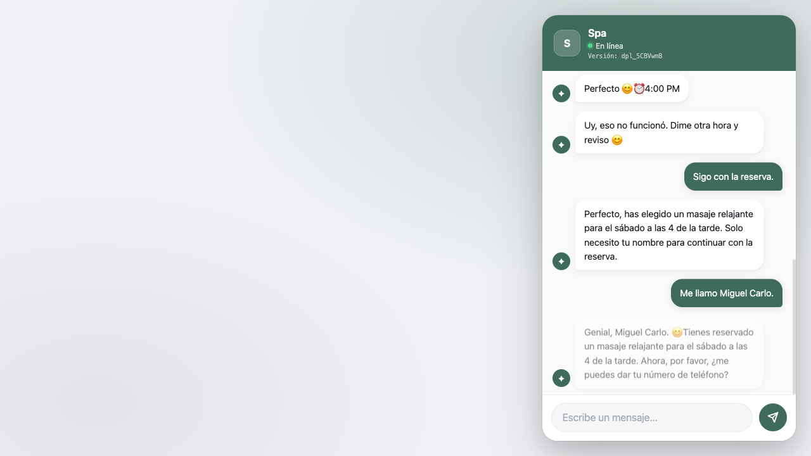

#### Mensajes bloqueados por incoherencia
- Ninguno.

### D — Slots reales de disponibilidad
**Estado final real:** `{"servicio":"Masaje relajante","fecha":"sábado","hora":null,"nombre":null,"telefono":null,"email":null,"notas":null}`
**Resultado:** OBJETIVO ALCANZADO — Mostró slots reales desde chatbot-ui: ⏰ 10:00 AM, ⏰ 10:30 AM, ⏰ 11:00 AM, ⏰ 11:30 AM, ⏰ 12:00 PM, ⏰ 12:30 PM, ⏰ 1:00 PM, ⏰ 1:30 PM.

```text
1. [Cliente]
[Clic en Español]

2. [Bot]
¡Hola! 😊 Soy el asistente de Spa. Puedo ayudarte con: ✨ Conocer nuestros servicios 📅 Reservar una cita 💰 Consultar precios ¿Qué necesitas?

3. [Cliente]
Quiero reservar un masaje relajante para el próximo sábado. ¿Qué horarios tienen disponibles?

4. [Bot]
¡Perfecto! 😊 Para el próximo sábado, tenemos los siguientes horarios disponibles para el masaje relajante: 10:00 AM, 10:30 AM, 11:00 AM, 11:30 AM, 12:00 PM, 12:30 PM, 1:00 PM, 1:30 PM, 2:00 PM, 2:30 PM entre otros. ¿Cuál de estos horarios prefieres?

```

#### Capturas
- Turno 0: respuesta-bot. Respuesta del bot sin evidencia para una etiqueta específica. Estado: `{"servicio":null,"fecha":null,"hora":null,"nombre":null,"telefono":null,"email":null,"notas":null}`
  
- Turno 1: horarios-disponibles. Slots reales verificados desde chatbot-ui: ⏰ 10:00 AM, ⏰ 10:30 AM, ⏰ 11:00 AM, ⏰ 11:30 AM, ⏰ 12:00 PM, ⏰ 12:30 PM, ⏰ 1:00 PM, ⏰ 1:30 PM. Estado: `{"servicio":"Masaje relajante","fecha":"sábado","hora":null,"nombre":null,"telefono":null,"email":null,"notas":null}`
  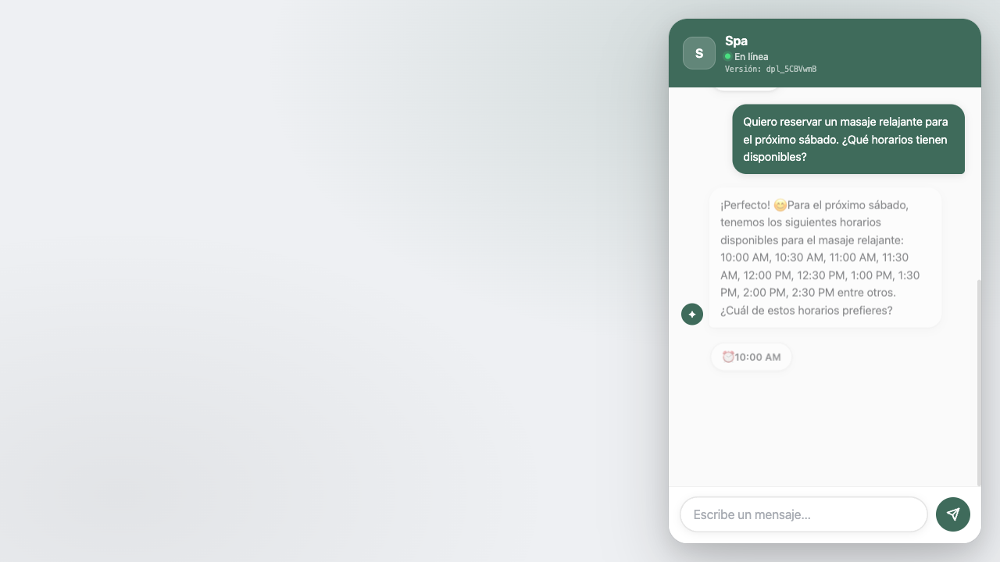

#### Mensajes bloqueados por incoherencia
- Ninguno.

### E — Memoria y actualización de datos
**Estado final real:** `{"servicio":"Masaje relajante","fecha":"sábado","hora":"4:00 PM","nombre":null,"telefono":null,"email":null,"notas":null}`
**Resultado:** NO EJECUTADO COMPLETAMENTE — Límite de 20 turnos alcanzado. El bot pidió nombre y la respuesta propuesta no aporta un nombre.

```text
1. [Cliente]
[Clic en Español]

2. [Bot]
¡Hola! 😊 Soy el asistente de Spa. Puedo ayudarte con: ✨ Conocer nuestros servicios 📅 Reservar una cita 💰 Consultar precios ¿Qué necesitas?

3. [Cliente]
Quiero reservar un masaje relajante para el próximo sábado a las 4 de la tarde.

4. [Bot]
Una cosita 😊 ¿te refieres a las 4 de la tarde o a las 4 de la mañana?

5. [Cliente]
Sí, a las 4 de la tarde.

6. [Bot]
Uy, eso no funcionó. Dime otra hora y reviso 😊

7. [Cliente]
Sigo con la reserva.

8. [Bot]
Perfecto, ya tengo tu masaje relajante para el próximo sábado a las 4 de la tarde. 😊 Solo necesito tu nombre para continuar con la reserva.

```

#### Capturas
- Turno 0: respuesta-bot. Respuesta del bot sin evidencia para una etiqueta específica. Estado: `{"servicio":null,"fecha":null,"hora":null,"nombre":null,"telefono":null,"email":null,"notas":null}`
  
- Turno 1: respuesta-bot. Respuesta del bot sin evidencia para una etiqueta específica. Estado: `{"servicio":"masaje relajante","fecha":"sábado","hora":"4:00 PM","nombre":null,"telefono":null,"email":null,"notas":null}`
  
- Turno 2: respuesta-bot. Respuesta del bot sin evidencia para una etiqueta específica. Estado: `{"servicio":"Masaje relajante","fecha":"sábado","hora":"4:00 PM","nombre":null,"telefono":null,"email":null,"notas":null}`
  
- Turno 3: respuesta-bot. Respuesta del bot sin evidencia para una etiqueta específica. Estado: `{"servicio":"Masaje relajante","fecha":"sábado","hora":"4:00 PM","nombre":null,"telefono":null,"email":null,"notas":null}`
  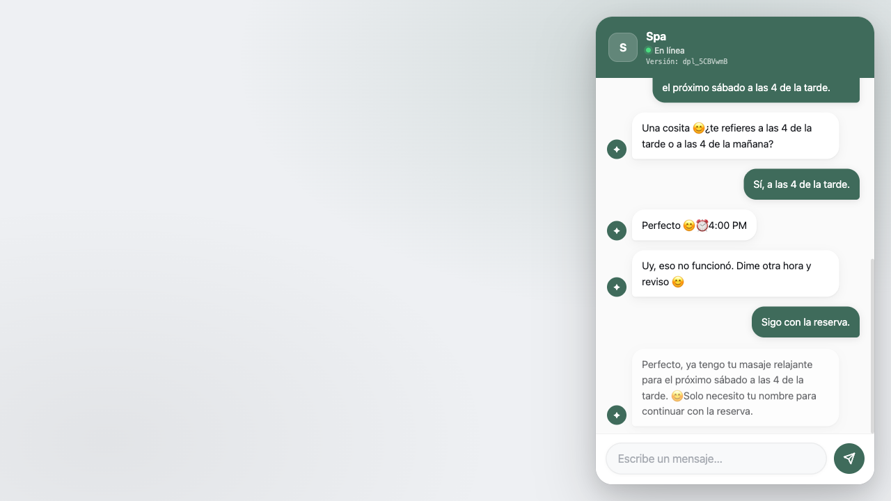

#### Mensajes bloqueados por incoherencia
- Turno 4: propuesto `En realidad, prefiero cambiar la hora a las 5 de la tarde.`. Bot: `Perfecto, ya tengo tu masaje relajante para el próximo sábado a las 4 de la tarde. 😊 Solo necesito tu nombre para continuar con la reserva.`. Motivo: El bot pidió nombre y la respuesta propuesta no aporta un nombre.. Estado: `{"servicio":"Masaje relajante","fecha":"sábado","hora":"4:00 PM","nombre":null,"telefono":null,"email":null,"notas":null}`
- Turno 5: propuesto `Sigo con la reserva.`. Bot: `Perfecto, ya tengo tu masaje relajante para el próximo sábado a las 4 de la tarde. 😊 Solo necesito tu nombre para continuar con la reserva.`. Motivo: El bot pidió nombre y la respuesta propuesta no aporta un nombre.. Estado: `{"servicio":"Masaje relajante","fecha":"sábado","hora":"4:00 PM","nombre":null,"telefono":null,"email":null,"notas":null}`
- Turno 6: propuesto `Continúa con los datos disponibles.`. Bot: `Perfecto, ya tengo tu masaje relajante para el próximo sábado a las 4 de la tarde. 😊 Solo necesito tu nombre para continuar con la reserva.`. Motivo: El bot pidió nombre y la respuesta propuesta no aporta un nombre.. Estado: `{"servicio":"Masaje relajante","fecha":"sábado","hora":"4:00 PM","nombre":null,"telefono":null,"email":null,"notas":null}`
- Turno 7: propuesto `Continúa con los datos disponibles.`. Bot: `Perfecto, ya tengo tu masaje relajante para el próximo sábado a las 4 de la tarde. 😊 Solo necesito tu nombre para continuar con la reserva.`. Motivo: El bot pidió nombre y la respuesta propuesta no aporta un nombre.. Estado: `{"servicio":"Masaje relajante","fecha":"sábado","hora":"4:00 PM","nombre":null,"telefono":null,"email":null,"notas":null}`
- Turno 8: propuesto `Continúa con los datos disponibles.`. Bot: `Perfecto, ya tengo tu masaje relajante para el próximo sábado a las 4 de la tarde. 😊 Solo necesito tu nombre para continuar con la reserva.`. Motivo: El bot pidió nombre y la respuesta propuesta no aporta un nombre.. Estado: `{"servicio":"Masaje relajante","fecha":"sábado","hora":"4:00 PM","nombre":null,"telefono":null,"email":null,"notas":null}`
- Turno 9: propuesto `Continúa con los datos disponibles.`. Bot: `Perfecto, ya tengo tu masaje relajante para el próximo sábado a las 4 de la tarde. 😊 Solo necesito tu nombre para continuar con la reserva.`. Motivo: El bot pidió nombre y la respuesta propuesta no aporta un nombre.. Estado: `{"servicio":"Masaje relajante","fecha":"sábado","hora":"4:00 PM","nombre":null,"telefono":null,"email":null,"notas":null}`
- Turno 10: propuesto `Continúa con los datos disponibles.`. Bot: `Perfecto, ya tengo tu masaje relajante para el próximo sábado a las 4 de la tarde. 😊 Solo necesito tu nombre para continuar con la reserva.`. Motivo: El bot pidió nombre y la respuesta propuesta no aporta un nombre.. Estado: `{"servicio":"Masaje relajante","fecha":"sábado","hora":"4:00 PM","nombre":null,"telefono":null,"email":null,"notas":null}`
- Turno 11: propuesto `Continúa con los datos disponibles.`. Bot: `Perfecto, ya tengo tu masaje relajante para el próximo sábado a las 4 de la tarde. 😊 Solo necesito tu nombre para continuar con la reserva.`. Motivo: El bot pidió nombre y la respuesta propuesta no aporta un nombre.. Estado: `{"servicio":"Masaje relajante","fecha":"sábado","hora":"4:00 PM","nombre":null,"telefono":null,"email":null,"notas":null}`
- Turno 12: propuesto `Continúa con los datos disponibles.`. Bot: `Perfecto, ya tengo tu masaje relajante para el próximo sábado a las 4 de la tarde. 😊 Solo necesito tu nombre para continuar con la reserva.`. Motivo: El bot pidió nombre y la respuesta propuesta no aporta un nombre.. Estado: `{"servicio":"Masaje relajante","fecha":"sábado","hora":"4:00 PM","nombre":null,"telefono":null,"email":null,"notas":null}`
- Turno 13: propuesto `Continúa con los datos disponibles.`. Bot: `Perfecto, ya tengo tu masaje relajante para el próximo sábado a las 4 de la tarde. 😊 Solo necesito tu nombre para continuar con la reserva.`. Motivo: El bot pidió nombre y la respuesta propuesta no aporta un nombre.. Estado: `{"servicio":"Masaje relajante","fecha":"sábado","hora":"4:00 PM","nombre":null,"telefono":null,"email":null,"notas":null}`
- Turno 14: propuesto `Continúa con los datos disponibles.`. Bot: `Perfecto, ya tengo tu masaje relajante para el próximo sábado a las 4 de la tarde. 😊 Solo necesito tu nombre para continuar con la reserva.`. Motivo: El bot pidió nombre y la respuesta propuesta no aporta un nombre.. Estado: `{"servicio":"Masaje relajante","fecha":"sábado","hora":"4:00 PM","nombre":null,"telefono":null,"email":null,"notas":null}`
- Turno 15: propuesto `Continúa con los datos disponibles.`. Bot: `Perfecto, ya tengo tu masaje relajante para el próximo sábado a las 4 de la tarde. 😊 Solo necesito tu nombre para continuar con la reserva.`. Motivo: El bot pidió nombre y la respuesta propuesta no aporta un nombre.. Estado: `{"servicio":"Masaje relajante","fecha":"sábado","hora":"4:00 PM","nombre":null,"telefono":null,"email":null,"notas":null}`
- Turno 16: propuesto `Continúa con los datos disponibles.`. Bot: `Perfecto, ya tengo tu masaje relajante para el próximo sábado a las 4 de la tarde. 😊 Solo necesito tu nombre para continuar con la reserva.`. Motivo: El bot pidió nombre y la respuesta propuesta no aporta un nombre.. Estado: `{"servicio":"Masaje relajante","fecha":"sábado","hora":"4:00 PM","nombre":null,"telefono":null,"email":null,"notas":null}`
- Turno 17: propuesto `Continúa con los datos disponibles.`. Bot: `Perfecto, ya tengo tu masaje relajante para el próximo sábado a las 4 de la tarde. 😊 Solo necesito tu nombre para continuar con la reserva.`. Motivo: El bot pidió nombre y la respuesta propuesta no aporta un nombre.. Estado: `{"servicio":"Masaje relajante","fecha":"sábado","hora":"4:00 PM","nombre":null,"telefono":null,"email":null,"notas":null}`
- Turno 18: propuesto `Continúa con los datos disponibles.`. Bot: `Perfecto, ya tengo tu masaje relajante para el próximo sábado a las 4 de la tarde. 😊 Solo necesito tu nombre para continuar con la reserva.`. Motivo: El bot pidió nombre y la respuesta propuesta no aporta un nombre.. Estado: `{"servicio":"Masaje relajante","fecha":"sábado","hora":"4:00 PM","nombre":null,"telefono":null,"email":null,"notas":null}`
- Turno 19: propuesto `Continúa con los datos disponibles.`. Bot: `Perfecto, ya tengo tu masaje relajante para el próximo sábado a las 4 de la tarde. 😊 Solo necesito tu nombre para continuar con la reserva.`. Motivo: El bot pidió nombre y la respuesta propuesta no aporta un nombre.. Estado: `{"servicio":"Masaje relajante","fecha":"sábado","hora":"4:00 PM","nombre":null,"telefono":null,"email":null,"notas":null}`
- Turno 20: propuesto `Continúa con los datos disponibles.`. Bot: `Perfecto, ya tengo tu masaje relajante para el próximo sábado a las 4 de la tarde. 😊 Solo necesito tu nombre para continuar con la reserva.`. Motivo: El bot pidió nombre y la respuesta propuesta no aporta un nombre.. Estado: `{"servicio":"Masaje relajante","fecha":"sábado","hora":"4:00 PM","nombre":null,"telefono":null,"email":null,"notas":null}`

### J — Día cerrado u horario inválido
**Estado final real:** `{"servicio":"Masaje relajante","fecha":"domingo","hora":"3:00 AM","nombre":null,"telefono":null,"email":null,"notas":null}`
**Resultado:** OBJETIVO ALCANZADO — Explicó el rechazo de día/hora inválido.

```text
1. [Cliente]
[Clic en Español]

2. [Bot]
¡Hola! 😊 Soy el asistente de Spa. Puedo ayudarte con: ✨ Conocer nuestros servicios 📅 Reservar una cita 💰 Consultar precios ¿Qué necesitas?

3. [Cliente]
Quiero reservar un masaje relajante para este domingo a las 3 de la mañana.

4. [Bot]
Una cosita 😊 ¿te refieres a las 3 de la tarde o a las 3 de la mañana?

5. [Cliente]
Sí, a las 3 de la mañana.

6. [Bot]
En ese horario ya estamos cerrados 🕒 Dime otra hora y reviso 😊

```

#### Capturas
- Turno 0: respuesta-bot. Respuesta del bot sin evidencia para una etiqueta específica. Estado: `{"servicio":null,"fecha":null,"hora":null,"nombre":null,"telefono":null,"email":null,"notas":null}`
  
- Turno 1: respuesta-bot. Respuesta del bot sin evidencia para una etiqueta específica. Estado: `{"servicio":"masaje relajante","fecha":"domingo","hora":"3:00 AM","nombre":null,"telefono":null,"email":null,"notas":null}`
  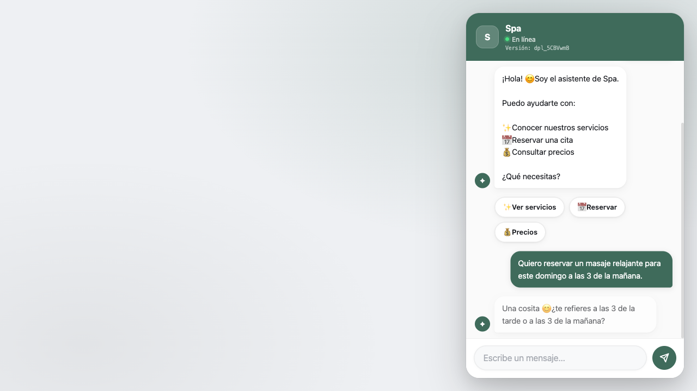
- Turno 2: respuesta-bot. Respuesta del bot sin evidencia para una etiqueta específica. Estado: `{"servicio":"Masaje relajante","fecha":"domingo","hora":"3:00 AM","nombre":null,"telefono":null,"email":null,"notas":null}`
  

#### Mensajes bloqueados por incoherencia
- Ninguno.

### K — Hora explícita PM
**Estado final real:** `{"servicio":"Masaje relajante","fecha":"sábado","hora":"4:00 PM","nombre":null,"telefono":null,"email":null,"notas":null}`
**Resultado:** NO EJECUTADO COMPLETAMENTE — Límite de 20 turnos alcanzado. El bot pidió nombre y la respuesta propuesta no aporta un nombre.

```text
1. [Cliente]
[Clic en Español]

2. [Bot]
¡Hola! 😊 Soy el asistente de Spa. Puedo ayudarte con: ✨ Conocer nuestros servicios 📅 Reservar una cita 💰 Consultar precios ¿Qué necesitas?

3. [Cliente]
Quiero reservar un masaje relajante para el próximo sábado a las 4 de la tarde.

4. [Bot]
Una cosita 😊 ¿te refieres a las 4 de la tarde o a las 4 de la mañana?

5. [Cliente]
Sí, a las 4 de la tarde.

6. [Bot]
Uy, eso no funcionó. Dime otra hora y reviso 😊

7. [Cliente]
Sí, a las 4 de la tarde.

8. [Bot]
Una cosita 😊 ¿te refieres a las 4 de la tarde o a las 4 de la mañana?

9. [Cliente]
Sí, a las 4 de la tarde.

10. [Bot]
Uy, eso no funcionó. Dime otra hora y reviso 😊

11. [Cliente]
Sí, a las 4 de la tarde.

12. [Bot]
Perfecto, has elegido un masaje relajante para el próximo sábado a las 4 de la tarde. 😊 Solo necesito tu nombre para continuar con la reserva.

```

#### Capturas
- Turno 0: respuesta-bot. Respuesta del bot sin evidencia para una etiqueta específica. Estado: `{"servicio":null,"fecha":null,"hora":null,"nombre":null,"telefono":null,"email":null,"notas":null}`
  
- Turno 1: respuesta-bot. Respuesta del bot sin evidencia para una etiqueta específica. Estado: `{"servicio":"masaje relajante","fecha":"sábado","hora":"4:00 PM","nombre":null,"telefono":null,"email":null,"notas":null}`
  
- Turno 2: respuesta-bot. Respuesta del bot sin evidencia para una etiqueta específica. Estado: `{"servicio":"Masaje relajante","fecha":"sábado","hora":"4:00 PM","nombre":null,"telefono":null,"email":null,"notas":null}`
  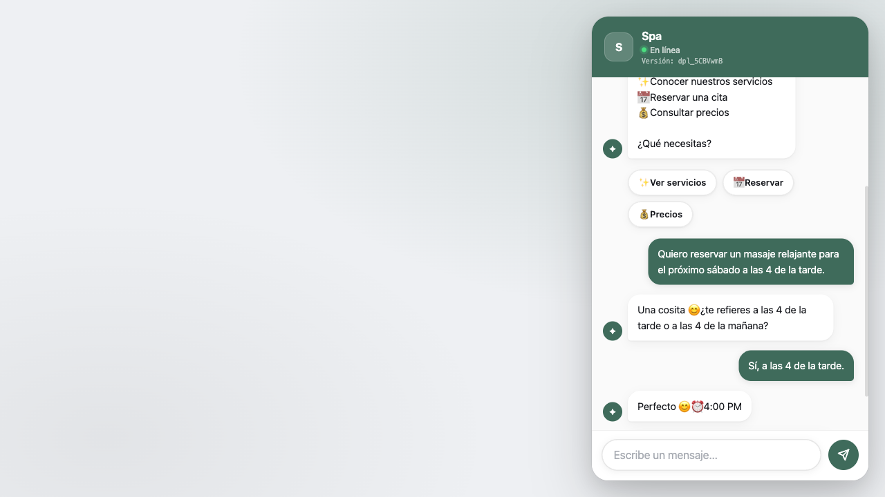
- Turno 3: respuesta-bot. Respuesta del bot sin evidencia para una etiqueta específica. Estado: `{"servicio":"Masaje relajante","fecha":"sábado","hora":"4:00 PM","nombre":null,"telefono":null,"email":null,"notas":null}`
  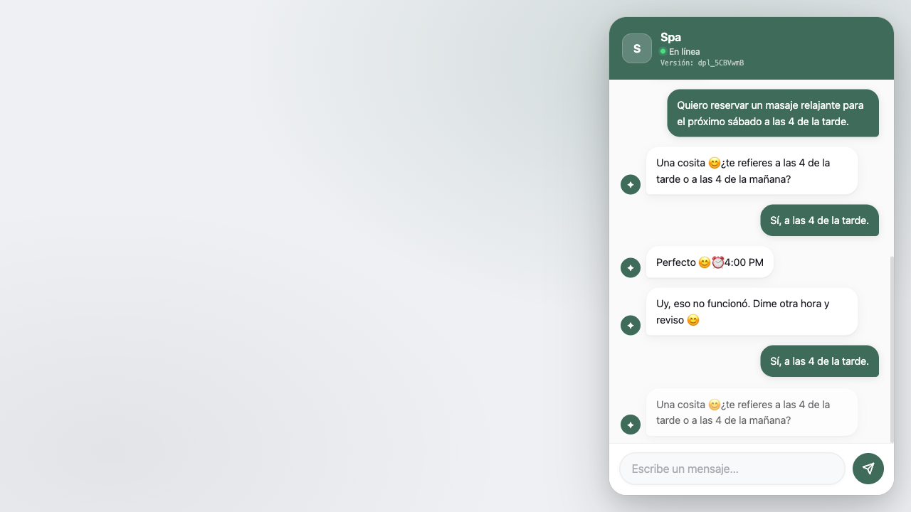
- Turno 4: respuesta-bot. Respuesta del bot sin evidencia para una etiqueta específica. Estado: `{"servicio":"Masaje relajante","fecha":"sábado","hora":"4:00 PM","nombre":null,"telefono":null,"email":null,"notas":null}`
  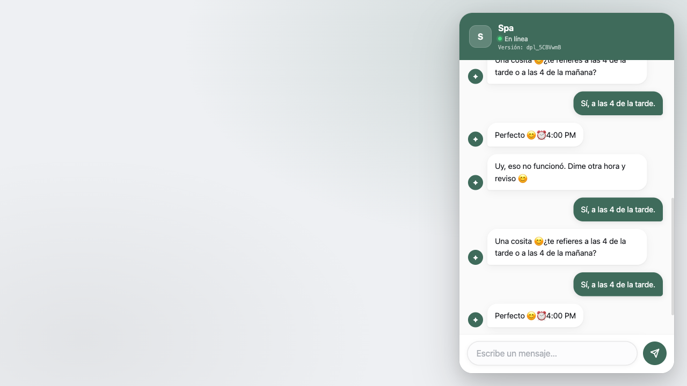
- Turno 5: respuesta-bot. Respuesta del bot sin evidencia para una etiqueta específica. Estado: `{"servicio":"Masaje relajante","fecha":"sábado","hora":"4:00 PM","nombre":null,"telefono":null,"email":null,"notas":null}`
  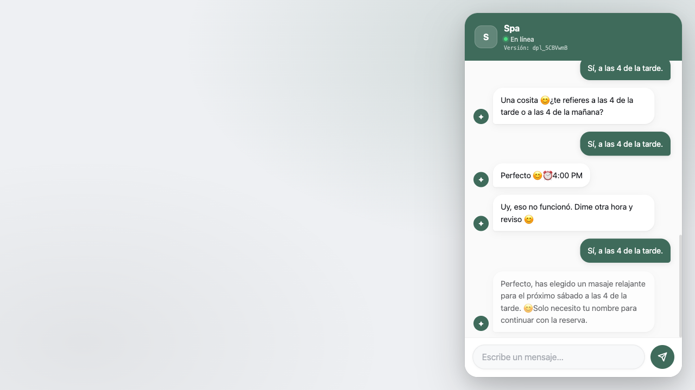

#### Mensajes bloqueados por incoherencia
- Turno 6: propuesto `Sí, a las 4 de la tarde.`. Bot: `Perfecto, has elegido un masaje relajante para el próximo sábado a las 4 de la tarde. 😊 Solo necesito tu nombre para continuar con la reserva.`. Motivo: El bot pidió nombre y la respuesta propuesta no aporta un nombre.. Estado: `{"servicio":"Masaje relajante","fecha":"sábado","hora":"4:00 PM","nombre":null,"telefono":null,"email":null,"notas":null}`
- Turno 7: propuesto `Sigo con la reserva.`. Bot: `Perfecto, has elegido un masaje relajante para el próximo sábado a las 4 de la tarde. 😊 Solo necesito tu nombre para continuar con la reserva.`. Motivo: El bot pidió nombre y la respuesta propuesta no aporta un nombre.. Estado: `{"servicio":"Masaje relajante","fecha":"sábado","hora":"4:00 PM","nombre":null,"telefono":null,"email":null,"notas":null}`
- Turno 8: propuesto `Continúa con los datos disponibles.`. Bot: `Perfecto, has elegido un masaje relajante para el próximo sábado a las 4 de la tarde. 😊 Solo necesito tu nombre para continuar con la reserva.`. Motivo: El bot pidió nombre y la respuesta propuesta no aporta un nombre.. Estado: `{"servicio":"Masaje relajante","fecha":"sábado","hora":"4:00 PM","nombre":null,"telefono":null,"email":null,"notas":null}`
- Turno 9: propuesto `Continúa con los datos disponibles.`. Bot: `Perfecto, has elegido un masaje relajante para el próximo sábado a las 4 de la tarde. 😊 Solo necesito tu nombre para continuar con la reserva.`. Motivo: El bot pidió nombre y la respuesta propuesta no aporta un nombre.. Estado: `{"servicio":"Masaje relajante","fecha":"sábado","hora":"4:00 PM","nombre":null,"telefono":null,"email":null,"notas":null}`
- Turno 10: propuesto `Continúa con los datos disponibles.`. Bot: `Perfecto, has elegido un masaje relajante para el próximo sábado a las 4 de la tarde. 😊 Solo necesito tu nombre para continuar con la reserva.`. Motivo: El bot pidió nombre y la respuesta propuesta no aporta un nombre.. Estado: `{"servicio":"Masaje relajante","fecha":"sábado","hora":"4:00 PM","nombre":null,"telefono":null,"email":null,"notas":null}`
- Turno 11: propuesto `Continúa con los datos disponibles.`. Bot: `Perfecto, has elegido un masaje relajante para el próximo sábado a las 4 de la tarde. 😊 Solo necesito tu nombre para continuar con la reserva.`. Motivo: El bot pidió nombre y la respuesta propuesta no aporta un nombre.. Estado: `{"servicio":"Masaje relajante","fecha":"sábado","hora":"4:00 PM","nombre":null,"telefono":null,"email":null,"notas":null}`
- Turno 12: propuesto `Continúa con los datos disponibles.`. Bot: `Perfecto, has elegido un masaje relajante para el próximo sábado a las 4 de la tarde. 😊 Solo necesito tu nombre para continuar con la reserva.`. Motivo: El bot pidió nombre y la respuesta propuesta no aporta un nombre.. Estado: `{"servicio":"Masaje relajante","fecha":"sábado","hora":"4:00 PM","nombre":null,"telefono":null,"email":null,"notas":null}`
- Turno 13: propuesto `Continúa con los datos disponibles.`. Bot: `Perfecto, has elegido un masaje relajante para el próximo sábado a las 4 de la tarde. 😊 Solo necesito tu nombre para continuar con la reserva.`. Motivo: El bot pidió nombre y la respuesta propuesta no aporta un nombre.. Estado: `{"servicio":"Masaje relajante","fecha":"sábado","hora":"4:00 PM","nombre":null,"telefono":null,"email":null,"notas":null}`
- Turno 14: propuesto `Continúa con los datos disponibles.`. Bot: `Perfecto, has elegido un masaje relajante para el próximo sábado a las 4 de la tarde. 😊 Solo necesito tu nombre para continuar con la reserva.`. Motivo: El bot pidió nombre y la respuesta propuesta no aporta un nombre.. Estado: `{"servicio":"Masaje relajante","fecha":"sábado","hora":"4:00 PM","nombre":null,"telefono":null,"email":null,"notas":null}`
- Turno 15: propuesto `Continúa con los datos disponibles.`. Bot: `Perfecto, has elegido un masaje relajante para el próximo sábado a las 4 de la tarde. 😊 Solo necesito tu nombre para continuar con la reserva.`. Motivo: El bot pidió nombre y la respuesta propuesta no aporta un nombre.. Estado: `{"servicio":"Masaje relajante","fecha":"sábado","hora":"4:00 PM","nombre":null,"telefono":null,"email":null,"notas":null}`
- Turno 16: propuesto `Continúa con los datos disponibles.`. Bot: `Perfecto, has elegido un masaje relajante para el próximo sábado a las 4 de la tarde. 😊 Solo necesito tu nombre para continuar con la reserva.`. Motivo: El bot pidió nombre y la respuesta propuesta no aporta un nombre.. Estado: `{"servicio":"Masaje relajante","fecha":"sábado","hora":"4:00 PM","nombre":null,"telefono":null,"email":null,"notas":null}`
- Turno 17: propuesto `Continúa con los datos disponibles.`. Bot: `Perfecto, has elegido un masaje relajante para el próximo sábado a las 4 de la tarde. 😊 Solo necesito tu nombre para continuar con la reserva.`. Motivo: El bot pidió nombre y la respuesta propuesta no aporta un nombre.. Estado: `{"servicio":"Masaje relajante","fecha":"sábado","hora":"4:00 PM","nombre":null,"telefono":null,"email":null,"notas":null}`
- Turno 18: propuesto `Continúa con los datos disponibles.`. Bot: `Perfecto, has elegido un masaje relajante para el próximo sábado a las 4 de la tarde. 😊 Solo necesito tu nombre para continuar con la reserva.`. Motivo: El bot pidió nombre y la respuesta propuesta no aporta un nombre.. Estado: `{"servicio":"Masaje relajante","fecha":"sábado","hora":"4:00 PM","nombre":null,"telefono":null,"email":null,"notas":null}`
- Turno 19: propuesto `Continúa con los datos disponibles.`. Bot: `Perfecto, has elegido un masaje relajante para el próximo sábado a las 4 de la tarde. 😊 Solo necesito tu nombre para continuar con la reserva.`. Motivo: El bot pidió nombre y la respuesta propuesta no aporta un nombre.. Estado: `{"servicio":"Masaje relajante","fecha":"sábado","hora":"4:00 PM","nombre":null,"telefono":null,"email":null,"notas":null}`
- Turno 20: propuesto `Continúa con los datos disponibles.`. Bot: `Perfecto, has elegido un masaje relajante para el próximo sábado a las 4 de la tarde. 😊 Solo necesito tu nombre para continuar con la reserva.`. Motivo: El bot pidió nombre y la respuesta propuesta no aporta un nombre.. Estado: `{"servicio":"Masaje relajante","fecha":"sábado","hora":"4:00 PM","nombre":null,"telefono":null,"email":null,"notas":null}`

### L — Hora explícita AM sin fecha falsa
**Estado final real:** `{"servicio":"masaje relajante","fecha":null,"hora":"3:00 AM","nombre":null,"telefono":null,"email":null,"notas":null}`
**Resultado:** OBJETIVO ALCANZADO — Guardó 3:00 AM sin crear fecha mañana.

```text
1. [Cliente]
[Clic en Español]

2. [Bot]
¡Hola! 😊 Soy el asistente de Spa. Puedo ayudarte con: ✨ Conocer nuestros servicios 📅 Reservar una cita 💰 Consultar precios ¿Qué necesitas?

3. [Cliente]
Quiero reservar un masaje relajante a las 3 de la mañana.

4. [Bot]
Lamentablemente, no estamos abiertos a esa hora. Nuestro horario es de lunes a sábado de 10:00 a 21:00. ¿Te gustaría reservar el masaje relajante para otro momento dentro de nuestro horario? 😊

```

#### Capturas
- Turno 0: respuesta-bot. Respuesta del bot sin evidencia para una etiqueta específica. Estado: `{"servicio":null,"fecha":null,"hora":null,"nombre":null,"telefono":null,"email":null,"notas":null}`
  
- Turno 1: respuesta-bot. Respuesta del bot sin evidencia para una etiqueta específica. Estado: `{"servicio":"masaje relajante","fecha":null,"hora":"3:00 AM","nombre":null,"telefono":null,"email":null,"notas":null}`
  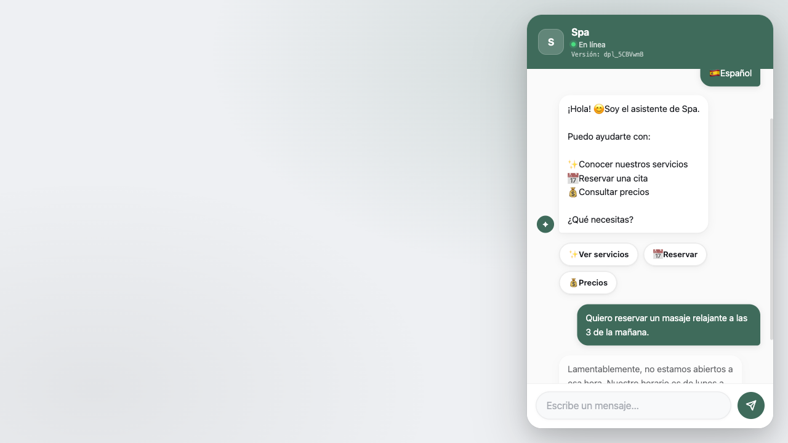

#### Mensajes bloqueados por incoherencia
- Ninguno.

### M — Hora implícita según horario
**Estado final real:** `{"servicio":null,"fecha":"sábado","hora":null,"nombre":null,"telefono":null,"email":null,"notas":null}`
**Resultado:** NO EJECUTADO COMPLETAMENTE — Límite de 20 turnos alcanzado. El chatbot no entendió la intención original tras una reformulación equivalente.

```text
1. [Cliente]
[Clic en Español]

2. [Bot]
¡Hola! 😊 Soy el asistente de Spa. Puedo ayudarte con: ✨ Conocer nuestros servicios 📅 Reservar una cita 💰 Consultar precios ¿Qué necesitas?

3. [Cliente]
Quiero reservar el sábado a las 4.

4. [Bot]
Perdona, no te entendí bien 😅 ¿Me lo repites?

5. [Cliente]
Para el sábado quiero una cita a las cuatro.

6. [Bot]
Perdona, no te entendí bien 😅 ¿Me lo repites?

7. [Cliente]
Sigo con la reserva.

8. [Bot]
Perdona, no te entendí bien 😅 ¿Me lo repites?

9. [Cliente]
Sigo con la reserva.

10. [Bot]
Perdona, no te entendí bien 😅 ¿Me lo repites?

11. [Cliente]
Sigo con la reserva.

12. [Bot]
Perdona, no te entendí bien 😅 ¿Me lo repites?

13. [Cliente]
Sigo con la reserva.

14. [Bot]
Perdona, no te entendí bien 😅 ¿Me lo repites?

15. [Cliente]
Sigo con la reserva.

16. [Bot]
Perdona, no te entendí bien 😅 ¿Me lo repites?

17. [Cliente]
Sigo con la reserva.

18. [Bot]
Perdona, no te entendí bien 😅 ¿Me lo repites?

19. [Cliente]
Sigo con la reserva.

20. [Bot]
Perdona, no te entendí bien 😅 ¿Me lo repites?

21. [Cliente]
Sigo con la reserva.

22. [Bot]
Perdona, no te entendí bien 😅 ¿Me lo repites?

23. [Cliente]
Sigo con la reserva.

24. [Bot]
Perdona, no te entendí bien 😅 ¿Me lo repites?

25. [Cliente]
Sigo con la reserva.

26. [Bot]
Perdona, no te entendí bien 😅 ¿Me lo repites?

27. [Cliente]
Sigo con la reserva.

28. [Bot]
Perdona, no te entendí bien 😅 ¿Me lo repites?

29. [Cliente]
Sigo con la reserva.

30. [Bot]
Perdona, no te entendí bien 😅 ¿Me lo repites?

31. [Cliente]
Sigo con la reserva.

32. [Bot]
Perdona, no te entendí bien 😅 ¿Me lo repites?

33. [Cliente]
Sigo con la reserva.

34. [Bot]
Perdona, no te entendí bien 😅 ¿Me lo repites?

35. [Cliente]
Sigo con la reserva.

36. [Bot]
Perdona, no te entendí bien 😅 ¿Me lo repites?

37. [Cliente]
Sigo con la reserva.

38. [Bot]
Perdona, no te entendí bien 😅 ¿Me lo repites?

39. [Cliente]
Sigo con la reserva.

40. [Bot]
Perdona, no te entendí bien 😅 ¿Me lo repites?

41. [Cliente]
Sigo con la reserva.

42. [Bot]
Perdona, no te entendí bien 😅 ¿Me lo repites?

```

#### Capturas
- Turno 0: respuesta-bot. Respuesta del bot sin evidencia para una etiqueta específica. Estado: `{"servicio":null,"fecha":null,"hora":null,"nombre":null,"telefono":null,"email":null,"notas":null}`
  
- Turno 1: respuesta-bot. Respuesta del bot sin evidencia para una etiqueta específica. Estado: `{"servicio":null,"fecha":"sábado","hora":null,"nombre":null,"telefono":null,"email":null,"notas":null}`
  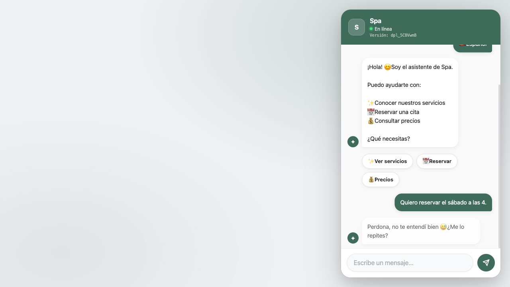
- Turno 2: respuesta-bot. Respuesta del bot sin evidencia para una etiqueta específica. Estado: `{"servicio":null,"fecha":"sábado","hora":null,"nombre":null,"telefono":null,"email":null,"notas":null}`
  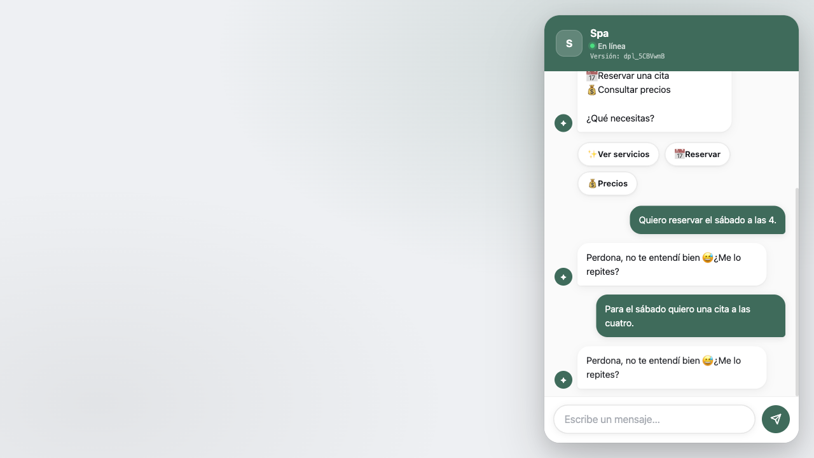
- Turno 3: respuesta-bot. Respuesta del bot sin evidencia para una etiqueta específica. Estado: `{"servicio":null,"fecha":"sábado","hora":null,"nombre":null,"telefono":null,"email":null,"notas":null}`
  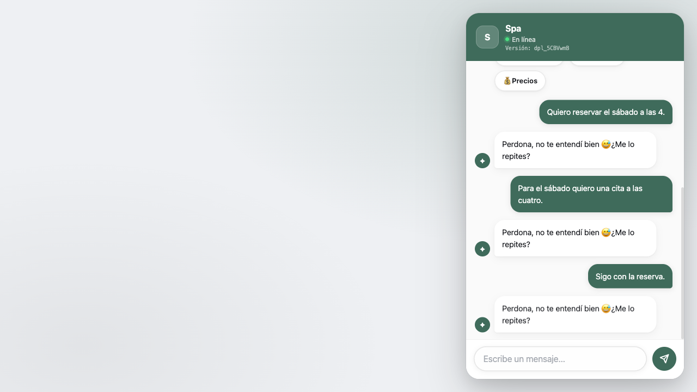
- Turno 4: respuesta-bot. Respuesta del bot sin evidencia para una etiqueta específica. Estado: `{"servicio":null,"fecha":"sábado","hora":null,"nombre":null,"telefono":null,"email":null,"notas":null}`
  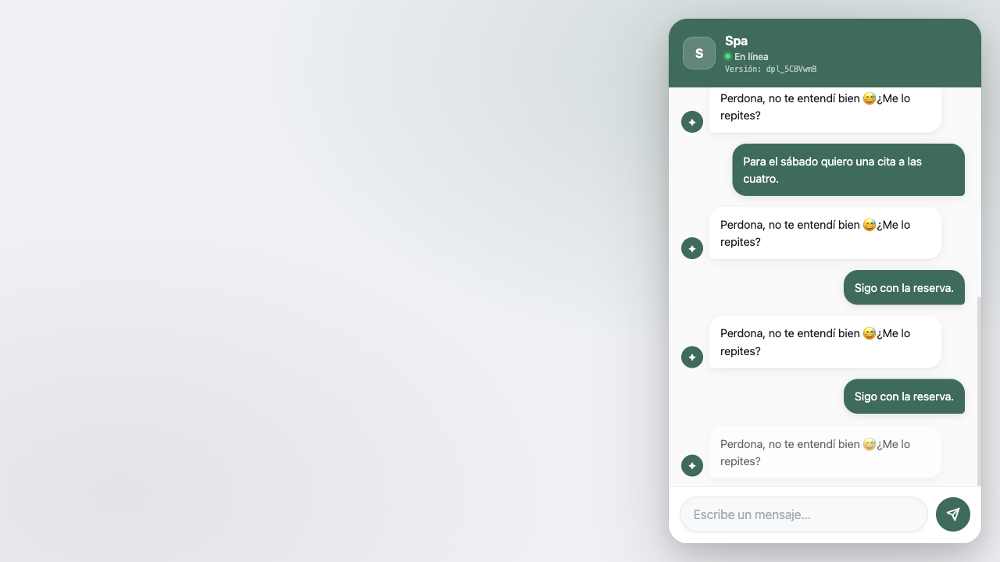
- Turno 5: respuesta-bot. Respuesta del bot sin evidencia para una etiqueta específica. Estado: `{"servicio":null,"fecha":"sábado","hora":null,"nombre":null,"telefono":null,"email":null,"notas":null}`
  
- Turno 6: respuesta-bot. Respuesta del bot sin evidencia para una etiqueta específica. Estado: `{"servicio":null,"fecha":"sábado","hora":null,"nombre":null,"telefono":null,"email":null,"notas":null}`
  
- Turno 7: respuesta-bot. Respuesta del bot sin evidencia para una etiqueta específica. Estado: `{"servicio":null,"fecha":"sábado","hora":null,"nombre":null,"telefono":null,"email":null,"notas":null}`
  
- Turno 8: respuesta-bot. Respuesta del bot sin evidencia para una etiqueta específica. Estado: `{"servicio":null,"fecha":"sábado","hora":null,"nombre":null,"telefono":null,"email":null,"notas":null}`
  
- Turno 9: respuesta-bot. Respuesta del bot sin evidencia para una etiqueta específica. Estado: `{"servicio":null,"fecha":"sábado","hora":null,"nombre":null,"telefono":null,"email":null,"notas":null}`
  
- Turno 10: respuesta-bot. Respuesta del bot sin evidencia para una etiqueta específica. Estado: `{"servicio":null,"fecha":"sábado","hora":null,"nombre":null,"telefono":null,"email":null,"notas":null}`
  
- Turno 11: respuesta-bot. Respuesta del bot sin evidencia para una etiqueta específica. Estado: `{"servicio":null,"fecha":"sábado","hora":null,"nombre":null,"telefono":null,"email":null,"notas":null}`
  
- Turno 12: respuesta-bot. Respuesta del bot sin evidencia para una etiqueta específica. Estado: `{"servicio":null,"fecha":"sábado","hora":null,"nombre":null,"telefono":null,"email":null,"notas":null}`
  
- Turno 13: respuesta-bot. Respuesta del bot sin evidencia para una etiqueta específica. Estado: `{"servicio":null,"fecha":"sábado","hora":null,"nombre":null,"telefono":null,"email":null,"notas":null}`
  
- Turno 14: respuesta-bot. Respuesta del bot sin evidencia para una etiqueta específica. Estado: `{"servicio":null,"fecha":"sábado","hora":null,"nombre":null,"telefono":null,"email":null,"notas":null}`
  
- Turno 15: respuesta-bot. Respuesta del bot sin evidencia para una etiqueta específica. Estado: `{"servicio":null,"fecha":"sábado","hora":null,"nombre":null,"telefono":null,"email":null,"notas":null}`
  
- Turno 16: respuesta-bot. Respuesta del bot sin evidencia para una etiqueta específica. Estado: `{"servicio":null,"fecha":"sábado","hora":null,"nombre":null,"telefono":null,"email":null,"notas":null}`
  
- Turno 17: respuesta-bot. Respuesta del bot sin evidencia para una etiqueta específica. Estado: `{"servicio":null,"fecha":"sábado","hora":null,"nombre":null,"telefono":null,"email":null,"notas":null}`
  
- Turno 18: respuesta-bot. Respuesta del bot sin evidencia para una etiqueta específica. Estado: `{"servicio":null,"fecha":"sábado","hora":null,"nombre":null,"telefono":null,"email":null,"notas":null}`
  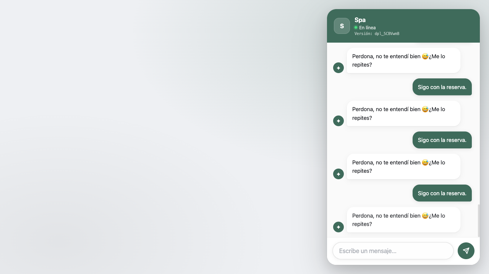
- Turno 19: respuesta-bot. Respuesta del bot sin evidencia para una etiqueta específica. Estado: `{"servicio":null,"fecha":"sábado","hora":null,"nombre":null,"telefono":null,"email":null,"notas":null}`
  
- Turno 20: respuesta-bot. Respuesta del bot sin evidencia para una etiqueta específica. Estado: `{"servicio":null,"fecha":"sábado","hora":null,"nombre":null,"telefono":null,"email":null,"notas":null}`
  

#### Mensajes bloqueados por incoherencia
- Ninguno.

### N — Ambigüedad real con botones
**Estado final real:** `{"servicio":null,"fecha":null,"hora":null,"nombre":null,"telefono":null,"email":null,"notas":null}`
**Resultado:** OBJETIVO ALCANZADO — Mostró botones 4:00 AM y 4:00 PM sin pregunta textual.

```text
1. [Bot]
¡Hola! 😊 Soy el asistente de Auditoría local AM/PM. Puedo ayudarte con: ✨ Conocer nuestros servicios 📅 Reservar una cita 💰 Consultar precios ¿Qué necesitas?

2. [Cliente]
Quiero reservar a las 4.

3. [Bot]
¡Hola! 😊 Soy el asistente de Auditoría local AM/PM. Puedo ayudarte con: ✨ Conocer nuestros servicios 📅 Reservar una cita 💰 Consultar precios ¿Qué necesitas?

```

#### Capturas
- Turno 0: respuesta-bot. Respuesta del bot sin evidencia para una etiqueta específica. Estado: `{"servicio":null,"fecha":null,"hora":null,"nombre":null,"telefono":null,"email":null,"notas":null}`
  
- Turno 1: horarios-disponibles. Slots reales verificados desde chatbot-ui: ⏰ 4:00 AM, ⏰ 4:00 PM. Estado: `{"servicio":null,"fecha":null,"hora":null,"nombre":null,"telefono":null,"email":null,"notas":null}`
  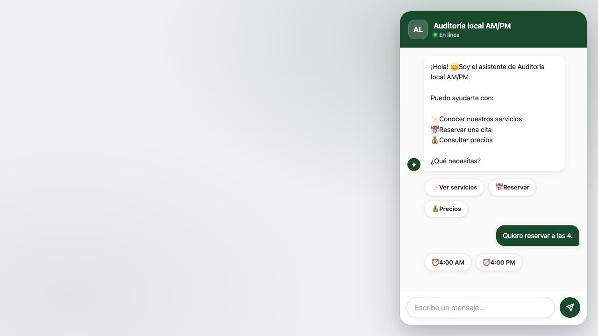

#### Mensajes bloqueados por incoherencia
- Ninguno.

### O — Fecha real más hora
**Estado final real:** `{"servicio":null,"fecha":null,"hora":null,"nombre":null,"telefono":null,"email":null,"notas":null}`
**Resultado:** NO EJECUTADO COMPLETAMENTE — Límite de 20 turnos alcanzado. El chatbot no entendió la intención original tras una reformulación equivalente.

```text
1. [Cliente]
[Clic en Español]

2. [Bot]
¡Hola! 😊 Soy el asistente de Spa. Puedo ayudarte con: ✨ Conocer nuestros servicios 📅 Reservar una cita 💰 Consultar precios ¿Qué necesitas?

3. [Cliente]
Mañana a las 3 PM.

4. [Bot]
Perdona, no te entendí bien 😅 ¿Me lo repites?

5. [Cliente]
Quiero una cita mañana a las tres PM.

6. [Bot]
Perdona, no te entendí bien 😅 ¿Me lo repites?

7. [Cliente]
Sigo con la reserva.

8. [Bot]
Perdona, no te entendí bien 😅 ¿Me lo repites?

9. [Cliente]
Sigo con la reserva.

10. [Bot]
Perdona, no te entendí bien 😅 ¿Me lo repites?

11. [Cliente]
Sigo con la reserva.

12. [Bot]
Perdona, no te entendí bien 😅 ¿Me lo repites?

13. [Cliente]
Sigo con la reserva.

14. [Bot]
Perdona, no te entendí bien 😅 ¿Me lo repites?

15. [Cliente]
Sigo con la reserva.

16. [Bot]
Perdona, no te entendí bien 😅 ¿Me lo repites?

17. [Cliente]
Sigo con la reserva.

18. [Bot]
Perdona, no te entendí bien 😅 ¿Me lo repites?

19. [Cliente]
Sigo con la reserva.

20. [Bot]
Perdona, no te entendí bien 😅 ¿Me lo repites?

21. [Cliente]
Sigo con la reserva.

22. [Bot]
Perdona, no te entendí bien 😅 ¿Me lo repites?

23. [Cliente]
Sigo con la reserva.

24. [Bot]
Perdona, no te entendí bien 😅 ¿Me lo repites?

25. [Cliente]
Sigo con la reserva.

26. [Bot]
Perdona, no te entendí bien 😅 ¿Me lo repites?

27. [Cliente]
Sigo con la reserva.

28. [Bot]
Perdona, no te entendí bien 😅 ¿Me lo repites?

29. [Cliente]
Sigo con la reserva.

30. [Bot]
Perdona, no te entendí bien 😅 ¿Me lo repites?

31. [Cliente]
Sigo con la reserva.

32. [Bot]
Perdona, no te entendí bien 😅 ¿Me lo repites?

33. [Cliente]
Sigo con la reserva.

34. [Bot]
Perdona, no te entendí bien 😅 ¿Me lo repites?

35. [Cliente]
Sigo con la reserva.

36. [Bot]
Perdona, no te entendí bien 😅 ¿Me lo repites?

37. [Cliente]
Sigo con la reserva.

38. [Bot]
Perdona, no te entendí bien 😅 ¿Me lo repites?

39. [Cliente]
Sigo con la reserva.

40. [Bot]
Perdona, no te entendí bien 😅 ¿Me lo repites?

41. [Cliente]
Sigo con la reserva.

42. [Bot]
Perdona, no te entendí bien 😅 ¿Me lo repites?

```

#### Capturas
- Turno 0: respuesta-bot. Respuesta del bot sin evidencia para una etiqueta específica. Estado: `{"servicio":null,"fecha":null,"hora":null,"nombre":null,"telefono":null,"email":null,"notas":null}`
  
- Turno 1: respuesta-bot. Respuesta del bot sin evidencia para una etiqueta específica. Estado: `{"servicio":null,"fecha":null,"hora":null,"nombre":null,"telefono":null,"email":null,"notas":null}`
  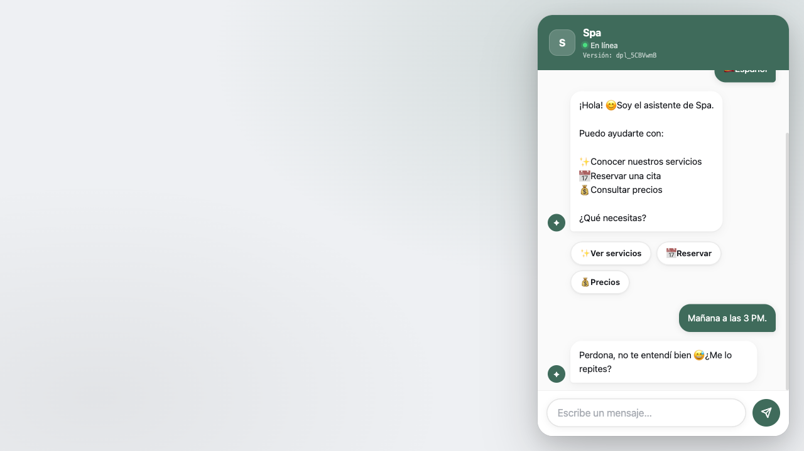
- Turno 2: respuesta-bot. Respuesta del bot sin evidencia para una etiqueta específica. Estado: `{"servicio":null,"fecha":null,"hora":null,"nombre":null,"telefono":null,"email":null,"notas":null}`
  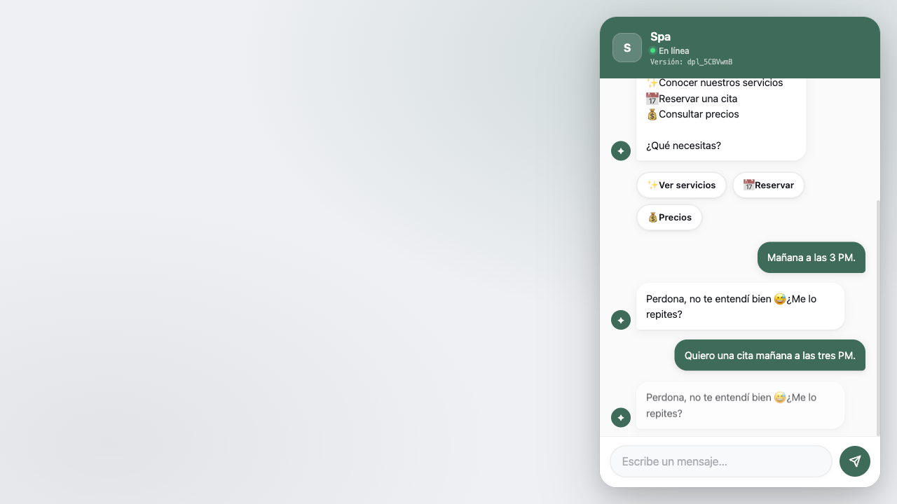
- Turno 3: respuesta-bot. Respuesta del bot sin evidencia para una etiqueta específica. Estado: `{"servicio":null,"fecha":null,"hora":null,"nombre":null,"telefono":null,"email":null,"notas":null}`
  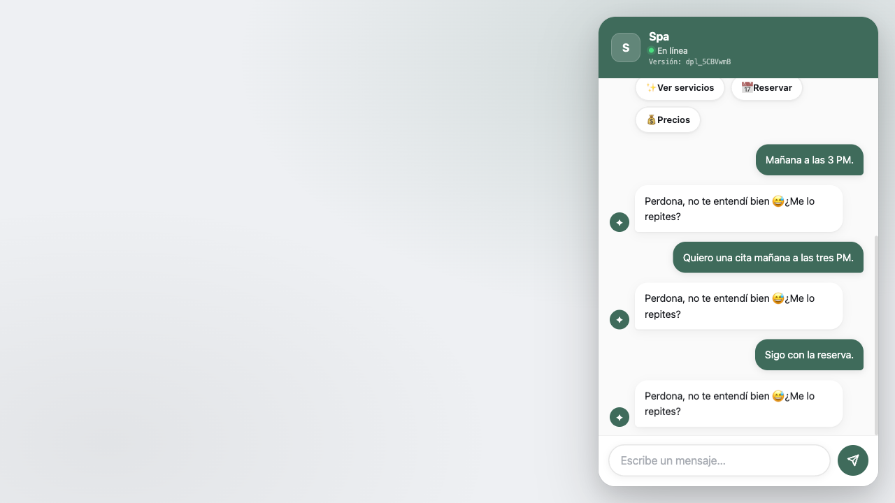
- Turno 4: respuesta-bot. Respuesta del bot sin evidencia para una etiqueta específica. Estado: `{"servicio":null,"fecha":null,"hora":null,"nombre":null,"telefono":null,"email":null,"notas":null}`
  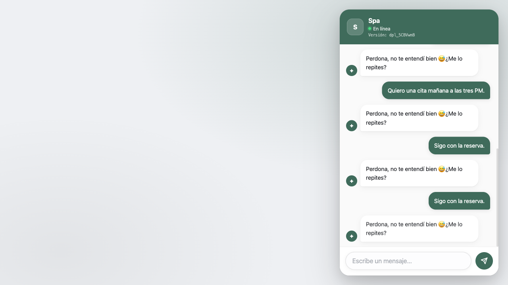
- Turno 5: respuesta-bot. Respuesta del bot sin evidencia para una etiqueta específica. Estado: `{"servicio":null,"fecha":null,"hora":null,"nombre":null,"telefono":null,"email":null,"notas":null}`
  
- Turno 6: respuesta-bot. Respuesta del bot sin evidencia para una etiqueta específica. Estado: `{"servicio":null,"fecha":null,"hora":null,"nombre":null,"telefono":null,"email":null,"notas":null}`
  
- Turno 7: respuesta-bot. Respuesta del bot sin evidencia para una etiqueta específica. Estado: `{"servicio":null,"fecha":null,"hora":null,"nombre":null,"telefono":null,"email":null,"notas":null}`
  
- Turno 8: respuesta-bot. Respuesta del bot sin evidencia para una etiqueta específica. Estado: `{"servicio":null,"fecha":null,"hora":null,"nombre":null,"telefono":null,"email":null,"notas":null}`
  
- Turno 9: respuesta-bot. Respuesta del bot sin evidencia para una etiqueta específica. Estado: `{"servicio":null,"fecha":null,"hora":null,"nombre":null,"telefono":null,"email":null,"notas":null}`
  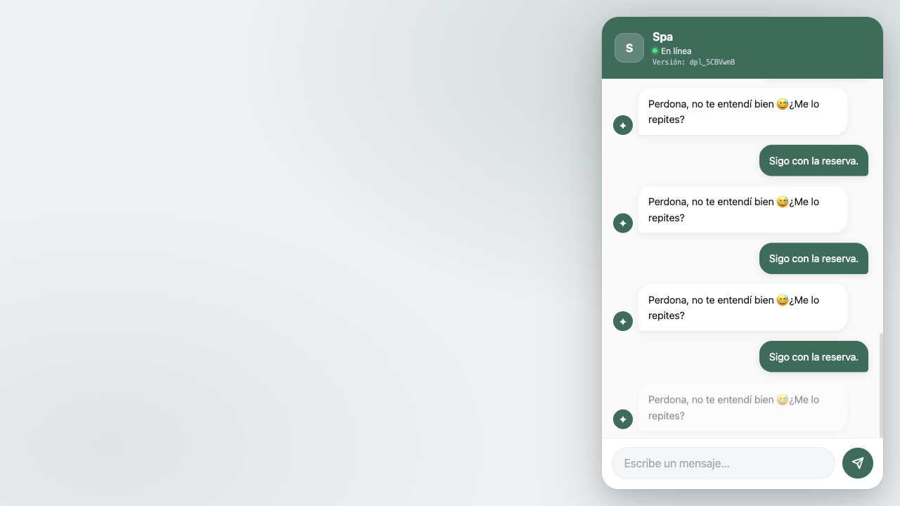
- Turno 10: respuesta-bot. Respuesta del bot sin evidencia para una etiqueta específica. Estado: `{"servicio":null,"fecha":null,"hora":null,"nombre":null,"telefono":null,"email":null,"notas":null}`
  
- Turno 11: respuesta-bot. Respuesta del bot sin evidencia para una etiqueta específica. Estado: `{"servicio":null,"fecha":null,"hora":null,"nombre":null,"telefono":null,"email":null,"notas":null}`
  
- Turno 12: respuesta-bot. Respuesta del bot sin evidencia para una etiqueta específica. Estado: `{"servicio":null,"fecha":null,"hora":null,"nombre":null,"telefono":null,"email":null,"notas":null}`
  
- Turno 13: respuesta-bot. Respuesta del bot sin evidencia para una etiqueta específica. Estado: `{"servicio":null,"fecha":null,"hora":null,"nombre":null,"telefono":null,"email":null,"notas":null}`
  
- Turno 14: respuesta-bot. Respuesta del bot sin evidencia para una etiqueta específica. Estado: `{"servicio":null,"fecha":null,"hora":null,"nombre":null,"telefono":null,"email":null,"notas":null}`
  
- Turno 15: respuesta-bot. Respuesta del bot sin evidencia para una etiqueta específica. Estado: `{"servicio":null,"fecha":null,"hora":null,"nombre":null,"telefono":null,"email":null,"notas":null}`
  
- Turno 16: respuesta-bot. Respuesta del bot sin evidencia para una etiqueta específica. Estado: `{"servicio":null,"fecha":null,"hora":null,"nombre":null,"telefono":null,"email":null,"notas":null}`
  
- Turno 17: respuesta-bot. Respuesta del bot sin evidencia para una etiqueta específica. Estado: `{"servicio":null,"fecha":null,"hora":null,"nombre":null,"telefono":null,"email":null,"notas":null}`
  
- Turno 18: respuesta-bot. Respuesta del bot sin evidencia para una etiqueta específica. Estado: `{"servicio":null,"fecha":null,"hora":null,"nombre":null,"telefono":null,"email":null,"notas":null}`
  
- Turno 19: respuesta-bot. Respuesta del bot sin evidencia para una etiqueta específica. Estado: `{"servicio":null,"fecha":null,"hora":null,"nombre":null,"telefono":null,"email":null,"notas":null}`
  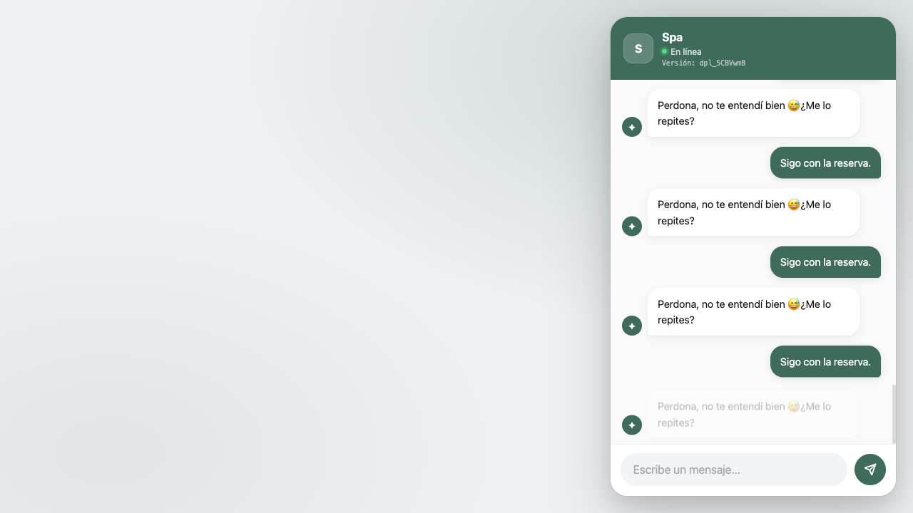
- Turno 20: respuesta-bot. Respuesta del bot sin evidencia para una etiqueta específica. Estado: `{"servicio":null,"fecha":null,"hora":null,"nombre":null,"telefono":null,"email":null,"notas":null}`
  

#### Mensajes bloqueados por incoherencia
- Ninguno.

### F — Persistencia backend
**Estado final real:** `{"servicio":null,"fecha":null,"hora":null,"nombre":null,"telefono":null,"email":null,"notas":null}`
**Resultado:** NO EJECUTADO COMPLETAMENTE — Bloqueado: requiere escritura de reservas en producción, no autorizada.

```text
```

#### Capturas

#### Mensajes bloqueados por incoherencia
- Ninguno.

### G — Modificación API
**Estado final real:** `{"servicio":null,"fecha":null,"hora":null,"nombre":null,"telefono":null,"email":null,"notas":null}`
**Resultado:** NO EJECUTADO COMPLETAMENTE — Bloqueado: requiere escritura de reservas en producción, no autorizada.

```text
```

#### Capturas

#### Mensajes bloqueados por incoherencia
- Ninguno.

### H — Cancelación API
**Estado final real:** `{"servicio":null,"fecha":null,"hora":null,"nombre":null,"telefono":null,"email":null,"notas":null}`
**Resultado:** NO EJECUTADO COMPLETAMENTE — Bloqueado: requiere escritura de reservas en producción, no autorizada.

```text
```

#### Capturas

#### Mensajes bloqueados por incoherencia
- Ninguno.

### I — Idempotencia
**Estado final real:** `{"servicio":null,"fecha":null,"hora":null,"nombre":null,"telefono":null,"email":null,"notas":null}`
**Resultado:** NO EJECUTADO COMPLETAMENTE — Bloqueado: requiere escritura de reservas en producción, no autorizada.

```text
```

#### Capturas

#### Mensajes bloqueados por incoherencia
- Ninguno.

## Hallazgos clasificados
- **CHATBOT** | B, turno 1 | ACLARACIÓN REDUNDANTE DE HORA | MEDIO | Cliente: "Quiero reservar un masaje relajante para el próximo sábado a las 4 de la tarde.". Bot: "Una cosita 😊 ¿te refieres a las 4 de la tarde o a las 4 de la mañana?"
- **SCRIPT** | B, turno 3 | CONTINUACIÓN SIN RUTA ESPECÍFICA | MEDIO | No hay una continuación específica para esta respuesta del bot: "Ese horario ya está reservado, pero tengo disponibilidad a las 5:00 PM. ¿Te funciona? 😊"
- **SCRIPT** | B, turno 4 | CONTINUACIÓN SIN RUTA ESPECÍFICA | MEDIO | No hay una continuación específica para esta respuesta del bot: "Perdona, ¿de la mañana o de la tarde? 😊"
- **SCRIPT** | B, turno 5 | CONTINUACIÓN SIN RUTA ESPECÍFICA | MEDIO | No hay una continuación específica para esta respuesta del bot: "Perdona, ¿de la mañana o de la tarde? 😊"
- **SCRIPT** | B, turno 6 | CONTINUACIÓN SIN RUTA ESPECÍFICA | MEDIO | No hay una continuación específica para esta respuesta del bot: "Perdona, ¿de la mañana o de la tarde? 😊"
- **SCRIPT** | B, turno 7 | CONTINUACIÓN SIN RUTA ESPECÍFICA | MEDIO | No hay una continuación específica para esta respuesta del bot: "Perdona, ¿de la mañana o de la tarde? 😊"
- **SCRIPT** | B, turno 8 | CONTINUACIÓN SIN RUTA ESPECÍFICA | MEDIO | No hay una continuación específica para esta respuesta del bot: "Perdona, ¿de la mañana o de la tarde? 😊"
- **SCRIPT** | B, turno 9 | CONTINUACIÓN SIN RUTA ESPECÍFICA | MEDIO | No hay una continuación específica para esta respuesta del bot: "Perdona, ¿de la mañana o de la tarde? 😊"
- **SCRIPT** | B, turno 10 | CONTINUACIÓN SIN RUTA ESPECÍFICA | MEDIO | No hay una continuación específica para esta respuesta del bot: "Perdona, ¿de la mañana o de la tarde? 😊"
- **SCRIPT** | B, turno 11 | CONTINUACIÓN SIN RUTA ESPECÍFICA | MEDIO | No hay una continuación específica para esta respuesta del bot: "Perdona, ¿de la mañana o de la tarde? 😊"
- **SCRIPT** | B, turno 12 | CONTINUACIÓN SIN RUTA ESPECÍFICA | MEDIO | No hay una continuación específica para esta respuesta del bot: "Perdona, ¿de la mañana o de la tarde? 😊"
- **SCRIPT** | B, turno 13 | CONTINUACIÓN SIN RUTA ESPECÍFICA | MEDIO | No hay una continuación específica para esta respuesta del bot: "Perdona, ¿de la mañana o de la tarde? 😊"
- **SCRIPT** | B, turno 14 | CONTINUACIÓN SIN RUTA ESPECÍFICA | MEDIO | No hay una continuación específica para esta respuesta del bot: "Perdona, ¿de la mañana o de la tarde? 😊"
- **SCRIPT** | B, turno 15 | CONTINUACIÓN SIN RUTA ESPECÍFICA | MEDIO | No hay una continuación específica para esta respuesta del bot: "Perdona, ¿de la mañana o de la tarde? 😊"
- **SCRIPT** | B, turno 16 | CONTINUACIÓN SIN RUTA ESPECÍFICA | MEDIO | No hay una continuación específica para esta respuesta del bot: "Perdona, ¿de la mañana o de la tarde? 😊"
- **SCRIPT** | B, turno 17 | CONTINUACIÓN SIN RUTA ESPECÍFICA | MEDIO | No hay una continuación específica para esta respuesta del bot: "Perdona, ¿de la mañana o de la tarde? 😊"
- **SCRIPT** | B, turno 18 | CONTINUACIÓN SIN RUTA ESPECÍFICA | MEDIO | No hay una continuación específica para esta respuesta del bot: "Perdona, ¿de la mañana o de la tarde? 😊"
- **SCRIPT** | B, turno 19 | CONTINUACIÓN SIN RUTA ESPECÍFICA | MEDIO | No hay una continuación específica para esta respuesta del bot: "Perdona, ¿de la mañana o de la tarde? 😊"
- **SCRIPT** | B, turno 20 | CONTINUACIÓN SIN RUTA ESPECÍFICA | MEDIO | No hay una continuación específica para esta respuesta del bot: "Perdona, ¿de la mañana o de la tarde? 😊"
- **CHATBOT** | C, turno 1 | ACLARACIÓN REDUNDANTE DE HORA | MEDIO | Cliente: "Quiero reservar un masaje relajante para el próximo sábado a las 4 de la tarde.". Bot: "Una cosita 😊 ¿te refieres a las 4 de la tarde o a las 4 de la mañana?"
- **SCRIPT** | C, turno 2 | CONTINUACIÓN SIN RUTA ESPECÍFICA | MEDIO | No hay una continuación específica para esta respuesta del bot: "Uy, eso no funcionó. Dime otra hora y reviso 😊"
- **CHATBOT** | E, turno 1 | ACLARACIÓN REDUNDANTE DE HORA | MEDIO | Cliente: "Quiero reservar un masaje relajante para el próximo sábado a las 4 de la tarde.". Bot: "Una cosita 😊 ¿te refieres a las 4 de la tarde o a las 4 de la mañana?"
- **SCRIPT** | E, turno 2 | CONTINUACIÓN SIN RUTA ESPECÍFICA | MEDIO | No hay una continuación específica para esta respuesta del bot: "Uy, eso no funcionó. Dime otra hora y reviso 😊"
- **SCRIPT** | E, turno 4 | MENSAJE BLOQUEADO POR INCOHERENTE | ALTO | El bot pidió nombre y la respuesta propuesta no aporta un nombre.
- **SCRIPT** | E, turno 5 | MENSAJE BLOQUEADO POR INCOHERENTE | ALTO | El bot pidió nombre y la respuesta propuesta no aporta un nombre.
- **SCRIPT** | E, turno 6 | MENSAJE BLOQUEADO POR INCOHERENTE | ALTO | El bot pidió nombre y la respuesta propuesta no aporta un nombre.
- **SCRIPT** | E, turno 7 | MENSAJE BLOQUEADO POR INCOHERENTE | ALTO | El bot pidió nombre y la respuesta propuesta no aporta un nombre.
- **SCRIPT** | E, turno 8 | MENSAJE BLOQUEADO POR INCOHERENTE | ALTO | El bot pidió nombre y la respuesta propuesta no aporta un nombre.
- **SCRIPT** | E, turno 9 | MENSAJE BLOQUEADO POR INCOHERENTE | ALTO | El bot pidió nombre y la respuesta propuesta no aporta un nombre.
- **SCRIPT** | E, turno 10 | MENSAJE BLOQUEADO POR INCOHERENTE | ALTO | El bot pidió nombre y la respuesta propuesta no aporta un nombre.
- **SCRIPT** | E, turno 11 | MENSAJE BLOQUEADO POR INCOHERENTE | ALTO | El bot pidió nombre y la respuesta propuesta no aporta un nombre.
- **SCRIPT** | E, turno 12 | MENSAJE BLOQUEADO POR INCOHERENTE | ALTO | El bot pidió nombre y la respuesta propuesta no aporta un nombre.
- **SCRIPT** | E, turno 13 | MENSAJE BLOQUEADO POR INCOHERENTE | ALTO | El bot pidió nombre y la respuesta propuesta no aporta un nombre.
- **SCRIPT** | E, turno 14 | MENSAJE BLOQUEADO POR INCOHERENTE | ALTO | El bot pidió nombre y la respuesta propuesta no aporta un nombre.
- **SCRIPT** | E, turno 15 | MENSAJE BLOQUEADO POR INCOHERENTE | ALTO | El bot pidió nombre y la respuesta propuesta no aporta un nombre.
- **SCRIPT** | E, turno 16 | MENSAJE BLOQUEADO POR INCOHERENTE | ALTO | El bot pidió nombre y la respuesta propuesta no aporta un nombre.
- **SCRIPT** | E, turno 17 | MENSAJE BLOQUEADO POR INCOHERENTE | ALTO | El bot pidió nombre y la respuesta propuesta no aporta un nombre.
- **SCRIPT** | E, turno 18 | MENSAJE BLOQUEADO POR INCOHERENTE | ALTO | El bot pidió nombre y la respuesta propuesta no aporta un nombre.
- **SCRIPT** | E, turno 19 | MENSAJE BLOQUEADO POR INCOHERENTE | ALTO | El bot pidió nombre y la respuesta propuesta no aporta un nombre.
- **SCRIPT** | E, turno 20 | MENSAJE BLOQUEADO POR INCOHERENTE | ALTO | El bot pidió nombre y la respuesta propuesta no aporta un nombre.
- **CHATBOT** | J, turno 1 | ACLARACIÓN REDUNDANTE DE HORA | MEDIO | Cliente: "Quiero reservar un masaje relajante para este domingo a las 3 de la mañana.". Bot: "Una cosita 😊 ¿te refieres a las 3 de la tarde o a las 3 de la mañana?"
- **CHATBOT** | K, turno 1 | ACLARACIÓN REDUNDANTE DE HORA | MEDIO | Cliente: "Quiero reservar un masaje relajante para el próximo sábado a las 4 de la tarde.". Bot: "Una cosita 😊 ¿te refieres a las 4 de la tarde o a las 4 de la mañana?"
- **SCRIPT** | K, turno 6 | MENSAJE BLOQUEADO POR INCOHERENTE | ALTO | El bot pidió nombre y la respuesta propuesta no aporta un nombre.
- **SCRIPT** | K, turno 7 | MENSAJE BLOQUEADO POR INCOHERENTE | ALTO | El bot pidió nombre y la respuesta propuesta no aporta un nombre.
- **SCRIPT** | K, turno 8 | MENSAJE BLOQUEADO POR INCOHERENTE | ALTO | El bot pidió nombre y la respuesta propuesta no aporta un nombre.
- **SCRIPT** | K, turno 9 | MENSAJE BLOQUEADO POR INCOHERENTE | ALTO | El bot pidió nombre y la respuesta propuesta no aporta un nombre.
- **SCRIPT** | K, turno 10 | MENSAJE BLOQUEADO POR INCOHERENTE | ALTO | El bot pidió nombre y la respuesta propuesta no aporta un nombre.
- **SCRIPT** | K, turno 11 | MENSAJE BLOQUEADO POR INCOHERENTE | ALTO | El bot pidió nombre y la respuesta propuesta no aporta un nombre.
- **SCRIPT** | K, turno 12 | MENSAJE BLOQUEADO POR INCOHERENTE | ALTO | El bot pidió nombre y la respuesta propuesta no aporta un nombre.
- **SCRIPT** | K, turno 13 | MENSAJE BLOQUEADO POR INCOHERENTE | ALTO | El bot pidió nombre y la respuesta propuesta no aporta un nombre.
- **SCRIPT** | K, turno 14 | MENSAJE BLOQUEADO POR INCOHERENTE | ALTO | El bot pidió nombre y la respuesta propuesta no aporta un nombre.
- **SCRIPT** | K, turno 15 | MENSAJE BLOQUEADO POR INCOHERENTE | ALTO | El bot pidió nombre y la respuesta propuesta no aporta un nombre.
- **SCRIPT** | K, turno 16 | MENSAJE BLOQUEADO POR INCOHERENTE | ALTO | El bot pidió nombre y la respuesta propuesta no aporta un nombre.
- **SCRIPT** | K, turno 17 | MENSAJE BLOQUEADO POR INCOHERENTE | ALTO | El bot pidió nombre y la respuesta propuesta no aporta un nombre.
- **SCRIPT** | K, turno 18 | MENSAJE BLOQUEADO POR INCOHERENTE | ALTO | El bot pidió nombre y la respuesta propuesta no aporta un nombre.
- **SCRIPT** | K, turno 19 | MENSAJE BLOQUEADO POR INCOHERENTE | ALTO | El bot pidió nombre y la respuesta propuesta no aporta un nombre.
- **SCRIPT** | K, turno 20 | MENSAJE BLOQUEADO POR INCOHERENTE | ALTO | El bot pidió nombre y la respuesta propuesta no aporta un nombre.
- **CHATBOT** | M, turno 2 | CONTINUACIÓN SIN RUTA ESPECÍFICA | ALTO | El chatbot no entendió la intención original tras una reformulación equivalente.
- **CHATBOT** | M, turno 3 | CONTINUACIÓN SIN RUTA ESPECÍFICA | ALTO | El chatbot no entendió la intención original tras una reformulación equivalente.
- **CHATBOT** | M, turno 4 | CONTINUACIÓN SIN RUTA ESPECÍFICA | ALTO | El chatbot no entendió la intención original tras una reformulación equivalente.
- **CHATBOT** | M, turno 5 | CONTINUACIÓN SIN RUTA ESPECÍFICA | ALTO | El chatbot no entendió la intención original tras una reformulación equivalente.
- **CHATBOT** | M, turno 6 | CONTINUACIÓN SIN RUTA ESPECÍFICA | ALTO | El chatbot no entendió la intención original tras una reformulación equivalente.
- **CHATBOT** | M, turno 7 | CONTINUACIÓN SIN RUTA ESPECÍFICA | ALTO | El chatbot no entendió la intención original tras una reformulación equivalente.
- **CHATBOT** | M, turno 8 | CONTINUACIÓN SIN RUTA ESPECÍFICA | ALTO | El chatbot no entendió la intención original tras una reformulación equivalente.
- **CHATBOT** | M, turno 9 | CONTINUACIÓN SIN RUTA ESPECÍFICA | ALTO | El chatbot no entendió la intención original tras una reformulación equivalente.
- **CHATBOT** | M, turno 10 | CONTINUACIÓN SIN RUTA ESPECÍFICA | ALTO | El chatbot no entendió la intención original tras una reformulación equivalente.
- **CHATBOT** | M, turno 11 | CONTINUACIÓN SIN RUTA ESPECÍFICA | ALTO | El chatbot no entendió la intención original tras una reformulación equivalente.
- **CHATBOT** | M, turno 12 | CONTINUACIÓN SIN RUTA ESPECÍFICA | ALTO | El chatbot no entendió la intención original tras una reformulación equivalente.
- **CHATBOT** | M, turno 13 | CONTINUACIÓN SIN RUTA ESPECÍFICA | ALTO | El chatbot no entendió la intención original tras una reformulación equivalente.
- **CHATBOT** | M, turno 14 | CONTINUACIÓN SIN RUTA ESPECÍFICA | ALTO | El chatbot no entendió la intención original tras una reformulación equivalente.
- **CHATBOT** | M, turno 15 | CONTINUACIÓN SIN RUTA ESPECÍFICA | ALTO | El chatbot no entendió la intención original tras una reformulación equivalente.
- **CHATBOT** | M, turno 16 | CONTINUACIÓN SIN RUTA ESPECÍFICA | ALTO | El chatbot no entendió la intención original tras una reformulación equivalente.
- **CHATBOT** | M, turno 17 | CONTINUACIÓN SIN RUTA ESPECÍFICA | ALTO | El chatbot no entendió la intención original tras una reformulación equivalente.
- **CHATBOT** | M, turno 18 | CONTINUACIÓN SIN RUTA ESPECÍFICA | ALTO | El chatbot no entendió la intención original tras una reformulación equivalente.
- **CHATBOT** | M, turno 19 | CONTINUACIÓN SIN RUTA ESPECÍFICA | ALTO | El chatbot no entendió la intención original tras una reformulación equivalente.
- **CHATBOT** | M, turno 20 | CONTINUACIÓN SIN RUTA ESPECÍFICA | ALTO | El chatbot no entendió la intención original tras una reformulación equivalente.
- **CHATBOT** | O, turno 2 | CONTINUACIÓN SIN RUTA ESPECÍFICA | ALTO | El chatbot no entendió la intención original tras una reformulación equivalente.
- **CHATBOT** | O, turno 3 | CONTINUACIÓN SIN RUTA ESPECÍFICA | ALTO | El chatbot no entendió la intención original tras una reformulación equivalente.
- **CHATBOT** | O, turno 4 | CONTINUACIÓN SIN RUTA ESPECÍFICA | ALTO | El chatbot no entendió la intención original tras una reformulación equivalente.
- **CHATBOT** | O, turno 5 | CONTINUACIÓN SIN RUTA ESPECÍFICA | ALTO | El chatbot no entendió la intención original tras una reformulación equivalente.
- **CHATBOT** | O, turno 6 | CONTINUACIÓN SIN RUTA ESPECÍFICA | ALTO | El chatbot no entendió la intención original tras una reformulación equivalente.
- **CHATBOT** | O, turno 7 | CONTINUACIÓN SIN RUTA ESPECÍFICA | ALTO | El chatbot no entendió la intención original tras una reformulación equivalente.
- **CHATBOT** | O, turno 8 | CONTINUACIÓN SIN RUTA ESPECÍFICA | ALTO | El chatbot no entendió la intención original tras una reformulación equivalente.
- **CHATBOT** | O, turno 9 | CONTINUACIÓN SIN RUTA ESPECÍFICA | ALTO | El chatbot no entendió la intención original tras una reformulación equivalente.
- **CHATBOT** | O, turno 10 | CONTINUACIÓN SIN RUTA ESPECÍFICA | ALTO | El chatbot no entendió la intención original tras una reformulación equivalente.
- **CHATBOT** | O, turno 11 | CONTINUACIÓN SIN RUTA ESPECÍFICA | ALTO | El chatbot no entendió la intención original tras una reformulación equivalente.
- **CHATBOT** | O, turno 12 | CONTINUACIÓN SIN RUTA ESPECÍFICA | ALTO | El chatbot no entendió la intención original tras una reformulación equivalente.
- **CHATBOT** | O, turno 13 | CONTINUACIÓN SIN RUTA ESPECÍFICA | ALTO | El chatbot no entendió la intención original tras una reformulación equivalente.
- **CHATBOT** | O, turno 14 | CONTINUACIÓN SIN RUTA ESPECÍFICA | ALTO | El chatbot no entendió la intención original tras una reformulación equivalente.
- **CHATBOT** | O, turno 15 | CONTINUACIÓN SIN RUTA ESPECÍFICA | ALTO | El chatbot no entendió la intención original tras una reformulación equivalente.
- **CHATBOT** | O, turno 16 | CONTINUACIÓN SIN RUTA ESPECÍFICA | ALTO | El chatbot no entendió la intención original tras una reformulación equivalente.
- **CHATBOT** | O, turno 17 | CONTINUACIÓN SIN RUTA ESPECÍFICA | ALTO | El chatbot no entendió la intención original tras una reformulación equivalente.
- **CHATBOT** | O, turno 18 | CONTINUACIÓN SIN RUTA ESPECÍFICA | ALTO | El chatbot no entendió la intención original tras una reformulación equivalente.
- **CHATBOT** | O, turno 19 | CONTINUACIÓN SIN RUTA ESPECÍFICA | ALTO | El chatbot no entendió la intención original tras una reformulación equivalente.
- **CHATBOT** | O, turno 20 | CONTINUACIÓN SIN RUTA ESPECÍFICA | ALTO | El chatbot no entendió la intención original tras una reformulación equivalente.
- **SCRIPT** | F, turno 0 | EJECUCIÓN BLOQUEADA | INFO | Crear, modificar, cancelar o repetir confirmaciones escribiría datos en producción.
- **SCRIPT** | G, turno 0 | EJECUCIÓN BLOQUEADA | INFO | Crear, modificar, cancelar o repetir confirmaciones escribiría datos en producción.
- **SCRIPT** | H, turno 0 | EJECUCIÓN BLOQUEADA | INFO | Crear, modificar, cancelar o repetir confirmaciones escribiría datos en producción.
- **SCRIPT** | I, turno 0 | EJECUCIÓN BLOQUEADA | INFO | Crear, modificar, cancelar o repetir confirmaciones escribiría datos en producción.
