# Auditoría supervisada — spa
**Fecha:** 2026-08-13T06:38:09.846Z
**URL:** https://jbstudio.app/asistente.html?id=spa
**Capturas:** `./auditoria-capturas-spa-1786602915856/`

## Matriz
| Escenario | Objetivo | Resultado | Motivo |
|---|---|---|---|
| A | informacion_servicio | **NO EJECUTADO COMPLETAMENTE** | Límite de 20 turnos alcanzado. El bot repitió 3 veces la misma respuesta: "Perdona, no te entendí bien 😅 ¿Me lo repites?" |
| B | resumen_reserva | **NO EJECUTADO COMPLETAMENTE** | Límite de 20 turnos alcanzado. El bot repitió 3 veces la misma respuesta: "Perdona, no te entendí bien 😅 ¿Me lo repites?" |
| C | alternativa_horario | **NO EJECUTADO COMPLETAMENTE** | Límite de 20 turnos alcanzado. El bot repitió 3 veces la misma respuesta: "Perdona, no te entendí bien 😅 ¿Me lo repites?" |
| D | slots_disponibles | **NO EJECUTADO COMPLETAMENTE** | Límite de 20 turnos alcanzado. El bot repitió 3 veces la misma respuesta: "Perdona, no te entendí bien 😅 ¿Me lo repites?" |
| E | correccion_dato | **NO EJECUTADO COMPLETAMENTE** | Límite de 20 turnos alcanzado. El bot repitió 3 veces la misma respuesta: "Perdona, no te entendí bien 😅 ¿Me lo repites?" |
| J | rechazo_horario | **NO EJECUTADO COMPLETAMENTE** | Límite de 20 turnos alcanzado. El bot repitió 3 veces la misma respuesta: "Perdona, no te entendí bien 😅 ¿Me lo repites?" |
| K | hora_pm_sin_pregunta | **NO EJECUTADO COMPLETAMENTE** | Límite de 20 turnos alcanzado. El bot repitió 3 veces la misma respuesta: "Perdona, no te entendí bien 😅 ¿Me lo repites?" |
| L | hora_am_sin_fecha | **NO EJECUTADO COMPLETAMENTE** | Límite de 20 turnos alcanzado. El bot repitió 3 veces la misma respuesta: "Perdona, no te entendí bien 😅 ¿Me lo repites?" |
| M | hora_deducida_pm | **NO EJECUTADO COMPLETAMENTE** | Límite de 20 turnos alcanzado. El bot repitió 3 veces la misma respuesta: "Perdona, no te entendí bien 😅 ¿Me lo repites?" |
| N | botones_ampm | **OBJETIVO ALCANZADO** | Mostró botones 4:00 AM y 4:00 PM sin pregunta textual. |
| O | fecha_y_hora | **NO EJECUTADO COMPLETAMENTE** | Límite de 20 turnos alcanzado. El bot repitió 3 veces la misma respuesta: "Perdona, no te entendí bien 😅 ¿Me lo repites?" |
| F | escritura_produccion_bloqueada | **NO EJECUTADO COMPLETAMENTE** | Bloqueado: requiere escritura de reservas en producción, no autorizada. |
| G | escritura_produccion_bloqueada | **NO EJECUTADO COMPLETAMENTE** | Bloqueado: requiere escritura de reservas en producción, no autorizada. |
| H | escritura_produccion_bloqueada | **NO EJECUTADO COMPLETAMENTE** | Bloqueado: requiere escritura de reservas en producción, no autorizada. |
| I | escritura_produccion_bloqueada | **NO EJECUTADO COMPLETAMENTE** | Bloqueado: requiere escritura de reservas en producción, no autorizada. |

## Conversaciones completas
### A — Preguntas informativas sin reservar
**Estado final real:** `{"servicio":"masaje relajante","fecha":null,"hora":null,"nombre":null,"telefono":null,"email":null,"notas":null}`
**Resultado:** NO EJECUTADO COMPLETAMENTE — Límite de 20 turnos alcanzado. El bot repitió 3 veces la misma respuesta: "Perdona, no te entendí bien 😅 ¿Me lo repites?"

```text
1. [Cliente]
[Clic en Español]


2. [Bot]
¡Hola! 😊 Soy el asistente de Spa. Puedo ayudarte con: ✨ Conocer nuestros servicios 📅 Reservar una cita 💰 Consultar precios ¿Qué necesitas?


3. [Cliente]
¿cuál es el precio y la duración del masaje relajante?
BOOKING DATA: {"servicio":"masaje relajante","fecha":null,"hora":null,"nombre":null,"telefono":null,"email":null,"notas":null}

4. [Bot]
Perdona, no te entendí bien 😅 ¿Me lo repites?
BOOKING DATA: {"servicio":"masaje relajante","fecha":null,"hora":null,"nombre":null,"telefono":null,"email":null,"notas":null}

5. [Cliente]
¿cuánto cuesta el masaje relajante y cuánto dura?
BOOKING DATA: {"servicio":"masaje relajante","fecha":null,"hora":null,"nombre":null,"telefono":null,"email":null,"notas":null}

6. [Bot]
Perdona, no te entendí bien 😅 ¿Me lo repites?
BOOKING DATA: {"servicio":"masaje relajante","fecha":null,"hora":null,"nombre":null,"telefono":null,"email":null,"notas":null}

7. [Cliente]
¿cuál es el precio y la duración del masaje relajante?
BOOKING DATA: {"servicio":"masaje relajante","fecha":null,"hora":null,"nombre":null,"telefono":null,"email":null,"notas":null}

8. [Bot]
Perdona, no te entendí bien 😅 ¿Me lo repites?
BOOKING DATA: {"servicio":"masaje relajante","fecha":null,"hora":null,"nombre":null,"telefono":null,"email":null,"notas":null}

```

#### Capturas
- Turno 0: respuesta-bot. Respuesta del bot sin evidencia para una etiqueta específica. Estado: `{"servicio":null,"fecha":null,"hora":null,"nombre":null,"telefono":null,"email":null,"notas":null}`
  
- Turno 1: respuesta-bot. Respuesta del bot sin evidencia para una etiqueta específica. Estado: `{"servicio":"masaje relajante","fecha":null,"hora":null,"nombre":null,"telefono":null,"email":null,"notas":null}`
  
- Turno 2: respuesta-bot. Respuesta del bot sin evidencia para una etiqueta específica. Estado: `{"servicio":"masaje relajante","fecha":null,"hora":null,"nombre":null,"telefono":null,"email":null,"notas":null}`
  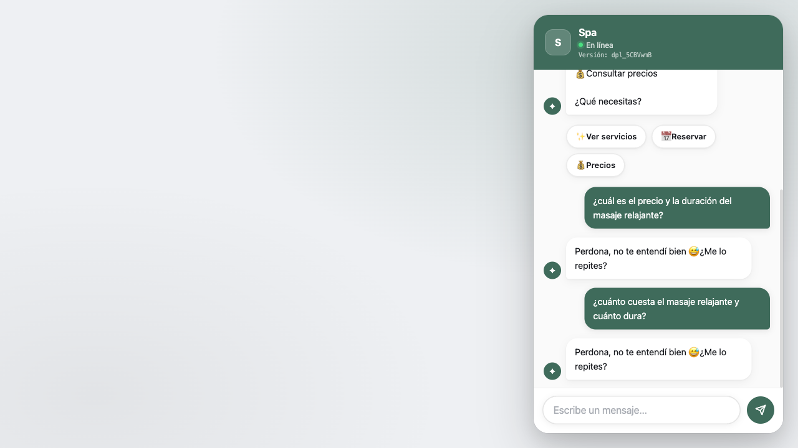

#### Mensajes bloqueados por incoherencia
- Ninguno.

### B — Reserva con corrección coherente
**Estado final real:** `{"servicio":"masaje relajante","fecha":"sábado","hora":"4:00 PM","nombre":null,"telefono":null,"email":null,"notas":null}`
**Resultado:** NO EJECUTADO COMPLETAMENTE — Límite de 20 turnos alcanzado. El bot repitió 3 veces la misma respuesta: "Perdona, no te entendí bien 😅 ¿Me lo repites?"

```text
1. [Cliente]
[Clic en Español]


2. [Bot]
¡Hola! 😊 Soy el asistente de Spa. Puedo ayudarte con: ✨ Conocer nuestros servicios 📅 Reservar una cita 💰 Consultar precios ¿Qué necesitas?


3. [Cliente]
Quiero reservar un masaje relajante para el próximo sábado a las 4 de la tarde.
BOOKING DATA: {"servicio":"masaje relajante","fecha":"sábado","hora":"4:00 PM","nombre":null,"telefono":null,"email":null,"notas":null}

4. [Bot]
Perdona, no te entendí bien 😅 ¿Me lo repites?
BOOKING DATA: {"servicio":"masaje relajante","fecha":"sábado","hora":"4:00 PM","nombre":null,"telefono":null,"email":null,"notas":null}

5. [Cliente]
Me gustaría agendar un masaje relajante el sábado próximo, a las cuatro de la tarde.
BOOKING DATA: {"servicio":"masaje relajante","fecha":"sábado","hora":"4:00 PM","nombre":null,"telefono":null,"email":null,"notas":null}

6. [Bot]
Perdona, no te entendí bien 😅 ¿Me lo repites?
BOOKING DATA: {"servicio":"masaje relajante","fecha":"sábado","hora":"4:00 PM","nombre":null,"telefono":null,"email":null,"notas":null}

7. [Cliente]
Quiero reservar un masaje relajante para el próximo sábado a las 4 de la tarde.
BOOKING DATA: {"servicio":"masaje relajante","fecha":"sábado","hora":"4:00 PM","nombre":null,"telefono":null,"email":null,"notas":null}

8. [Bot]
Perdona, no te entendí bien 😅 ¿Me lo repites?
BOOKING DATA: {"servicio":"masaje relajante","fecha":"sábado","hora":"4:00 PM","nombre":null,"telefono":null,"email":null,"notas":null}

```

#### Capturas
- Turno 0: respuesta-bot. Respuesta del bot sin evidencia para una etiqueta específica. Estado: `{"servicio":null,"fecha":null,"hora":null,"nombre":null,"telefono":null,"email":null,"notas":null}`
  
- Turno 1: respuesta-bot. Respuesta del bot sin evidencia para una etiqueta específica. Estado: `{"servicio":"masaje relajante","fecha":"sábado","hora":"4:00 PM","nombre":null,"telefono":null,"email":null,"notas":null}`
  
- Turno 2: respuesta-bot. Respuesta del bot sin evidencia para una etiqueta específica. Estado: `{"servicio":"masaje relajante","fecha":"sábado","hora":"4:00 PM","nombre":null,"telefono":null,"email":null,"notas":null}`
  

#### Mensajes bloqueados por incoherencia
- Ninguno.

### C — Horario ocupado y alternativa
**Estado final real:** `{"servicio":"masaje relajante","fecha":"sábado","hora":"4:00 PM","nombre":null,"telefono":null,"email":null,"notas":null}`
**Resultado:** NO EJECUTADO COMPLETAMENTE — Límite de 20 turnos alcanzado. El bot repitió 3 veces la misma respuesta: "Perdona, no te entendí bien 😅 ¿Me lo repites?"

```text
1. [Cliente]
[Clic en Español]


2. [Bot]
¡Hola! 😊 Soy el asistente de Spa. Puedo ayudarte con: ✨ Conocer nuestros servicios 📅 Reservar una cita 💰 Consultar precios ¿Qué necesitas?


3. [Cliente]
Quiero reservar un masaje relajante para el próximo sábado a las 4 de la tarde.
BOOKING DATA: {"servicio":"masaje relajante","fecha":"sábado","hora":"4:00 PM","nombre":null,"telefono":null,"email":null,"notas":null}

4. [Bot]
Perdona, no te entendí bien 😅 ¿Me lo repites?
BOOKING DATA: {"servicio":"masaje relajante","fecha":"sábado","hora":"4:00 PM","nombre":null,"telefono":null,"email":null,"notas":null}

5. [Cliente]
Busco una cita para masaje relajante el sábado próximo a las 4 PM.
BOOKING DATA: {"servicio":"masaje relajante","fecha":"sábado","hora":"4:00 PM","nombre":null,"telefono":null,"email":null,"notas":null}

6. [Bot]
Perdona, no te entendí bien 😅 ¿Me lo repites?
BOOKING DATA: {"servicio":"masaje relajante","fecha":"sábado","hora":"4:00 PM","nombre":null,"telefono":null,"email":null,"notas":null}

7. [Cliente]
Quiero reservar un masaje relajante para el próximo sábado a las 4 de la tarde.
BOOKING DATA: {"servicio":"masaje relajante","fecha":"sábado","hora":"4:00 PM","nombre":null,"telefono":null,"email":null,"notas":null}

8. [Bot]
Perdona, no te entendí bien 😅 ¿Me lo repites?
BOOKING DATA: {"servicio":"masaje relajante","fecha":"sábado","hora":"4:00 PM","nombre":null,"telefono":null,"email":null,"notas":null}

```

#### Capturas
- Turno 0: respuesta-bot. Respuesta del bot sin evidencia para una etiqueta específica. Estado: `{"servicio":null,"fecha":null,"hora":null,"nombre":null,"telefono":null,"email":null,"notas":null}`
  
- Turno 1: respuesta-bot. Respuesta del bot sin evidencia para una etiqueta específica. Estado: `{"servicio":"masaje relajante","fecha":"sábado","hora":"4:00 PM","nombre":null,"telefono":null,"email":null,"notas":null}`
  
- Turno 2: respuesta-bot. Respuesta del bot sin evidencia para una etiqueta específica. Estado: `{"servicio":"masaje relajante","fecha":"sábado","hora":"4:00 PM","nombre":null,"telefono":null,"email":null,"notas":null}`
  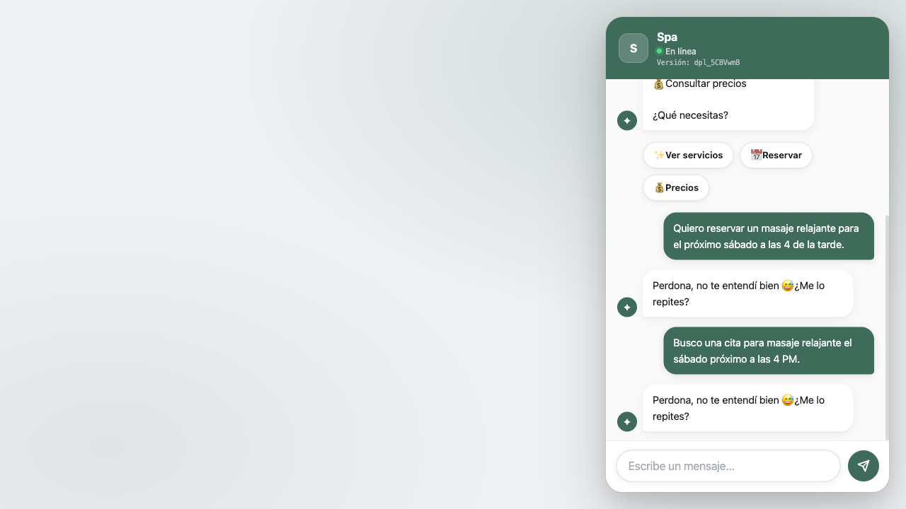

#### Mensajes bloqueados por incoherencia
- Ninguno.

### D — Slots reales de disponibilidad
**Estado final real:** `{"servicio":"masaje relajante","fecha":"sábado","hora":null,"nombre":null,"telefono":null,"email":null,"notas":null}`
**Resultado:** NO EJECUTADO COMPLETAMENTE — Límite de 20 turnos alcanzado. El bot repitió 3 veces la misma respuesta: "Perdona, no te entendí bien 😅 ¿Me lo repites?"

```text
1. [Cliente]
[Clic en Español]


2. [Bot]
¡Hola! 😊 Soy el asistente de Spa. Puedo ayudarte con: ✨ Conocer nuestros servicios 📅 Reservar una cita 💰 Consultar precios ¿Qué necesitas?


3. [Cliente]
Quiero reservar un masaje relajante para el próximo sábado. ¿Qué horarios tienen disponibles?
BOOKING DATA: {"servicio":"masaje relajante","fecha":"sábado","hora":null,"nombre":null,"telefono":null,"email":null,"notas":null}

4. [Bot]
Perdona, no te entendí bien 😅 ¿Me lo repites?
BOOKING DATA: {"servicio":"masaje relajante","fecha":"sábado","hora":null,"nombre":null,"telefono":null,"email":null,"notas":null}

5. [Cliente]
Para el sábado próximo necesito conocer las horas libres para un masaje relajante.
BOOKING DATA: {"servicio":"masaje relajante","fecha":"sábado","hora":null,"nombre":null,"telefono":null,"email":null,"notas":null}

6. [Bot]
Perdona, no te entendí bien 😅 ¿Me lo repites?
BOOKING DATA: {"servicio":"masaje relajante","fecha":"sábado","hora":null,"nombre":null,"telefono":null,"email":null,"notas":null}

7. [Cliente]
Quiero reservar un masaje relajante para el próximo sábado. ¿Qué horarios tienen disponibles?
BOOKING DATA: {"servicio":"masaje relajante","fecha":"sábado","hora":null,"nombre":null,"telefono":null,"email":null,"notas":null}

8. [Bot]
Perdona, no te entendí bien 😅 ¿Me lo repites?
BOOKING DATA: {"servicio":"masaje relajante","fecha":"sábado","hora":null,"nombre":null,"telefono":null,"email":null,"notas":null}

```

#### Capturas
- Turno 0: respuesta-bot. Respuesta del bot sin evidencia para una etiqueta específica. Estado: `{"servicio":null,"fecha":null,"hora":null,"nombre":null,"telefono":null,"email":null,"notas":null}`
  
- Turno 1: respuesta-bot. Respuesta del bot sin evidencia para una etiqueta específica. Estado: `{"servicio":"masaje relajante","fecha":"sábado","hora":null,"nombre":null,"telefono":null,"email":null,"notas":null}`
  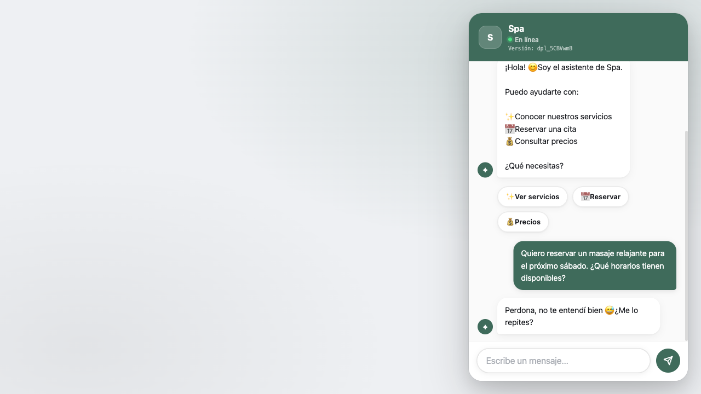
- Turno 2: respuesta-bot. Respuesta del bot sin evidencia para una etiqueta específica. Estado: `{"servicio":"masaje relajante","fecha":"sábado","hora":null,"nombre":null,"telefono":null,"email":null,"notas":null}`
  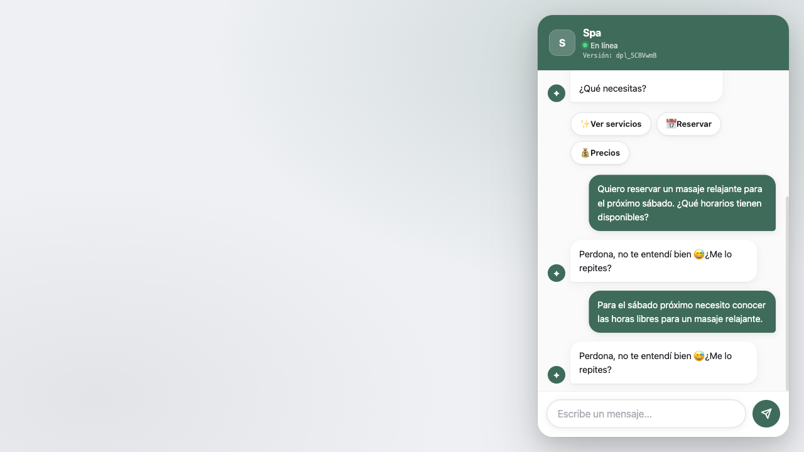

#### Mensajes bloqueados por incoherencia
- Ninguno.

### E — Memoria y actualización de datos
**Estado final real:** `{"servicio":"masaje relajante","fecha":"sábado","hora":"4:00 PM","nombre":null,"telefono":null,"email":null,"notas":null}`
**Resultado:** NO EJECUTADO COMPLETAMENTE — Límite de 20 turnos alcanzado. El bot repitió 3 veces la misma respuesta: "Perdona, no te entendí bien 😅 ¿Me lo repites?"

```text
1. [Cliente]
[Clic en Español]


2. [Bot]
¡Hola! 😊 Soy el asistente de Spa. Puedo ayudarte con: ✨ Conocer nuestros servicios 📅 Reservar una cita 💰 Consultar precios ¿Qué necesitas?


3. [Cliente]
Quiero reservar un masaje relajante para el próximo sábado a las 4 de la tarde.
BOOKING DATA: {"servicio":"masaje relajante","fecha":"sábado","hora":"4:00 PM","nombre":null,"telefono":null,"email":null,"notas":null}

4. [Bot]
Perdona, no te entendí bien 😅 ¿Me lo repites?
BOOKING DATA: {"servicio":"masaje relajante","fecha":"sábado","hora":"4:00 PM","nombre":null,"telefono":null,"email":null,"notas":null}

5. [Cliente]
Necesito programar un masaje relajante para el sábado próximo, a las cuatro de la tarde.
BOOKING DATA: {"servicio":"masaje relajante","fecha":"sábado","hora":"4:00 PM","nombre":null,"telefono":null,"email":null,"notas":null}

6. [Bot]
Perdona, no te entendí bien 😅 ¿Me lo repites?
BOOKING DATA: {"servicio":"masaje relajante","fecha":"sábado","hora":"4:00 PM","nombre":null,"telefono":null,"email":null,"notas":null}

7. [Cliente]
Quiero reservar un masaje relajante para el próximo sábado a las 4 de la tarde.
BOOKING DATA: {"servicio":"masaje relajante","fecha":"sábado","hora":"4:00 PM","nombre":null,"telefono":null,"email":null,"notas":null}

8. [Bot]
Perdona, no te entendí bien 😅 ¿Me lo repites?
BOOKING DATA: {"servicio":"masaje relajante","fecha":"sábado","hora":"4:00 PM","nombre":null,"telefono":null,"email":null,"notas":null}

```

#### Capturas
- Turno 0: respuesta-bot. Respuesta del bot sin evidencia para una etiqueta específica. Estado: `{"servicio":null,"fecha":null,"hora":null,"nombre":null,"telefono":null,"email":null,"notas":null}`
  
- Turno 1: respuesta-bot. Respuesta del bot sin evidencia para una etiqueta específica. Estado: `{"servicio":"masaje relajante","fecha":"sábado","hora":"4:00 PM","nombre":null,"telefono":null,"email":null,"notas":null}`
  
- Turno 2: respuesta-bot. Respuesta del bot sin evidencia para una etiqueta específica. Estado: `{"servicio":"masaje relajante","fecha":"sábado","hora":"4:00 PM","nombre":null,"telefono":null,"email":null,"notas":null}`
  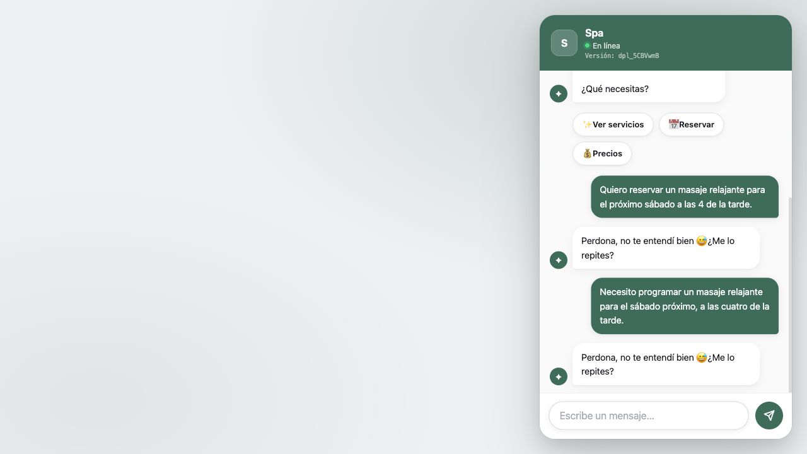

#### Mensajes bloqueados por incoherencia
- Ninguno.

### J — Día cerrado u horario inválido
**Estado final real:** `{"servicio":"masaje relajante","fecha":"domingo","hora":"3:00 AM","nombre":null,"telefono":null,"email":null,"notas":null}`
**Resultado:** NO EJECUTADO COMPLETAMENTE — Límite de 20 turnos alcanzado. El bot repitió 3 veces la misma respuesta: "Perdona, no te entendí bien 😅 ¿Me lo repites?"

```text
1. [Cliente]
[Clic en Español]


2. [Bot]
¡Hola! 😊 Soy el asistente de Spa. Puedo ayudarte con: ✨ Conocer nuestros servicios 📅 Reservar una cita 💰 Consultar precios ¿Qué necesitas?


3. [Cliente]
Quiero reservar un masaje relajante para este domingo a las 3 de la mañana.
BOOKING DATA: {"servicio":"masaje relajante","fecha":"domingo","hora":"3:00 AM","nombre":null,"telefono":null,"email":null,"notas":null}

4. [Bot]
Perdona, no te entendí bien 😅 ¿Me lo repites?
BOOKING DATA: {"servicio":"masaje relajante","fecha":"domingo","hora":"3:00 AM","nombre":null,"telefono":null,"email":null,"notas":null}

5. [Cliente]
Quisiera una cita de masaje relajante este domingo a las tres de la mañana.
BOOKING DATA: {"servicio":"masaje relajante","fecha":"domingo","hora":"3:00 AM","nombre":null,"telefono":null,"email":null,"notas":null}

6. [Bot]
Perdona, no te entendí bien 😅 ¿Me lo repites?
BOOKING DATA: {"servicio":"masaje relajante","fecha":"domingo","hora":"3:00 AM","nombre":null,"telefono":null,"email":null,"notas":null}

7. [Cliente]
Quiero reservar un masaje relajante para este domingo a las 3 de la mañana.
BOOKING DATA: {"servicio":"masaje relajante","fecha":"domingo","hora":"3:00 AM","nombre":null,"telefono":null,"email":null,"notas":null}

8. [Bot]
Perdona, no te entendí bien 😅 ¿Me lo repites?
BOOKING DATA: {"servicio":"masaje relajante","fecha":"domingo","hora":"3:00 AM","nombre":null,"telefono":null,"email":null,"notas":null}

```

#### Capturas
- Turno 0: respuesta-bot. Respuesta del bot sin evidencia para una etiqueta específica. Estado: `{"servicio":null,"fecha":null,"hora":null,"nombre":null,"telefono":null,"email":null,"notas":null}`
  
- Turno 1: respuesta-bot. Respuesta del bot sin evidencia para una etiqueta específica. Estado: `{"servicio":"masaje relajante","fecha":"domingo","hora":"3:00 AM","nombre":null,"telefono":null,"email":null,"notas":null}`
  
- Turno 2: respuesta-bot. Respuesta del bot sin evidencia para una etiqueta específica. Estado: `{"servicio":"masaje relajante","fecha":"domingo","hora":"3:00 AM","nombre":null,"telefono":null,"email":null,"notas":null}`
  

#### Mensajes bloqueados por incoherencia
- Ninguno.

### K — Hora explícita PM
**Estado final real:** `{"servicio":"masaje relajante","fecha":"sábado","hora":"4:00 PM","nombre":null,"telefono":null,"email":null,"notas":null}`
**Resultado:** NO EJECUTADO COMPLETAMENTE — Límite de 20 turnos alcanzado. El bot repitió 3 veces la misma respuesta: "Perdona, no te entendí bien 😅 ¿Me lo repites?"

```text
1. [Cliente]
[Clic en Español]


2. [Bot]
¡Hola! 😊 Soy el asistente de Spa. Puedo ayudarte con: ✨ Conocer nuestros servicios 📅 Reservar una cita 💰 Consultar precios ¿Qué necesitas?


3. [Cliente]
Quiero reservar un masaje relajante para el próximo sábado a las 4 de la tarde.
BOOKING DATA: {"servicio":"masaje relajante","fecha":"sábado","hora":"4:00 PM","nombre":null,"telefono":null,"email":null,"notas":null}

4. [Bot]
Perdona, no te entendí bien 😅 ¿Me lo repites?
BOOKING DATA: {"servicio":"masaje relajante","fecha":"sábado","hora":"4:00 PM","nombre":null,"telefono":null,"email":null,"notas":null}

5. [Cliente]
Quiero agendar un masaje relajante el sábado próximo a las cuatro de la tarde.
BOOKING DATA: {"servicio":"masaje relajante","fecha":"sábado","hora":"4:00 PM","nombre":null,"telefono":null,"email":null,"notas":null}

6. [Bot]
Perdona, no te entendí bien 😅 ¿Me lo repites?
BOOKING DATA: {"servicio":"masaje relajante","fecha":"sábado","hora":"4:00 PM","nombre":null,"telefono":null,"email":null,"notas":null}

7. [Cliente]
Quiero reservar un masaje relajante para el próximo sábado a las 4 de la tarde.
BOOKING DATA: {"servicio":"masaje relajante","fecha":"sábado","hora":"4:00 PM","nombre":null,"telefono":null,"email":null,"notas":null}

8. [Bot]
Perdona, no te entendí bien 😅 ¿Me lo repites?
BOOKING DATA: {"servicio":"masaje relajante","fecha":"sábado","hora":"4:00 PM","nombre":null,"telefono":null,"email":null,"notas":null}

```

#### Capturas
- Turno 0: respuesta-bot. Respuesta del bot sin evidencia para una etiqueta específica. Estado: `{"servicio":null,"fecha":null,"hora":null,"nombre":null,"telefono":null,"email":null,"notas":null}`
  
- Turno 1: respuesta-bot. Respuesta del bot sin evidencia para una etiqueta específica. Estado: `{"servicio":"masaje relajante","fecha":"sábado","hora":"4:00 PM","nombre":null,"telefono":null,"email":null,"notas":null}`
  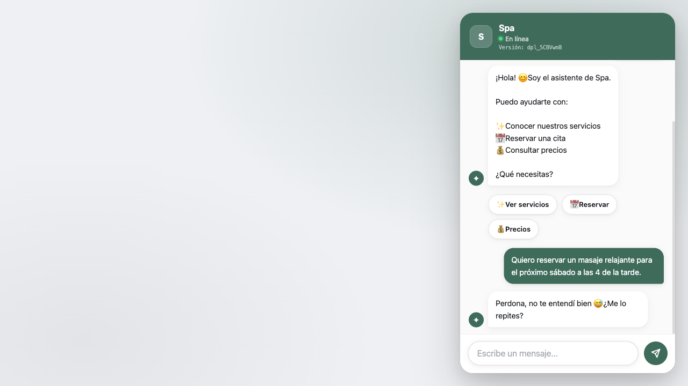
- Turno 2: respuesta-bot. Respuesta del bot sin evidencia para una etiqueta específica. Estado: `{"servicio":"masaje relajante","fecha":"sábado","hora":"4:00 PM","nombre":null,"telefono":null,"email":null,"notas":null}`
  

#### Mensajes bloqueados por incoherencia
- Ninguno.

### L — Hora explícita AM sin fecha falsa
**Estado final real:** `{"servicio":"masaje relajante","fecha":null,"hora":"3:00 AM","nombre":null,"telefono":null,"email":null,"notas":null}`
**Resultado:** NO EJECUTADO COMPLETAMENTE — Límite de 20 turnos alcanzado. El bot repitió 3 veces la misma respuesta: "Perdona, no te entendí bien 😅 ¿Me lo repites?"

```text
1. [Cliente]
[Clic en Español]


2. [Bot]
¡Hola! 😊 Soy el asistente de Spa. Puedo ayudarte con: ✨ Conocer nuestros servicios 📅 Reservar una cita 💰 Consultar precios ¿Qué necesitas?


3. [Cliente]
Quiero reservar un masaje relajante a las 3 de la mañana.
BOOKING DATA: {"servicio":"masaje relajante","fecha":null,"hora":"3:00 AM","nombre":null,"telefono":null,"email":null,"notas":null}

4. [Bot]
Perdona, no te entendí bien 😅 ¿Me lo repites?
BOOKING DATA: {"servicio":"masaje relajante","fecha":null,"hora":"3:00 AM","nombre":null,"telefono":null,"email":null,"notas":null}

5. [Cliente]
Necesito una cita de masaje relajante a las tres de la mañana.
BOOKING DATA: {"servicio":"masaje relajante","fecha":null,"hora":"3:00 AM","nombre":null,"telefono":null,"email":null,"notas":null}

6. [Bot]
Perdona, no te entendí bien 😅 ¿Me lo repites?
BOOKING DATA: {"servicio":"masaje relajante","fecha":null,"hora":"3:00 AM","nombre":null,"telefono":null,"email":null,"notas":null}

7. [Cliente]
Quiero reservar un masaje relajante a las 3 de la mañana.
BOOKING DATA: {"servicio":"masaje relajante","fecha":null,"hora":"3:00 AM","nombre":null,"telefono":null,"email":null,"notas":null}

8. [Bot]
Perdona, no te entendí bien 😅 ¿Me lo repites?
BOOKING DATA: {"servicio":"masaje relajante","fecha":null,"hora":"3:00 AM","nombre":null,"telefono":null,"email":null,"notas":null}

```

#### Capturas
- Turno 0: respuesta-bot. Respuesta del bot sin evidencia para una etiqueta específica. Estado: `{"servicio":null,"fecha":null,"hora":null,"nombre":null,"telefono":null,"email":null,"notas":null}`
  
- Turno 1: respuesta-bot. Respuesta del bot sin evidencia para una etiqueta específica. Estado: `{"servicio":"masaje relajante","fecha":null,"hora":"3:00 AM","nombre":null,"telefono":null,"email":null,"notas":null}`
  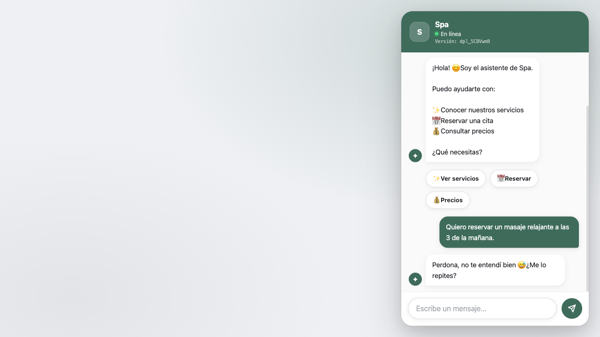
- Turno 2: respuesta-bot. Respuesta del bot sin evidencia para una etiqueta específica. Estado: `{"servicio":"masaje relajante","fecha":null,"hora":"3:00 AM","nombre":null,"telefono":null,"email":null,"notas":null}`
  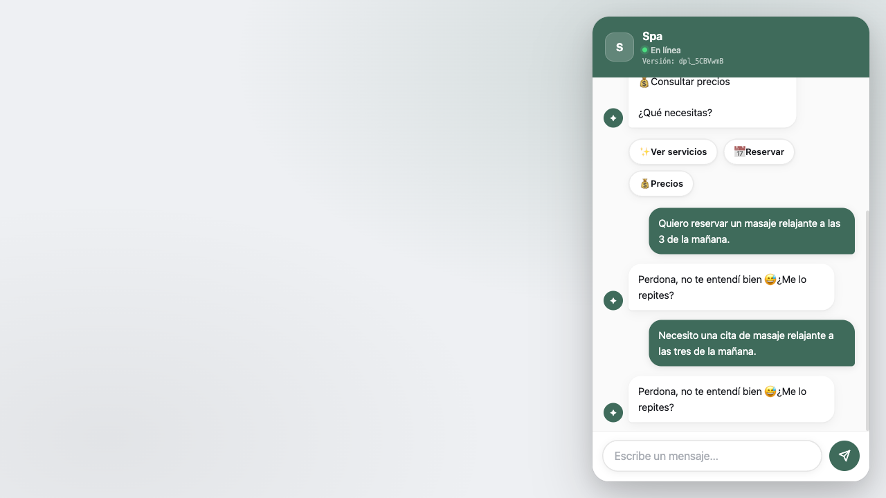

#### Mensajes bloqueados por incoherencia
- Ninguno.

### M — Hora implícita según horario
**Estado final real:** `{"servicio":null,"fecha":"sábado","hora":null,"nombre":null,"telefono":null,"email":null,"notas":null}`
**Resultado:** NO EJECUTADO COMPLETAMENTE — Límite de 20 turnos alcanzado. El bot repitió 3 veces la misma respuesta: "Perdona, no te entendí bien 😅 ¿Me lo repites?"

```text
1. [Cliente]
[Clic en Español]


2. [Bot]
¡Hola! 😊 Soy el asistente de Spa. Puedo ayudarte con: ✨ Conocer nuestros servicios 📅 Reservar una cita 💰 Consultar precios ¿Qué necesitas?


3. [Cliente]
Quiero reservar el sábado a las 4.
BOOKING DATA: {"servicio":null,"fecha":"sábado","hora":null,"nombre":null,"telefono":null,"email":null,"notas":null}

4. [Bot]
Perdona, no te entendí bien 😅 ¿Me lo repites?
BOOKING DATA: {"servicio":null,"fecha":"sábado","hora":null,"nombre":null,"telefono":null,"email":null,"notas":null}

5. [Cliente]
Para el sábado quiero una cita a las cuatro.
BOOKING DATA: {"servicio":null,"fecha":"sábado","hora":null,"nombre":null,"telefono":null,"email":null,"notas":null}

6. [Bot]
Perdona, no te entendí bien 😅 ¿Me lo repites?
BOOKING DATA: {"servicio":null,"fecha":"sábado","hora":null,"nombre":null,"telefono":null,"email":null,"notas":null}

7. [Cliente]
Quiero reservar el sábado a las 4.
BOOKING DATA: {"servicio":null,"fecha":"sábado","hora":null,"nombre":null,"telefono":null,"email":null,"notas":null}

8. [Bot]
Perdona, no te entendí bien 😅 ¿Me lo repites?
BOOKING DATA: {"servicio":null,"fecha":"sábado","hora":null,"nombre":null,"telefono":null,"email":null,"notas":null}

```

#### Capturas
- Turno 0: respuesta-bot. Respuesta del bot sin evidencia para una etiqueta específica. Estado: `{"servicio":null,"fecha":null,"hora":null,"nombre":null,"telefono":null,"email":null,"notas":null}`
  
- Turno 1: respuesta-bot. Respuesta del bot sin evidencia para una etiqueta específica. Estado: `{"servicio":null,"fecha":"sábado","hora":null,"nombre":null,"telefono":null,"email":null,"notas":null}`
  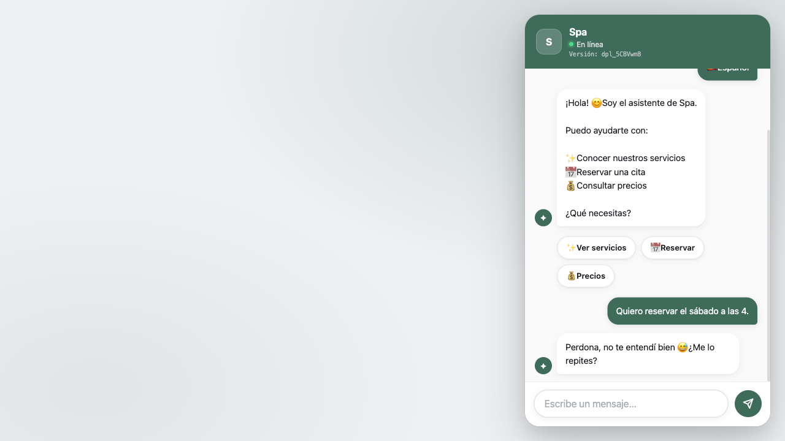
- Turno 2: respuesta-bot. Respuesta del bot sin evidencia para una etiqueta específica. Estado: `{"servicio":null,"fecha":"sábado","hora":null,"nombre":null,"telefono":null,"email":null,"notas":null}`
  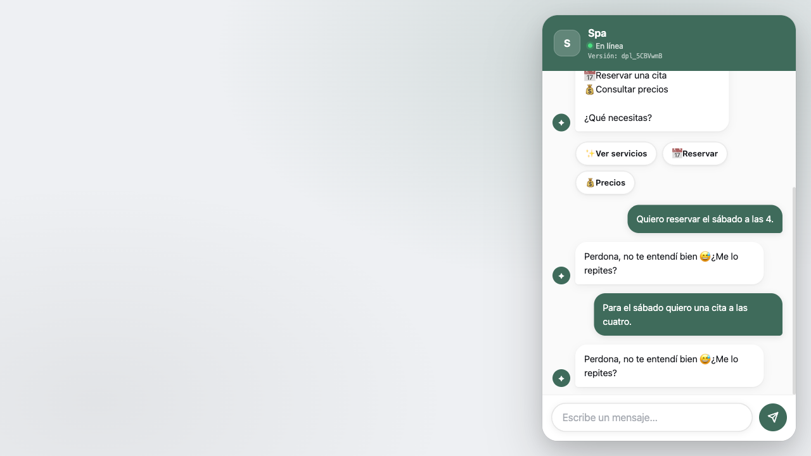

#### Mensajes bloqueados por incoherencia
- Ninguno.

### N — Ambigüedad real con botones
**Estado final real:** `{"servicio":null,"fecha":null,"hora":null,"nombre":null,"telefono":null,"email":null,"notas":null}`
**Resultado:** OBJETIVO ALCANZADO — Mostró botones 4:00 AM y 4:00 PM sin pregunta textual.

```text
1. [Bot]
¡Hola! 😊 Soy el asistente de Auditoría local AM/PM. Puedo ayudarte con: ✨ Conocer nuestros servicios 📅 Reservar una cita 💰 Consultar precios ¿Qué necesitas?


2. [Cliente]
Quiero reservar a las 4.
BOOKING DATA: {"servicio":null,"fecha":null,"hora":null,"nombre":null,"telefono":null,"email":null,"notas":null}

3. [Bot]
¡Hola! 😊 Soy el asistente de Auditoría local AM/PM. Puedo ayudarte con: ✨ Conocer nuestros servicios 📅 Reservar una cita 💰 Consultar precios ¿Qué necesitas?


```

#### Capturas
- Turno 0: respuesta-bot. Respuesta del bot sin evidencia para una etiqueta específica. Estado: `{"servicio":null,"fecha":null,"hora":null,"nombre":null,"telefono":null,"email":null,"notas":null}`
  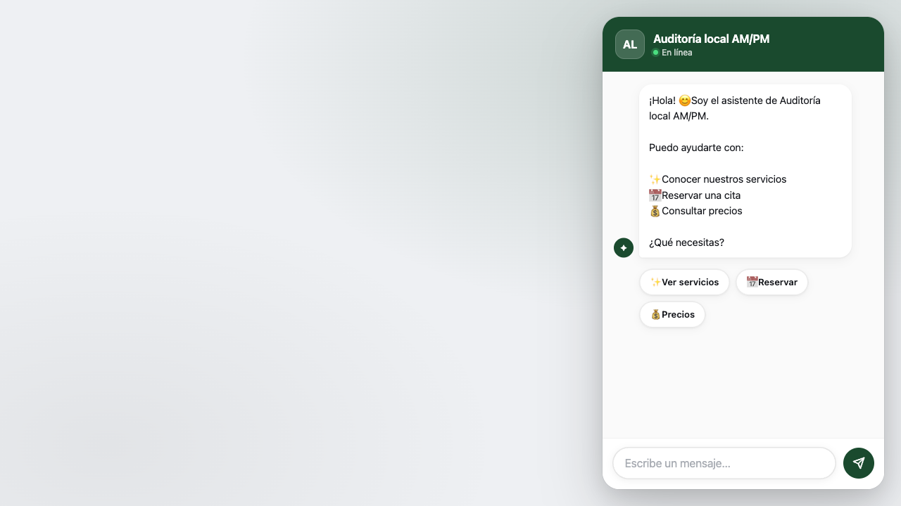
- Turno 1: horarios-disponibles. Slots reales verificados desde chatbot-ui: ⏰ 4:00 AM, ⏰ 4:00 PM. Estado: `{"servicio":null,"fecha":null,"hora":null,"nombre":null,"telefono":null,"email":null,"notas":null}`
  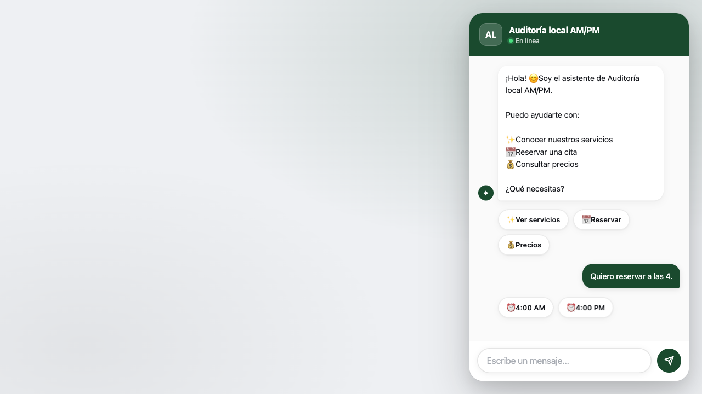

#### Mensajes bloqueados por incoherencia
- Ninguno.

### O — Fecha real más hora
**Estado final real:** `{"servicio":null,"fecha":null,"hora":null,"nombre":null,"telefono":null,"email":null,"notas":null}`
**Resultado:** NO EJECUTADO COMPLETAMENTE — Límite de 20 turnos alcanzado. El bot repitió 3 veces la misma respuesta: "Perdona, no te entendí bien 😅 ¿Me lo repites?"

```text
1. [Cliente]
[Clic en Español]


2. [Bot]
¡Hola! 😊 Soy el asistente de Spa. Puedo ayudarte con: ✨ Conocer nuestros servicios 📅 Reservar una cita 💰 Consultar precios ¿Qué necesitas?


3. [Cliente]
Mañana a las 3 PM.
BOOKING DATA: {"servicio":null,"fecha":null,"hora":null,"nombre":null,"telefono":null,"email":null,"notas":null}

4. [Bot]
Perdona, no te entendí bien 😅 ¿Me lo repites?
BOOKING DATA: {"servicio":null,"fecha":null,"hora":null,"nombre":null,"telefono":null,"email":null,"notas":null}

5. [Cliente]
Quiero una cita mañana a las tres PM.
BOOKING DATA: {"servicio":null,"fecha":null,"hora":null,"nombre":null,"telefono":null,"email":null,"notas":null}

6. [Bot]
Perdona, no te entendí bien 😅 ¿Me lo repites?
BOOKING DATA: {"servicio":null,"fecha":null,"hora":null,"nombre":null,"telefono":null,"email":null,"notas":null}

7. [Cliente]
Mañana a las 3 PM.
BOOKING DATA: {"servicio":null,"fecha":null,"hora":null,"nombre":null,"telefono":null,"email":null,"notas":null}

8. [Bot]
Perdona, no te entendí bien 😅 ¿Me lo repites?
BOOKING DATA: {"servicio":null,"fecha":null,"hora":null,"nombre":null,"telefono":null,"email":null,"notas":null}

```

#### Capturas
- Turno 0: respuesta-bot. Respuesta del bot sin evidencia para una etiqueta específica. Estado: `{"servicio":null,"fecha":null,"hora":null,"nombre":null,"telefono":null,"email":null,"notas":null}`
  
- Turno 1: respuesta-bot. Respuesta del bot sin evidencia para una etiqueta específica. Estado: `{"servicio":null,"fecha":null,"hora":null,"nombre":null,"telefono":null,"email":null,"notas":null}`
  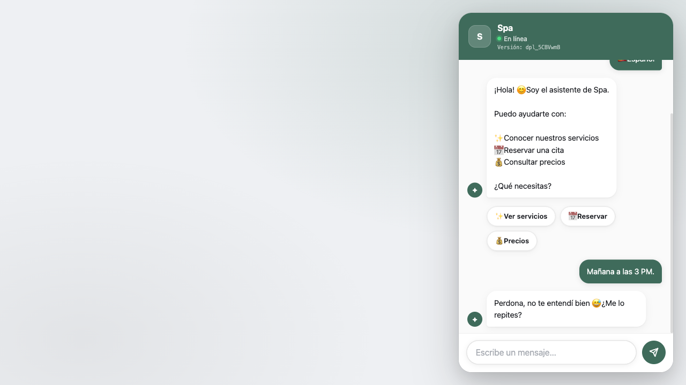
- Turno 2: respuesta-bot. Respuesta del bot sin evidencia para una etiqueta específica. Estado: `{"servicio":null,"fecha":null,"hora":null,"nombre":null,"telefono":null,"email":null,"notas":null}`
  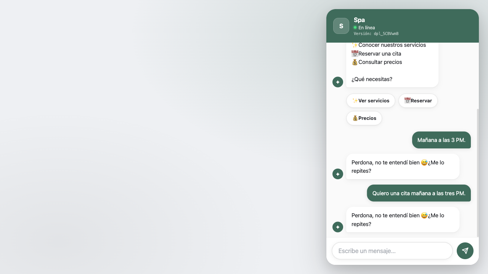

#### Mensajes bloqueados por incoherencia
- Ninguno.

### F — Persistencia backend
**Estado final real:** `{"servicio":null,"fecha":null,"hora":null,"nombre":null,"telefono":null,"email":null,"notas":null}`
**Resultado:** NO EJECUTADO COMPLETAMENTE — Bloqueado: requiere escritura de reservas en producción, no autorizada.

```text
```

#### Capturas

#### Mensajes bloqueados por incoherencia
- Ninguno.

### G — Modificación API
**Estado final real:** `{"servicio":null,"fecha":null,"hora":null,"nombre":null,"telefono":null,"email":null,"notas":null}`
**Resultado:** NO EJECUTADO COMPLETAMENTE — Bloqueado: requiere escritura de reservas en producción, no autorizada.

```text
```

#### Capturas

#### Mensajes bloqueados por incoherencia
- Ninguno.

### H — Cancelación API
**Estado final real:** `{"servicio":null,"fecha":null,"hora":null,"nombre":null,"telefono":null,"email":null,"notas":null}`
**Resultado:** NO EJECUTADO COMPLETAMENTE — Bloqueado: requiere escritura de reservas en producción, no autorizada.

```text
```

#### Capturas

#### Mensajes bloqueados por incoherencia
- Ninguno.

### I — Idempotencia
**Estado final real:** `{"servicio":null,"fecha":null,"hora":null,"nombre":null,"telefono":null,"email":null,"notas":null}`
**Resultado:** NO EJECUTADO COMPLETAMENTE — Bloqueado: requiere escritura de reservas en producción, no autorizada.

```text
```

#### Capturas

#### Mensajes bloqueados por incoherencia
- Ninguno.

## Hallazgos clasificados
- **CHATBOT** | A, turno 2 | CONTINUACIÓN SIN RUTA ESPECÍFICA | ALTO | El chatbot no entendió la intención original tras una reformulación equivalente.
- **CHATBOT** | A, turno 3 | LOOP DETECTADO | ALTO | El bot repitió 3 veces la misma respuesta: "Perdona, no te entendí bien 😅 ¿Me lo repites?"
- **CHATBOT** | B, turno 2 | CONTINUACIÓN SIN RUTA ESPECÍFICA | ALTO | El chatbot no entendió la intención original tras una reformulación equivalente.
- **CHATBOT** | B, turno 3 | LOOP DETECTADO | ALTO | El bot repitió 3 veces la misma respuesta: "Perdona, no te entendí bien 😅 ¿Me lo repites?"
- **CHATBOT** | C, turno 2 | CONTINUACIÓN SIN RUTA ESPECÍFICA | ALTO | El chatbot no entendió la intención original tras una reformulación equivalente.
- **CHATBOT** | C, turno 3 | LOOP DETECTADO | ALTO | El bot repitió 3 veces la misma respuesta: "Perdona, no te entendí bien 😅 ¿Me lo repites?"
- **CHATBOT** | D, turno 2 | CONTINUACIÓN SIN RUTA ESPECÍFICA | ALTO | El chatbot no entendió la intención original tras una reformulación equivalente.
- **CHATBOT** | D, turno 3 | LOOP DETECTADO | ALTO | El bot repitió 3 veces la misma respuesta: "Perdona, no te entendí bien 😅 ¿Me lo repites?"
- **CHATBOT** | E, turno 2 | CONTINUACIÓN SIN RUTA ESPECÍFICA | ALTO | El chatbot no entendió la intención original tras una reformulación equivalente.
- **CHATBOT** | E, turno 3 | LOOP DETECTADO | ALTO | El bot repitió 3 veces la misma respuesta: "Perdona, no te entendí bien 😅 ¿Me lo repites?"
- **CHATBOT** | J, turno 2 | CONTINUACIÓN SIN RUTA ESPECÍFICA | ALTO | El chatbot no entendió la intención original tras una reformulación equivalente.
- **CHATBOT** | J, turno 3 | LOOP DETECTADO | ALTO | El bot repitió 3 veces la misma respuesta: "Perdona, no te entendí bien 😅 ¿Me lo repites?"
- **CHATBOT** | K, turno 2 | CONTINUACIÓN SIN RUTA ESPECÍFICA | ALTO | El chatbot no entendió la intención original tras una reformulación equivalente.
- **CHATBOT** | K, turno 3 | LOOP DETECTADO | ALTO | El bot repitió 3 veces la misma respuesta: "Perdona, no te entendí bien 😅 ¿Me lo repites?"
- **CHATBOT** | L, turno 2 | CONTINUACIÓN SIN RUTA ESPECÍFICA | ALTO | El chatbot no entendió la intención original tras una reformulación equivalente.
- **CHATBOT** | L, turno 3 | LOOP DETECTADO | ALTO | El bot repitió 3 veces la misma respuesta: "Perdona, no te entendí bien 😅 ¿Me lo repites?"
- **CHATBOT** | M, turno 2 | CONTINUACIÓN SIN RUTA ESPECÍFICA | ALTO | El chatbot no entendió la intención original tras una reformulación equivalente.
- **CHATBOT** | M, turno 3 | LOOP DETECTADO | ALTO | El bot repitió 3 veces la misma respuesta: "Perdona, no te entendí bien 😅 ¿Me lo repites?"
- **CHATBOT** | O, turno 2 | CONTINUACIÓN SIN RUTA ESPECÍFICA | ALTO | El chatbot no entendió la intención original tras una reformulación equivalente.
- **CHATBOT** | O, turno 3 | LOOP DETECTADO | ALTO | El bot repitió 3 veces la misma respuesta: "Perdona, no te entendí bien 😅 ¿Me lo repites?"
- **SCRIPT** | F, turno 0 | EJECUCIÓN BLOQUEADA | INFO | Crear, modificar, cancelar o repetir confirmaciones escribiría datos en producción.
- **SCRIPT** | G, turno 0 | EJECUCIÓN BLOQUEADA | INFO | Crear, modificar, cancelar o repetir confirmaciones escribiría datos en producción.
- **SCRIPT** | H, turno 0 | EJECUCIÓN BLOQUEADA | INFO | Crear, modificar, cancelar o repetir confirmaciones escribiría datos en producción.
- **SCRIPT** | I, turno 0 | EJECUCIÓN BLOQUEADA | INFO | Crear, modificar, cancelar o repetir confirmaciones escribiría datos en producción.
