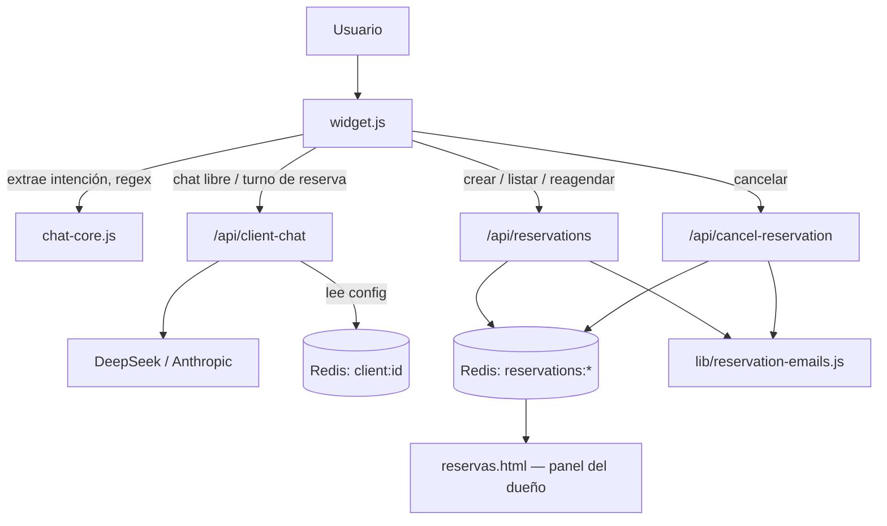
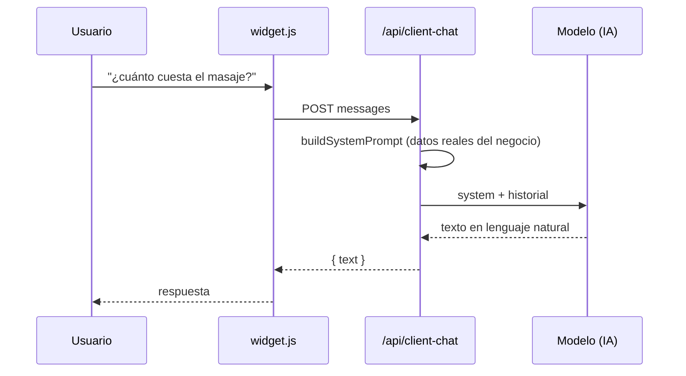
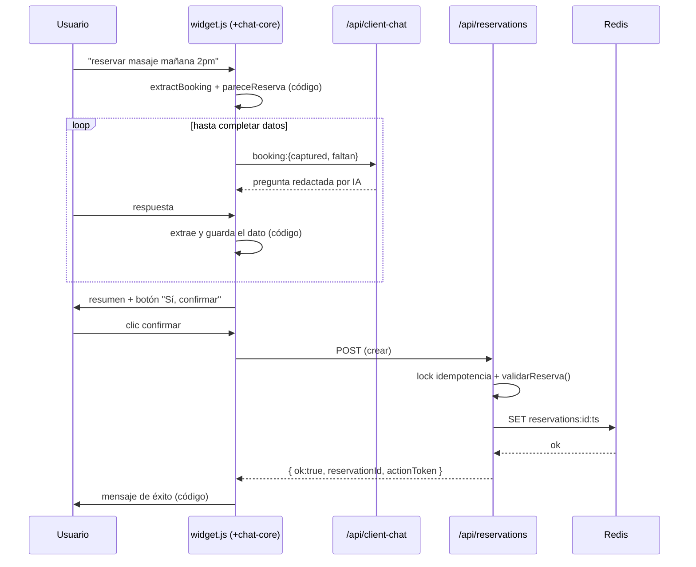
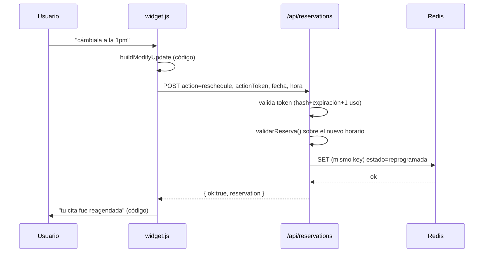
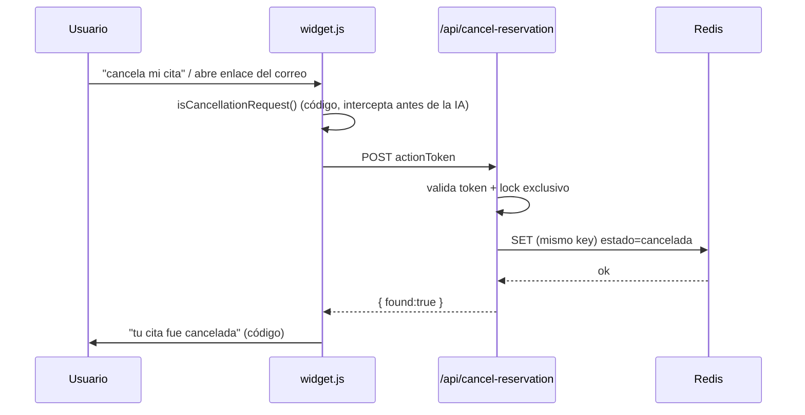

# Cómo funciona el chatbot de JB Studio hoy

Auditoría de solo lectura del repositorio `jb-studio-site`, previa a evaluar una arquitectura donde la IA conversa y el código decide reservar / reagendar / cancelar. Ningún archivo fue modificado durante esta auditoría.

**Estado al momento de la auditoría:**
- repo = producción (commit `4eb0566`)
- git status limpio
- 5/5 monitores de Better Stack arriba
- 0 issues críticos de reserva en Sentry

---

## Fase 1 — Entorno: repo, rama y producción

No se asumió que el HEAD local fuera lo desplegado — se verificó contra Vercel directamente.

| Campo | Valor |
|---|---|
| Remote | `github.com/micarlojean2-dev/jb-studio-site` |
| Rama | HEAD separado (`detached HEAD from 0e87f19`) — apunta exactamente al mismo commit que `origin/main` |
| Último commit | `4eb0566` — "fix(billing): deactivate chatbot when subscription is cancelled during trial period" (2026-08-06 23:52) |
| Cambios sin commit | Ninguno — `git status` limpio |
| Deployment en producción (Vercel) | `dpl_2mcxQ7zvbKxszGq4sDvh9jaXZUri` · READY · target `production` · commit `4eb0566` |

**Conclusión:** Local, `origin/main` y producción coinciden exactamente. La única rareza es que la rama local `main` (con puntero propio) está 18 commits detrás — es un puntero de rama obsoleto, no una divergencia real: el código auditado abajo es el que corre ahora mismo en `jbstudio.app`.

---

## Fase 2 — Mapa de archivos y funciones

El proyecto vive en el plan Hobby de Vercel (límite de 12 funciones serverless), lo que explica por qué varios endpoints públicos son en realidad un mismo archivo con *scopes* internos, ruteados por `vercel.json`.

### Frontend

**`widget.js`** (1663 líneas)

- `send(t)` — L1279 — Orquestador de cada mensaje: decide entre modificar reserva activa, ofrecer modificar/cancelar ante duplicado, continuar flujo de reserva, o chat libre. Llama a `POST /api/client-chat`.
- `askBookingTurn()` — L956 — Durante una reserva activa, arma `{captured, faltan}` y pide a la IA que redacte (nunca decide) el siguiente turno. Llama a `POST /api/client-chat` (con `booking`).
- `submitBooking()` — L1080 — Único punto que crea una reserva real — se dispara solo con el botón "✅ Sí, confirmar cita", nunca por texto libre. Llama a `POST /api/reservations`.
- `submitModify()` / `submitActiveCancel()` — L1235 / L1218 — Reagenda o cancela la reserva activa usando su `actionToken`. Llaman a `POST /api/reservations` (action=reschedule) y `POST /api/cancel-reservation` respectivamente.

**`chat-core.js`** (1297 líneas — compartido por widget.js y asistente.html)

- `extractBooking()` — L608 — Motor de extracción de datos de texto libre (fecha, hora, servicio, personas, contacto). 100% regex/reglas, cero IA.
- `pareceReserva()` — L921 — Detección de intención de reservar. Único árbitro de qué es "fecha", "hora", "servicio", "intención de reservar". Sin llamadas de red.

### Backend

**`api/client-chat.js`** (821 líneas)

- `handler()` — L557 — Arma el system prompt (`buildSystemPrompt`, L377: personalidad fija + datos reales del negocio + reglas anti-alucinación) y llama al modelo. Post-procesa el texto con regex para decidir si mostrar menú/galería. Llama a Redis (`client:id`) y a DeepSeek / Anthropic.

**`api/reservations.js`** (1375 líneas — también aloja los crons por el límite de 12 funciones)

- `handler()` — L779, `validarReserva()` — L495 — Única autoridad de creación, reagendado, listado y validación de disponibilidad (horario, capacidad, solapes, anticipación, duplicados). Llama a Redis y a `lib/reservation-emails.js`.

**`api/cancel-reservation.js`** (239 líneas)

- `handler()` — L95 — Cancelación pública vía `actionToken` (hash + expiración + un solo uso). Llama a Redis y `lib/reservation-emails.js`.

**`api/client-config.js`** (578 líneas — 6 endpoints virtuales vía rewrites)

- `createClientConfigHandler()` — L31 — Config pública del negocio, panel de imágenes, health check, build info, estado de cliente, portal Stripe y listado de reservas del panel — todo en un archivo por el límite de funciones. Llama a Redis, Stripe y Cloudinary.

**`lib/setup.js`**

- `faltaConfig()` / `necesitaSetup()` — Única fuente de verdad de "qué le falta a un negocio para tomar reservas" — antes estaba copiada en 3 archivos. Función pura, sin llamadas externas.

---

## Fase 3 — Reserva de principio a fin

Trazado con: *"Quiero reservar un masaje mañana a las 2pm"*

### 1 · Detección de intención — CÓDIGO

`widget.js` pasa cada mensaje por `CORE.extractBooking()` y `CORE.pareceReserva()` antes de tocar la red:

```js
// chat-core.js:921
function pareceReserva(t, extraido) {
  if (BOOKING_TRIGGERS.test(t)) return true;
  // sin trigger explícito, exige servicio + fecha/hora ya extraídos
  if (!INTENT_RE.test(t)) return false;
  return !!(extraido.servicio && (extraido.fecha || extraido.hora));
}
```

Si es una reserva, `widget.js` entra en `bookingStep = 1` y guarda lo ya extraído (servicio: masaje, fecha: mañana, hora: 2pm) en `bookingData` — todo esto en memoria del navegador.

### 2 · Completar datos — CÓDIGO decide qué falta, IA lo redacta

`askBookingTurn()` calcula `faltan` con `CORE.bookingRequirements()` y se lo manda al modelo junto con lo ya capturado — la IA solo elige las palabras:

```
// api/client-chat.js:657–661 (instrucción inyectada en el system prompt cuando hay booking activo)
CRÍTICO: la lista de "Datos que aún faltan" es la única verdad sobre qué se guardó...
FORBIDDEN afirmar: "ya notificamos al equipo/negocio", "tu cita está confirmada",
"el correo fue enviado", "la reserva fue creada/guardada". El sistema envía esos
avisos por su cuenta y te lo confirmará; tú no.
```

Esto se repite (en inglés/español) para cada turno — es la barrera explícita que impide que el modelo se adelante a afirmar un resultado.

### 3 · Resumen y confirmación explícita — CÓDIGO

Cuando `faltan.length === 0`, `showBookingSummary()` pinta el resumen y dos botones. **Solo** el clic en "✅ Sí, confirmar cita" ejecuta `submitBooking()` — un "sí" escrito nunca confirma (comentario `[BUG-CONFIRMACION-TEXTO]` en el propio código documenta que esto se corrigió a propósito).

### 4 · Creación — CÓDIGO, autoridad única

`POST /api/reservations` (sin `action`) valida configuración del negocio, adquiere un lock de idempotencia (`SET NX`, cubre doble-clic o reintento), valida disponibilidad real, y **solo entonces** escribe en Redis:

```js
// api/reservations.js:1294–1303
// ── Guardar en Redis (operación primaria: la reserva no se pierde
//    aunque falle un correo) ──────────────────────────────────────
const { actionToken, ...storedReservation } = reservation;
try {
  await redis.set(key, storedReservation);
} catch (e) {
  await redis.del(lockKey).catch(() => {});
  return res.status(503).json({ error: 'No pudimos guardar la reserva...' });
}
```

El correo de confirmación se intenta *después* de guardar y su fallo nunca revierte ni oculta el éxito — el campo `email` de la respuesta reporta la verdad (`configured:false`, o el error real de Resend).

**Cuándo se considera confirmada:** En el instante en que `redis.set(key, storedReservation)` no lanza excepción (L1298) y el handler responde `{ ok:true, reservationCreated:true }` (L1338). El mensaje de éxito que ve el cliente (`CORE.mensajeReservaGuardada`) lo redacta el código, y **solo se muestra si `d.ok === true`** llegó del backend — la IA nunca lo genera.

---

## Fase 4 — Reagendado

Trazado con: *"Quiero cambiar mi cita para mañana a la 1pm"*

**Cómo identifica la reserva existente:** No por fecha ni contacto: por el `actionToken` emitido al crear la reserva (guardado en `sessionStorage` del navegador). El servidor lo re-verifica contra el hash guardado, su expiración y que no haya sido usado ya:

```js
// api/reservations.js:207–216
function actionTokenIsActive(reservation, token) {
  // hash + expiración + un solo uso — nunca confía en el token crudo del cliente
  ...
}
```

**Nueva fecha/hora, disponibilidad y ejecución — todo CÓDIGO:** `chat-core.js` interpreta el texto libre del cambio (`buildModifyUpdate`), y si hay ambigüedad AM/PM pregunta antes de enviar nada. El endpoint es el mismo `POST /api/reservations` con `action:'reschedule'`, que revalida disponibilidad con la misma `validarReserva()` que la creación:

```js
// api/reservations.js:1084–1099
const availability = validarReserva(checkedClient, candidate.fechaISO, candidate.horaISO, candidate.servicio, undefined, otherReservations);
if (!availability.ok) return res.status(200).json({ ok: false, ...availability });
candidate.estado = 'reprogramada';
candidate.fechaAnterior = existing.fecha;
candidate.horaAnterior  = existing.hora;
...
try {
  await redis.set(keys[index], storedCandidate);   // MISMO key: sobrescribe, no crea otro registro
} catch (err) {
  return res.status(503).json({ error: 'No pudimos guardar la reserva...' });
}
```

**¿Existe un camino de falso éxito?** No se encontró ninguno. El patrón es idéntico al de creación: `redis.set()` primero, y solo si no lanza excepción se responde `{ ok:true, reservation }` (L1118). Si Redis falla, el handler devuelve `503` **antes** de tocar la respuesta de éxito. En el frontend, `submitModify()` (widget.js:1235) solo pinta el mensaje de "reagendado" cuando `d.ok && d.reservation` — nunca antes.

El `actionToken` se reemite tras reagendar (nuevo hash/expiración), salvo cuando el cambio viene de la lista del chat (`selectedReservationId`), donde se conserva el mismo.

---

## Fase 5 — Cancelación

| Pregunta | Respuesta encontrada |
|---|---|
| ¿Cómo encuentra la reserva? | Por `actionToken` (enlace del correo o token en sesión del chat) — nunca por fecha o contacto sueltos. `widget.js` incluso bloquea la cancelación por chat libre: *"Para cancelar de forma segura, abre el enlace de reserva de tu correo"* si no hay `activeReservation` en sesión. |
| ¿Quién decide cancelar? | Código. La IA nunca participa: `isCancellationRequest()` es una regex en widget.js que intercepta el mensaje antes de que llegue al modelo. |
| ¿Cómo se confirma? | Un lock exclusivo (`reservation-action-lock:{hash}`, `SET NX`) evita que dos solicitudes cancelen la misma reserva a la vez; se relee el registro bajo el lock antes de escribir. |
| ¿Qué cambia en Redis? | Se sobrescribe el **mismo** registro: `estado:'cancelada'`, `fechaCancelacion`, `cancelledBy:'cliente'`. No se crea un registro nuevo ni se borra el original (auditable). |
| ¿Bajo qué condición ve éxito el frontend? | Solo si el backend respondió `{found:true}` tras el `redis.set()` exitoso (api/cancel-reservation.js:200-227). El correo de cancelación se envía después y su fallo no revierte nada. |

```js
// api/cancel-reservation.js:224–227
// Failure does not undo cancellation: the slot is released regardless.
const email = await sendReservationEmails(client, match, 'cancelled');
return res.status(200).json({ found: true, aviso: { encolado: aviso.ok }, email, emailWarning: email.warning || null });
```

---

## Fase 6 — Redis / Upstash

Una sola base ("mybots"), un solo cliente real en producción (`spa`) conviviendo con varias llaves de pruebas QA. Inspección de solo lectura, nada escrito ni borrado.

### Prefijos de llave encontrados (SCAN completo)

| Prefijo | Tipo | Contenido |
|---|---|---|
| `client:{id}` | string(json) | Configuración completa del negocio — ver Fase 7. |
| `reservations:{clientId}:{ts}` | string(json) | Una reserva. `ts` = `Date.now()` de creación, nunca cambia. |
| `activity:{clientId}` | list | Bitácora legible (created/rescheduled/cancelled) para el panel — no es la fuente de verdad, solo un log. |
| `changes:{clientId}` | list | Cola de avisos pendientes para el resumen diario (vacía en este momento: el cron ya la drenó). |
| `digest:pending` | set | Qué negocios tienen avisos pendientes de enviar hoy. |
| `idempo:{clientId}:{key}` | string | Lock de idempotencia de creación, TTL 24h. |
| `usage:{clientId}:{yyyy-mm}` | string(json) | Consumo de tokens/costo estimado del modelo, por mes. |
| `client-images:{clientId}:*` | string | Referencias a imágenes confirmadas en Cloudinary. |
| `stripe_event:{id}` | string | Deduplicación de webhooks de Stripe ya procesados. |

### Ejemplo real anonimizado — una reserva cancelada

`reservations:spa:1786054472415` — correos/teléfonos/hashes sustituidos por placeholders:

```json
{
  "clientId": "spa",
  "nombre": "Preview Cancel Test",
  "telefono": "+1XXXXXXXXXX",
  "email": "REDACTED@example.com",
  "fecha": "2026-08-10", "fechaISO": "2026-08-10",
  "hora": "4:00 PM",     "horaISO": "16:00",
  "timezone": "America/Los_Angeles",
  "servicio": "Masaje relajante", "duracion": 60,
  "actionTokenHash": "REDACTED-sha256",
  "actionTokenExpiresAt": "2026-08-11T06:59:59.999Z",
  "actionTokenUsedAt": "2026-08-06T22:15:52.787Z",
  "estado": "cancelada",
  "fechaConfirmacion": "2026-08-06T22:14:32.415Z",
  "fechaCancelacion":  "2026-08-06T22:15:52.787Z",
  "cancelledBy": "cliente"
}
```

| Campo | Representación |
|---|---|
| Estado | `estado`: `confirmada` → `reprogramada` → `cancelada` (string plano, no enum tipado) |
| Fecha / hora | Texto libre mostrado (`fecha`, `hora`) + copia normalizada para cómputo (`fechaISO`, `horaISO`) |
| Servicio | `servicio` (nombre), `duracion` (minutos, resuelta al crear) |
| Cliente (negocio) | `clientId` — es el id del negocio, no del comensal; el comensal es `nombre/telefono/email` |
| Cancelación | `estado:'cancelada'` + `fechaCancelacion` + `cancelledBy` |
| Reagendado | **Mismo registro** — nunca se crea uno nuevo; se agregan `fechaAnterior`/`horaAnterior`/`fechaReprogramacion` |
| Panel del dueño | Lee vía `GET /api/client-config?__scope=reservations` (rewrite de `/api/reservations-list`) — mismas llaves `reservations:{clientId}:*`, sin tabla intermedia |

---

## Fase 7 — Configuración por negocio

Todo lo que varía de un negocio a otro vive en `client:{id}` en Redis. Lo que es igual para todos los negocios está fijo en el código.

| Campo | Fuente |
|---|---|
| businessName, address, whatsapp, timezone | Redis `client:{id}` |
| businessHours (por día, rangos), holidays, minNoticeHours, capacityPerSlot, reservationIntervalMinutes | Redis |
| menu / services (nombre, precio, duración, descripción, imagen) | Redis |
| languages, primaryLanguage, color/secondaryColor, displayMode, widgetPosition | Redis |
| features (reservations, cancellation, rescheduling, catalog, leads…) | Redis — flags por negocio |
| Personalidad base, tono, ejemplo bueno/malo de respuesta | Código — `spaHeaderEs/En()` en api/client-chat.js, igual para todos |
| Reglas anti-inyección de prompt / seguridad | Código — fijas, no configurables por negocio |
| Matiz de tono por vertical (spa calmado / barbería casual / restaurante dinámico) | Código — 3 strings fijos según `templateId` |
| Regex de intención (reservar/modificar/cancelar/menú/galería) | Código — idénticas para todos los negocios, no configurables |
| FAQ | Redis, dentro del `prompt` guardado del cliente (texto libre, no estructurado) |

---

## Fase 8 — Cuánto control tiene hoy la IA

| Función | IA | Código | Mixto |
|---|---|---|---|
| Redactar respuestas conversacionales | ● | | |
| Decidir qué campo pedir a continuación | | ● | |
| Extraer nombre / teléfono / email / fecha / hora / servicio | | ● | |
| Decidir cuándo hay datos suficientes | | ● | |
| Elegir el servicio de un catálogo | | ● | |
| Interpretar fecha/hora ambigua (AM/PM, "el próximo martes") | | ● | |
| Detectar preferencias espontáneas ("cuarto silencioso") | | | ● (regex + marcador `[NOTA:]` emitido por la IA) |
| Decidir disponibilidad real | | ● | |
| Iniciar creación / reagendado / cancelación | | ● | |
| Generar el mensaje de éxito | | ● | |
| Mostrar tarjetas de menú/galería | | | ● (IA emite marcador, código decide si obedecerlo) |
| Responder precio/horario/FAQ general | ● (con datos reales inyectados, prohibido inventar) | | |

**Lectura:** El diseño actual ya seudo-implementa la separación que se quiere evaluar: la IA nunca ejecuta una acción transaccional ni afirma un resultado — solo conversa dentro de una jaula de instrucciones en texto. El riesgo no es de autoridad (el código ya la tiene), sino de que esa jaula es *prosa*, no un contrato tipado: depende de que el modelo obedezca instrucciones en lenguaje natural en cada turno.

---

## Fase 9 — Observabilidad: Sentry, Vercel, Better Stack

| Fuente | Hallazgo |
|---|---|
| Vercel · runtime errors (7d) | 6 grupos. El más frecuente es un `DeprecationWarning` de Node (`url.parse()`, 649 veces) — ruido, no afecta reservas. El resto son fallos de envío de correo a direcciones `@example.com` de datos de prueba (`qa-test-*`) y un error de Stripe por usar un `price_id` de modo live con clave de test. |
| Sentry · issues sin resolver (14d) | 10 issues. Ninguno relacionado con la lógica de reserva/reagendado/cancelación en sí — son fallos de email por dominios de prueba, un 400 de Anthropic en `/api/generate-client-config` (creador de chatbots, no el chat en vivo), y varios "issues" que son pruebas deliberadas de la integración de Sentry (`Sentry test — widget production`, etc.) y un simulacro de caída de Better Stack. |
| Better Stack · monitores | 5/5 arriba: `/api/health`, home, `widget.js`, `/api/client-chat`, `/api/reservations`. Sin incidentes activos. |

**Nota:** Los fallos de email `@example.com` vienen de las mismas llaves de prueba que aparecen en Redis (Fase 6) — es decir, sesiones QA ejecutadas contra producción están generando ruido real en Sentry, no un bug del flujo.

### Detalle de issues Sentry (org `jb-studio`, 14 días, `is:unresolved`)

1. **NODE-A** — `Error: No such price: 'price_1To6ibBwbj79Pav2yymySB65'; ... test mode key was used` — `POST /api/create-checkout` — 2 eventos.
2. **NODE-5** — `Resend customer email failed: Invalid 'to' field ... example.com` — `POST /api/cancel-reservation` — 50 eventos.
3. **NODE-7** — `Resend cancellation email failed: Invalid 'to' field ... example.com` — `POST /api/cancel-reservation` — 10 eventos.
4. **NODE-9** — `Error: Anthropic API error: 400` — `POST /api/generate-client-config` — 1 evento.
5. **NODE-8** — `Error: OPENAI_API_KEY not configured` — `POST /api/generate-client-config` — 1 evento.
6. **NODE-6** — `Controlled Better Stack outage drill (synthetic, temporary...)` — `GET /api/health` — 6 eventos (simulacro deliberado).
7. **NODE-3** — `Sentry test — widget production (widget.js)` — 2 eventos (prueba deliberada).
8. **NODE-1** — `Sentry test — own page production (asistente.html)` — 2 eventos (prueba deliberada).
9. **NODE-4** — `Sentry test — backend production (api/reservations)` — 1 evento (prueba deliberada).
10. **NODE-2** — `Sentry test — backend (api/reservations)` — 1 evento (prueba deliberada).

### Detalle de runtime errors Vercel (proyecto `jb-studio-site`, 7 días)

1. `(node:4) [DEP0169] DeprecationWarning: url.parse() ...` — rutas `/api/clients`, `/api/client-config`, `/api/reservations`, `/api/reservations-list` — 649 ocurrencias, 21 usuarios.
2. `[reservation-emails] customer email failed for qa-test-spa-claude: Invalid 'to' field ... example.com` — `/api/reservations`, `/api/cancel-reservation` — 5 ocurrencias.
3. `[reservation-emails] customer email failed for spa: Invalid 'to' field ... example.com` — `/api/reservations`, `/api/cancel-reservation` — 4 ocurrencias.
4. `[api/ventas-chat] Anthropic 400` — `/api/ventas-chat` — 4 ocurrencias, 4 usuarios (chatbot de ventas, no el chat en vivo del cliente).
5. `[api/create-checkout] No such price: 'price_1To6ibBwbj79Pav2yymySB65'; ... test mode key was used` — `/api/create-checkout` — 2 ocurrencias.
6. `[reservation-emails] customer email failed for qa-test-restaurante-claude: Invalid 'to' field ... example.com` — `/api/reservations`, `/api/cancel-reservation` — 2 ocurrencias.

### Better Stack — monitores

| Monitor | URL | Estado |
|---|---|---|
| jbstudio.app/api/health | https://jbstudio.app/api/health | 🟢 Up |
| jbstudio.app | https://jbstudio.app/ | 🟢 Up |
| jbstudio.app/widget.js | https://jbstudio.app/widget.js | 🟢 Up |
| jbstudio.app/api/client-chat | jbstudio.app/api/client-chat | 🟢 Up |
| jbstudio.app/api/reservations | https://jbstudio.app/api/reservations | 🟢 Up |

---

## Fase 10 — Diagramas del sistema actual

### Vista general



### 1 · Pregunta normal (sin reserva)



### 2 · Reservar



### 3 · Reagendar



### 4 · Cancelar



---

## Fase 11 — Dónde está la complejidad hoy

- **Estado en el navegador.** `bookingStep`, `bookingData`, `bookingPending` y `activeReservation` viven enteramente en memoria del cliente + `sessionStorage` hasta el submit final. Es el punto de "estado duplicado" más importante: dos pestañas, una recarga a mitad de flujo, o un JS corrupto pueden llevar al frontend a un estado que el backend nunca vio.

- **Intención por regex dispersas.** `BOOKING_TRIGGERS`, `MODIFY_TRIGGERS`, `INTENT_RE`, `MENU_INTENT`, `GALLERY_INTENT`, `CLOSING_INTENT`… repartidas entre `chat-core.js` y `client-chat.js`. El propio código documenta más de 15 comentarios `[BUG-XXX]` de parches puntuales — evidencia de fragilidad recurrente ante frases no anticipadas, no de un diseño consolidado.

- **Monolito por límite de plan.** `api/reservations.js` (1375 líneas) concentra creación + reagendado + listado + validación + 3 endpoints de cron — consecuencia directa del límite de 12 funciones del plan Hobby de Vercel, no de una decisión de diseño.

- **Canal IA→código por texto plano.** Marcadores como `[MOSTRAR_MENU]` o `[NOTA: ...]` dependen de que el modelo los escriba exactamente bien formados dentro de su respuesta en lenguaje natural — no hay salida estructurada/tipada.

- **Datos de QA en Redis de producción.** Llaves `qa-test-*`, `fase3-restaurante-prueba`, `Preview Cancel Test` conviven con el único cliente real (`spa`) en la misma base — ya genera ruido real en Sentry (correos a `@example.com` fallando).

- **Nada que rehacer aquí (positivo).** No se encontró ningún camino donde el frontend muestre éxito antes de que Redis confirme la escritura: creación, reagendado y cancelación escriben primero y responden después, de forma consistente en los tres endpoints (Fases 3–5). Es la pieza que menos necesita cambiar.

- **Prompt como string gigante.** El system prompt se arma por concatenación de ~7 bloques (header + datos del negocio + prompt del cliente + reglas de restaurante + tono + catálogo + medios) en un único archivo. Cualquier cambio a las reglas de "qué no debe decir la IA" se valida solo por lectura humana del texto, sin test automatizado de esas garantías.

---

## Fase 12 — Qué podríamos reutilizar

Bajo el objetivo "IA = conversación, código = acciones importantes":

### ✅ Reutilizar tal cual

| Componente | Por qué |
|---|---|
| `validarReserva()` y el motor de disponibilidad | Es exactamente la pieza determinista (horario, capacidad, solapes, anticipación) que la arquitectura objetivo pide. |
| Patrón lock-idempotencia + escribir-antes-de-responder | Ya resuelve el problema de "éxito falso" que la nueva arquitectura busca evitar. |
| Sistema de `actionToken` (hash + expiración + un solo uso) | Autoriza reagendar/cancelar sin cuenta de usuario, con buena higiene criptográfica. |
| `lib/setup.js` | Única fuente de verdad de "qué falta configurar", ya consolidada tras un bug previo de triplicación. |
| Envío de email desacoplado (nunca bloquea/revierte) | Ya separa correctamente "la operación ocurrió" de "el aviso se mandó". |

### 🟡 Reutilizar con cambios

| Componente | Por qué |
|---|---|
| `extractBooking` / `pareceReserva` / `bookingRequirements` | Lógica reutilizable, pero hoy vive en el navegador; si el código va a tener autoridad real, el estado de la reserva en curso no debería poder manipularse desde el cliente. |
| Reglas del system prompt ("nunca confirmes, nunca inventes disponibilidad") | Ya son la base correcta del contrato IA=conversación, pero como instrucciones en texto dependen de que el modelo las obedezca — convertirlas en tool-calling con esquema tipado las haría verificables. |
| Estado `bookingData`/`activeReservation` | La idea (frontend guía con datos estructurados) es correcta; su ubicación (memoria + sessionStorage) debería pasar a una sesión de servidor. |

### 🔴 Probablemente reemplazar

| Componente | Por qué |
|---|---|
| Detección de intención por regex dispersas | Es justo el trabajo que "la IA detecta la intención" en la arquitectura objetivo debería absorber, con salida estructurada en vez de docenas de expresiones regulares. |
| Marcadores de texto libre (`[MOSTRAR_MENU]`, `[NOTA: ...]`) como canal IA→código | Frágil por diseño — un esquema de tool-calling con salida tipada lo reemplaza de forma más robusta y verificable. |
| `api/reservations.js` como monolito multi-responsabilidad | Impuesto por el límite de funciones del plan Hobby — si eso cambia, separar cron/validate/list/reschedule/create en módulos propios. |

---

## Notas finales

No se modificó, comiteó, desplegó ni escribió ningún dato durante esta auditoría. Todas las lecturas de Redis fueron de solo lectura (`GET`/`SCAN`/`TYPE`); no se ejecutó ninguna reserva ni prueba destructiva en el navegador. `api/clients.js` (CRUD del panel admin) y las plantillas HTML de venta no se auditaron en profundidad por estar fuera del alcance de chat/reservas.
